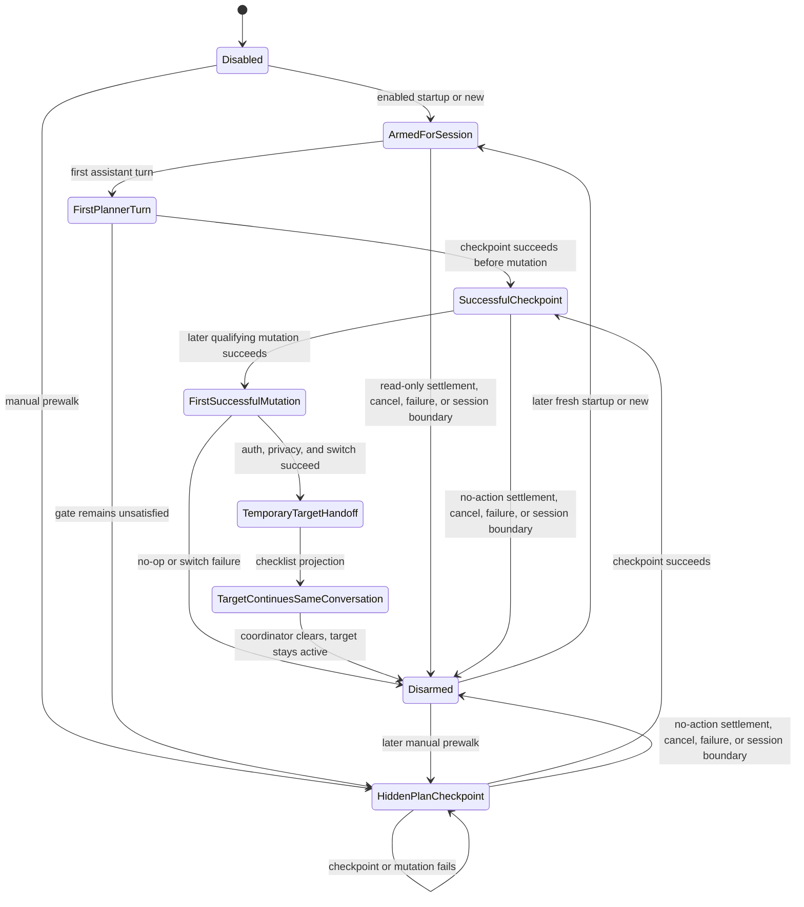
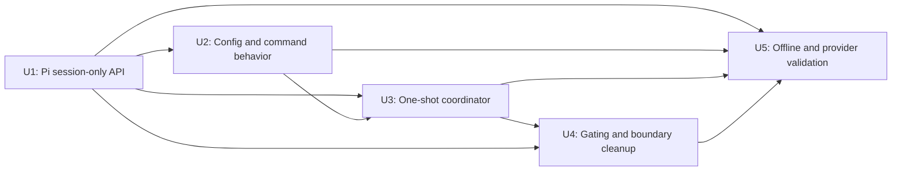

# Faithful Standalone Prewalk Parity - Plan

> **Superseded on 2026-07-29.** Feasibility research found that Pi 0.82.1 and
> current upstream do not expose a public session-only model/thinking setter.
> Do not implement U1 or patch the installed host. Continue with
> [`2026-07-29-002-feat-prewalk-extension-only-restart-plan.md`](./2026-07-29-002-feat-prewalk-extension-only-restart-plan.md),
> which uses a supported same-session restart handoff.

## Goal Capsule

Make `agent/extensions/prewalk.ts` reproduce the useful behavior and expected usage of Oh My Pi Prewalk at commit [`cc00ab161b2721e50d8a96a0dc9552abfd258b8b`](https://github.com/can1357/oh-my-pi/tree/cc00ab161b2721e50d8a96a0dc9552abfd258b8b) as one focused standalone Pi extension.

Automatic Prewalk is one armed, one-way handoff when a new extension instance receives Pi `startup` or `new`. A process `startup` may load an existing conversation, which intentionally matches OMP process-start arming; Pi `resume`, `fork`, and `reload` remain disarmed. The model already selected in Pi plans and begins implementation, then the configured target model takes over the same conversation after a valid checkpoint and the first successful mutation. The target remains active for the rest of that live session. Prewalk does not re-arm for every prompt and does not restore the planner merely because the agent settles.

The authority order is:

1. The user-corrected one-shot parity contract in this plan.
2. The pinned Oh My Pi source for actual automatic and manual behavior.
3. [Stencil's Prewalk article](https://stencil.so/blog/prewalk) for the planning-to-execution outcome.
4. Installed Pi 0.82.1 lifecycle and extension APIs for the smallest host-native adaptation.

This is a Standard plan with a high-risk privacy boundary and one cross-codebase dependency. Execution must stop before U1 until an editable checkout of `earendil-works/pi` containing `packages/coding-agent` is placed in scope. The installed global package contains compiled output only and is never an edit target.

The implementation stays small. Do not add Oh My Pi as a dependency, and remove abandoned experimental code before declaring completion.

## Product Contract

### Summary

Persistent local configuration enables one automatic Prewalk run when a new extension instance receives `startup` or `new`, including process startup that may load an existing conversation. Automatic mode leaves the planner's first assistant turn untouched, injects hidden OMP-style planning guidance only if the gate remains unsatisfied, requires one bounded 5 to 9 item checkpoint, and temporarily switches the current session after the first later successful mutation.

Manual `/prewalk` preserves OMP's meaningful distinction: it arms one run in the current conversation and injects the planning guidance immediately. It uses the configured standalone target because this product has no role aliases.

### Actors

- A1. The user enables automatic Prewalk and selects an exact target model and thinking level.
- A2. The planner is the model and effective thinking level already active when the run arms.
- A3. The target is the configured model and effective thinking level that continues the same transcript after handoff.
- A4. Pi owns session lifecycle, authentication, capability clamping, transcript transitions, and global defaults.

### Requirements

#### Configuration and arming

- R1. Extension-owned configuration contains only schema version, automatic enabled state, exact target provider and model, requested thinking level, and destination-bound cross-provider acknowledgement.
- R2. Automatic mode arms one run on Pi `session_start` reasons `startup` and `new`; it does not arm on ordinary prompts.
- R3. `resume`, `fork`, and `reload` start disarmed because they restore or rebuild an existing conversation. This is the smallest Pi-native adaptation to avoid duplicate or stale runs after extension rebind.
- R4. The planner is the Pi model already selected when the run arms. The extension does not introduce planner profiles, source-model settings, or role aliases.
- R5. Automatic startup resolves the configured target and revalidates authentication. Failure notifies clearly, leaves the coordinator disarmed, and does not block normal Pi use.

#### Automatic coordinator

- R6. Automatic mode allows the first planner assistant turn to run normally, matching Oh My Pi's coordinator rather than the article's simplified task-prefix description.
- R7. If the handoff gate remains unsatisfied after the first planner turn, the extension injects hidden planning guidance and schedules no more than one bounded continuation for the run.
- R8. The hidden guidance requires one successful `prewalk_checkpoint` call with 5 to 9 trimmed non-empty implementation and verification items before a mutation can qualify.
- R9. A successful checkpoint opens only the active run's gate. Failed, malformed, unavailable, stale, or out-of-phase checkpoint calls leave the gate closed and never enable a reduced no-todo mode.
- R10. The first successful qualifying mutation after the successful checkpoint triggers handoff. A same-turn checkpoint qualifies only mutations whose successful results follow it in Pi's delivered order.
- R11. `edit` and `write` are the OMP parity triggers. `apply_patch` and `ast_grep_replace` are standalone host adaptations only when runtime discovery confirms that they are active normal mutation tools with standard success and error results.
- R12. Failed mutation results never trigger handoff.

#### Handoff and continuation

- R13. Before target dispatch, the current run's hidden planning instruction is absent from stored transcript and outgoing context.
- R14. The host switches model and thinking level atomically for the current session, revalidates authentication, applies Pi capability clamping, records the normal ephemeral session transition, returns effective values, and does not update global defaults.
- R15. After a real switch, the extension injects the final verification checklist and the target continues the same transcript, including planner-visible reasoning output, reads, tool results, checkpoint, and first successful mutation.
- R16. After the first target dispatch consumes the checklist projection, the coordinator is disarmed and the target remains active for the rest of the live session. Later prompts do not re-arm Prewalk or restore the planner.
- R17. A same-model handoff with a genuinely cheaper effective thinking level remains valid. The same model with the same effective thinking level is a no-op and must not claim a switch.
- R18. Status and switch notices report the effective model and thinking level, including requested-to-effective clamping.

#### Manual and safety behavior

- R19. `/prewalk` manually arms one run against the configured target and injects planning guidance immediately without creating a role or one-task override system.
- R20. `/prewalk status` reports configured automatic state, configured target, active coordinator phase, checkpoint availability, and cross-provider boundary.
- R21. `/prewalk cancel` disarms an active run without changing persistent enablement. `/prewalk disable` disarms and persistently disables future automatic startup arming. These are deliberate standalone safety extensions, not OMP parity claims.
- R22. A read-only or no-action run disarms at `agent_settled` after its bounded continuation budget, so a later unrelated write cannot trigger a stale handoff.
- R23. Resolution, authentication, no-op, switch, cancellation, checkpoint unavailability, and session-boundary failures leave the coordinator in one coherent disarmed state with no delayed retry. Failed, malformed, stale, and out-of-phase checkpoint calls keep the gate closed and the current run armed for a later valid checkpoint.
- R24. Repeated manual runs use distinct run IDs, and no earlier hidden planning instruction or checklist can reach a later run.
- R25. Compaction, resume, fork, reload, context reconstruction, and fresh process restoration cannot expose a hidden planning instruction from an earlier run.

#### Privacy and standalone scope

- R26. Cross-provider handoff requires clear one-time acknowledgement bound to the exact configured destination because the target receives accumulated messages, checkpoint items, tool arguments and results, and gathered source context.
- R27. Configuration, status, notices, and extension control messages contain no credentials, raw provider errors, request bodies, task text, checkpoint contents, tool payloads, or repository paths.
- R28. Repository investigation remains the planner's work through ordinary Pi tools. Prewalk does not crawl, index, summarize, or persist a plan artifact.
- R29. The implementation remains one local extension, focused tests, and the smallest generic Pi host seam. It adds no OMP runtime, role system, startup profiles, per-prompt task detection, automatic re-arming, planner restoration loop, dashboards, subagents, general orchestration, compatibility layers, or settings save-and-restore.
- R30. Offline lifecycle and host tests pass before any controlled provider-backed canary.

### Key Flows

#### F1. Automatic fresh-session run

1. Pi emits `session_start` with reason `startup` or `new`.
2. Enabled configuration resolves the exact target, checks authentication and privacy acknowledgement, and arms one coordinator with the currently selected planner.
3. The user's first task begins normally, and the planner's first assistant turn is unmodified.
4. If the gate remains unsatisfied, a harmless continuation trigger causes the next provider context to receive the hidden planning guidance.
5. The planner investigates, calls `prewalk_checkpoint`, and begins implementation.
6. The first later successful qualifying mutation triggers the session-only handoff.
7. The target receives the same conversation plus the final checklist and continues.
8. The coordinator remains disarmed and the target stays active for later prompts in that live session.

#### F2. Manual one-shot run

1. In a disarmed live conversation, the user runs `/prewalk`.
2. The extension validates the configured target, authentication, no-op state, and privacy boundary.
3. A harmless trigger starts the next turn with the hidden planning guidance injected immediately.
4. Checkpoint, mutation, handoff, checklist, and final disarming follow F1.

#### F3. Read-only or no-action run

1. The automatic or manual run may consume its one bounded continuation.
2. No successful qualifying mutation follows a successful checkpoint.
3. `agent_settled` disarms the coordinator without switching models.
4. Later prompts in the live session run normally and do not re-arm automatic Prewalk.

#### F4. Failure or cancellation

1. A failed, malformed, stale, or out-of-phase checkpoint call and a failed mutation leave the current gate state unchanged.
2. Checkpoint unavailability, resolution, auth, no-op, switch failure, cancellation, disablement, or a session transition clears the current run and its context projection.
3. If cancellation wins while a switch is in flight but before target dispatch, cleanup returns to the planner through the same session-only API.
4. No later write can revive the run.

#### F5. Session lifecycle

1. `startup` and `new` create the closest Pi-native fresh live session and arm once when enabled.
2. `resume`, `fork`, and `reload` are existing-conversation boundaries and start disarmed.
3. Compaction preserves the current in-memory coordinator phase but cannot persist or summarize hidden planning text because that text exists only in the outgoing context projection.
4. A fresh process or restored session ignores ephemeral target selection as a global default and begins from Pi's configured model.

### Acceptance Examples

- AE1. Covers R2, R6-R16: enabled startup leaves the first planner turn untouched, injects the plan lazily, accepts a 5-item checkpoint, switches after the next successful write, and leaves the target active after settlement.
- AE2. Covers R16: a later ordinary prompt in the same live session stays on the target and does not re-arm Prewalk.
- AE3. Covers R19: manual `/prewalk` in a disarmed conversation injects the plan immediately and uses the configured target.
- AE4. Covers R9, R10, R12: a failed checkpoint, a mutation before checkpoint, and failed `edit`, `write`, `apply_patch`, or AST replacement results cannot switch.
- AE5. Covers R10: checkpoint then successful mutation in one delivered result sequence switches; mutation then checkpoint does not.
- AE6. Covers R22-R24: a read-only automatic run settles, a later write does not trigger it, and a later manual run receives only its own hidden control.
- AE7. Covers R17-R18: same-model lower thinking performs a handoff; unsupported thinking is reported at its effective clamp; same effective pair is a no-op.
- AE8. Covers R5, R23: missing startup auth and expired switch-time auth notify, disarm, and leave normal Pi use coherent.
- AE9. Covers R25: compaction, resume, fork, and reload expose no earlier hidden planning instruction and do not re-arm an existing conversation.
- AE10. Covers R26: same-provider handoff needs no acknowledgement; a changed or unacknowledged cross-provider destination cannot receive a request.
- AE11. Covers R14: settings are byte-for-byte unchanged after handoff, later target prompts, process exit, and a fresh Pi start on the configured planner default.

### Success Criteria

- The standalone command behaves like OMP automatic and manual Prewalk where Pi exposes equivalent lifecycle hooks.
- Automatic mode is one armed run per fresh live session, not per prompt.
- Every switch follows a successful current-run checkpoint and a later successful mutation.
- The target continues the same conversation and remains active after handoff.
- Read-only settlement, failures, cancellation, manual repetition, and session boundaries cannot trigger stale handoffs or leak hidden instructions.
- Cross-provider context transfer is disclosed and destination-bound.
- Global Pi defaults never change.

### Scope Boundaries

The plan includes:

- `agent/extensions/prewalk.ts`
- `agent/prewalk.json`
- Focused local tests under `agent/tests/`
- The smallest generic session-only model API in editable `earendil-works/pi` source

The plan excludes:

- Oh My Pi installation, initialization, or runtime dependencies
- Per-prompt task detection and automatic re-arming
- Automatic planner restoration after settlement
- Semantic task classification and temporary per-task overrides
- Role aliases such as `@smol`, general profiles, dashboards, and subagent Prewalk
- Repository crawling, indexing, durable plan handoff, or general orchestration
- Dynamic active-tool slate restoration
- Environment-variable compatibility paths or competing configuration sources
- Global-setting save-and-restore workarounds
- Backward-compatible parsing for the current `/prewalk [model]` behavior
- Generated files, installed compiled output, changelogs, and unrelated Pi refactors

### Dependencies

- D1. An editable checkout of [`earendil-works/pi`](https://github.com/earendil-works/pi) matching or intentionally superseding installed Pi 0.82.1 must be placed in scope before U1.
- D2. The resulting Pi host build must be available to an isolated test agent directory before U4 and U5.
- D3. Every future test execution must invoke and follow the `run-tests-on-request` skill.

## Planning Contract

### Verified Baseline

The local implementation is `agent/extensions/prewalk.ts` plus `agent/extensions/prewalk-OH-MY-PI-LICENSE.md`. No focused Prewalk tests or standalone config exist.

The current command injects immediately, conditionally drops the todo gate when no `todo` tool is active, checks mutation tool names without checking `isError`, calls Pi's persistent setters, can re-arm its continuation budget after later tool turns, and exposes stored older plan prompts when a new run is armed (`agent/extensions/prewalk.ts:103-113`, `agent/extensions/prewalk.ts:139-159`, `agent/extensions/prewalk.ts:201-245`, `agent/extensions/prewalk.ts:266-272`).

The configured environment has no active compatible `todo` tool. Its Pi settings select several source and target model families, and installed Pi 0.82.1 exposes lifecycle events for `startup`, `new`, `resume`, `fork`, and `reload`.

Installed `pi.setModel` persists the default model and provider, while `pi.setThinkingLevel` persists the clamped default thinking level. The package ships compiled output, docs, and examples but no editable source. Its manifest identifies `earendil-works/pi/packages/coding-agent` as the owner.

### Concept and Implementation Comparison

| Concern | Stencil article | Pinned OMP automatic | Pinned OMP manual | Planned standalone |
|---|---|---|---|---|
| Activation | Instruction appears prefixed to a task | Coordinator starts armed once for the AgentSession | `/prewalk` arms the current coordinator | Config arms on Pi `startup` or `new`; `/prewalk` manually arms |
| First turn | Presented as plan-constrained from task start | First planner turn runs normally | Planning nudge is injected immediately | Match each OMP mode |
| Target | Cheaper execution model | `@smol` role resolution | `@smol` | Exact configured provider/model and thinking |
| Checkpoint | Todo list protects against early completion | Successful `todo` when active, otherwise silent bypass | Same coordinator gate | Tiny required `prewalk_checkpoint`; no reduced mode |
| Mutation | First edit lands | First `edit` or `write`, including error results | Same | Successful later `edit`/`write`; locally proven mutation equivalents are host adaptations |
| Switch | Same conversation changes model | `setModelTemporary` with ephemeral history | Same | Generic Pi session-only atomic switch with effective-value return |
| After handoff | Cheaper model continues | Target stays active and coordinator clears | Target stays active | Preserve |
| No action | Article does not specify lifecycle cleanup | Bounded continuation ends but coordinator stays armed | Same risk | `agent_settled` disarms |
| Re-arming | Not specified | No per-prompt re-arm | Command may arm again | Fresh `startup`/`new` automatic run or explicit later `/prewalk` |
| Session boundaries | Not specified | Coordinator lifecycle does not map cleanly to Pi rebinds | Not specified | `resume`/`fork`/`reload` disarm as a documented Pi adaptation |
| Prompt cleanup | Planning instruction is temporary | Stored plan messages are physically removed | Same | Planning text is never stored; only current outgoing context receives it |
| Privacy | Not discussed | Cross-provider transfer is silent | Silent | Exact destination acknowledgement |

Primary sources:

- [OMP coordinator](https://github.com/can1357/oh-my-pi/blob/cc00ab161b2721e50d8a96a0dc9552abfd258b8b/packages/coding-agent/src/session/prewalk.ts)
- [OMP startup resolution](https://github.com/can1357/oh-my-pi/blob/cc00ab161b2721e50d8a96a0dc9552abfd258b8b/packages/coding-agent/src/main.ts#L985-L1014)
- [OMP settings](https://github.com/can1357/oh-my-pi/blob/cc00ab161b2721e50d8a96a0dc9552abfd258b8b/packages/coding-agent/src/config/settings-schema.ts#L453-L463)
- [OMP slash command](https://github.com/can1357/oh-my-pi/blob/cc00ab161b2721e50d8a96a0dc9552abfd258b8b/packages/coding-agent/src/slash-commands/builtin-registry.ts#L722-L744)
- [OMP temporary model switch](https://github.com/can1357/oh-my-pi/blob/cc00ab161b2721e50d8a96a0dc9552abfd258b8b/packages/coding-agent/src/session/model-controls.ts#L247-L283)
- [OMP lifecycle tests](https://github.com/can1357/oh-my-pi/blob/cc00ab161b2721e50d8a96a0dc9552abfd258b8b/packages/coding-agent/test/agent-session-prewalk.test.ts)
- [Stencil article](https://stencil.so/blog/prewalk)

### Key Technical Decisions

- KTD1. Match OMP's one armed, one-way live-session handoff and leave the target active after success. (session-settled: user-directed - chosen over per-prompt orchestration and automatic planner restoration: faithful OMP usage is the product target.) Governs R2, R6-R7, and R15-R16.
- KTD2. Arm automatic mode on Pi `startup` and `new`, then disarm on `resume`, `fork`, and `reload`. (session-settled: user-directed - chosen over quietly treating every idle prompt as a task: Pi session events are the closest host-native boundary.) Governs R2-R3 and R25.
- KTD3. Preserve the automatic/manual injection distinction. Automatic mode injects lazily after the first incomplete planner turn; manual `/prewalk` injects immediately. (session-settled: user-directed - chosen over one shared command-first flow: OMP intentionally exposes both behaviors.) Governs R6-R7 and R19.
- KTD4. Register one small `prewalk_checkpoint` tool that accepts 5 to 9 trimmed non-empty items and opens only the active run's gate. (session-settled: user-directed - chosen over OMP's silent no-todo bypass or an external dependency: the local setup lacks `todo` but should retain expected safety.) Governs R8-R9.
- KTD5. Keep `prewalk_checkpoint` registered instead of altering the user's active-tool slate. It returns a clear error outside the active checkpoint phase. A restrictive allowlist that excludes it disables handoff for that run with a notice. Governs R9 and R29.
- KTD6. Keep hidden planning and checklist instructions out of stored transcript entries. Use structurally tagged harmless triggers and a pure `context` projection that exposes exactly one current-phase control. Governs R13, R24-R25, and R27.
- KTD7. Add one generic atomic Pi host operation for temporary session model and thinking selection. It revalidates auth, clamps capability, appends normal ephemeral session history, emits normal events, returns the effective pair, and never writes global defaults. Governs R14, R17-R18, and R23.
- KTD8. Use `edit` and `write` as parity triggers. Admit `apply_patch` and `ast_grep_replace` only after runtime discovery confirms their active standard result contract; label them host adaptations in status and tests rather than OMP behavior. Governs R10-R12.
- KTD9. Store standalone config in `agent/prewalk.json`, resolve it through Pi's agent directory, validate unknown JSON strictly, and replace it atomically only after validation. Do not retain environment variables as a second source of truth. Governs R1 and R5.
- KTD10. Bind cross-provider acknowledgement to the exact resolved target and recheck it immediately before target dispatch. Use stable sanitized failure notices rather than raw provider errors. Governs R26-R27.
- KTD11. Attach asynchronous checkpoint, switch, cancellation, and continuation work to a unique run ID and epoch. This prevents stale callbacks from changing state or injecting a later checklist without introducing a general orchestration layer. Governs R10, R21-R25.
- KTD12. Use Node's existing test runner and already-installed TypeScript execution support for local tests. Do not add a package manifest or dependency solely for Prewalk. Governs R30.

### High-Level Technical Design

The diagram defines the observable lifecycle, not a required class structure.



The extension owns configuration, command parsing, one coordinator state, the checkpoint gate, result ordering, harmless continuation triggers, and phase-scoped context projection. Pi owns one new generic session-only model and thinking transition.

### System-Wide Impact

- **Global defaults:** the host seam must bypass `SettingsManager` default writes. A temporary target may remain active in the live session, but a fresh process or unrelated fresh session starts from configured Pi defaults.
- **Session transcript:** normal planner messages, checkpoint tool results, mutations, and ephemeral model transition remain visible to the target. Hidden planning and checklist imperatives are projection-only and cannot enter compaction summaries.
- **Authentication and privacy:** configuration-time validation is advisory because credentials and resolved destinations can change. Handoff revalidates both immediately before any target request.
- **Session lifecycle:** Pi reloads extension instances on `new`, `resume`, and `fork`. Among those reload events, only `new` arms; restored or derived conversations start disarmed. Process `startup` arming is handled separately and may load an existing conversation to match OMP.
- **Manual control:** status, cancel, and disable are narrow recovery surfaces. They do not grow into per-task overrides or a broader launch system.

### Implementation Constraints

- Read the editable Pi checkout's own `AGENTS.md` and repository instructions before U1.
- Never edit the installed package under `.nvm`, compiled `dist`, generated files, or changelogs.
- Do not use type casts outside tests.
- Do not add compatibility syntax for the current immediate-arm command.
- Do not save and restore global settings as a substitute for U1.
- Do not persist hidden planning or checklist text.
- Do not infer task boundaries from prompt text.
- Keep normal automatic notifications quiet; status carries diagnostics.

### Dependency Order



### Risks and Execution-Time Unknowns

- No editable Pi host source exists locally. U1 is blocked until D1 is satisfied, and upstream file organization may differ from the installed 0.82.1 package.
- Pi emits `startup` for process startup even when an existing session may be loaded. This intentionally matches OMP process-start arming, while live `resume`, `fork`, and `reload` disarm. Process-level tests must make the distinction visible.
- Pi tool-result ordering must be verified for parallel tool calls. If delivered order cannot prove checkpoint-before-mutation, a same-turn handoff fails closed.
- A read-only task may spend one extra planner turn because OMP-style lazy injection cannot classify intent. The continuation budget remains one.
- A restrictive tool allowlist can exclude `prewalk_checkpoint`. The run must disarm with a clear notice rather than weakening the gate or rewriting the active-tool slate.
- A target credential may expire after configuration or during handoff. Failure must prevent target dispatch where possible, disarm, and avoid raw provider errors.
- Manual cancellation racing with a committed switch may require a one-time session-only return to the captured planner before target dispatch. This is failure cleanup, not automatic settlement restoration.

## Implementation Units

### U1. Add the generic Pi temporary session model API

**Goal:** Give extensions one atomic, ephemeral way to change the active session model and thinking level without changing global defaults.

**Requirements:** R14, R17-R18, R23, R29

**Owning codebase:** Editable `earendil-works/pi`, not the installed package or this artifact root.

**Files:**

- `packages/coding-agent/src/core/agent-session.ts`
- `packages/coding-agent/src/core/extensions/types.ts`
- `packages/coding-agent/src/core/extensions/loader.ts`
- `packages/coding-agent/src/core/extensions/runner.ts`
- The current focused model-control test file under `packages/coding-agent/test/`, or a new `packages/coding-agent/test/agent-session-model-controls.test.ts`

**Dependencies:** D1

**Approach:**

- Follow existing authentication, model selection, thinking clamp, session-entry, and event paths.
- Add one generic operation that changes model and requested thinking as one transaction and returns the effective pair.
- Wire the public API wrapper through the extension loader and bind its runtime action through the extension runner.
- Mark the session transition ephemeral so it cannot become the configured model for a fresh process or unrelated session.
- Complete all fallible validation before observable commit and leave model and thinking unchanged on failure.
- Keep existing persistent setters unchanged for their current callers.

**Test scenarios:**

- Switch across authenticated models and assert active session state, normal ephemeral history, and selection events change while settings bytes do not.
- Perform same-model lower-thinking handoff and same-effective no-op.
- Request unsupported thinking and assert the returned effective clamp.
- Reject missing and expired auth without partial model or thinking changes.
- Fail before commit and assert no state, history, event, or settings mutation.
- Restore or start a fresh process after ephemeral handoff and assert Pi uses its configured planner default rather than the temporary target.
- Load a focused extension fixture and prove it can invoke the operation through the real loader and runner binding.

**Verification:** Focused host tests prove atomic session-only behavior, effective-value reporting, authentication failure, ephemeral restoration, and byte-for-byte unchanged global settings.

### U2. Add minimal standalone configuration and command behavior

**Goal:** Replace OMP settings and `@smol` with one exact target and a small automatic/manual control surface.

**Requirements:** R1-R5, R19-R21, R26-R27

**Files:**

- `agent/extensions/prewalk.ts`
- `agent/prewalk.json`
- `agent/tests/prewalk.test.ts`

**Dependencies:** U1 for integrated model validation; command and config tests can use a fake host.

**Approach:**

- Define and strictly validate the small config shape from R1.
- Resolve the file through Pi's agent directory and atomically replace it only after validation.
- Make bare `/prewalk` the immediate manual arm against the configured target.
- Keep `status`, `cancel`, `enable`, and `disable` as narrow standalone controls.
- Require explicit destination-bound acknowledgement when enablement can cross providers.
- Remove environment-driven defaults and old overloaded model arguments instead of adding compatibility parsing.

**Test scenarios:**

- Verify command registration, help, bare manual arm, status, cancellation, enablement, disablement, and malformed arguments.
- Reject missing config, malformed JSON, unknown fields, unresolved target, bad thinking name, extra arguments, and missing auth without changing live state.
- Enable same-provider and cross-provider targets, then change target resolution and prove stale acknowledgement is rejected.
- Prove commands never start an unintended empty turn except the deliberate bare manual arm.
- Prove status and errors contain no prohibited R27 data.

**Verification:** Fake-host tests prove deterministic config writes, command behavior, privacy acknowledgement, and separation between persistent enabled state and live coordinator state.

### U3. Implement the one-shot coordinator and prompt/checkpoint isolation

**Goal:** Match OMP automatic lazy injection and manual immediate injection without persisting hidden instructions.

**Requirements:** R2-R9, R13, R19, R22, R24-R25

**Files:**

- `agent/extensions/prewalk.ts`
- `agent/tests/prewalk.test.ts`

**Dependencies:** U1, U2

**Approach:**

- Arm once on `session_start` reasons `startup` and `new`; initialize disarmed on `resume`, `fork`, and `reload`.
- Capture the planner and resolved target when arming.
- Preserve the first automatic planner turn. If the gate remains closed, use one harmless trigger so the next outgoing context receives the planning guidance.
- Make manual arming use the same coordinator but set planning projection immediately.
- Register `prewalk_checkpoint` with deterministic 5 to 9 trimmed non-empty item validation and run ID/epoch binding.
- Keep a monotonic continuation budget that cannot be re-armed by later tool turns.
- Project exactly one active planning or checklist instruction into outgoing context without mutating stored messages.

**Test scenarios:**

- `startup` and `new` arm once; ordinary later prompts do not re-arm.
- `resume`, `fork`, and `reload` start disarmed with no old context projection.
- Automatic first turn is untouched; manual first turn receives planning guidance immediately.
- Text-only planning consumes at most one continuation, then settlement disarms.
- Accept 5 and 9 trimmed non-empty checkpoint items; reject 0, 4, 10, malformed, empty, stale, and out-of-phase calls.
- Two manual runs use distinct IDs and expose only the current control.
- Repeated context projection is pure and idempotent, and marker-like user or tool text remains untouched.
- Compaction during planning, after cancel, and after handoff cannot summarize or restore hidden planning text.

**Verification:** Handler-level tests drive Pi event order and snapshot stored messages separately from provider context.

### U4. Enforce successful mutation, failure cleanup, and session boundaries

**Goal:** Switch exactly once after valid progress and terminate every non-success path coherently.

**Requirements:** R10-R12, R14-R18, R21-R26

**Files:**

- `agent/extensions/prewalk.ts`
- `agent/tests/prewalk.test.ts`

**Dependencies:** U1-U3, D2

**Approach:**

- Process checkpoint and mutation results in delivered order and require `isError !== true`.
- Recognize `edit` and `write` directly. Add discovered `apply_patch` and AST replacement names only when their runtime result contract is equivalent.
- Recheck target resolution, auth, destination acknowledgement, run epoch, and effective no-op state before switching and again before target dispatch where the host exposes that boundary.
- Clear planning projection before the target request, enter a checklist-pending handoff phase after successful switch, project the checklist into the first target request, and disarm only after that dispatch consumes the projection.
- On read-only settlement, cancellation, disablement, auth failure, no-op, switch failure, or session transition, clear the coordinator and suppress delayed callbacks.
- If cancellation wins after switch commit but before target dispatch, return once to the captured planner as explicit cleanup.

**Test scenarios:**

- Successful checkpoint followed by successful `edit` and `write` switches once.
- Locally active `apply_patch` and AST replacement tools switch only after their successful standard result.
- Failed checkpoint, mutation before checkpoint, and failed results for every qualifying tool do not switch.
- Same-turn ordered checkpoint then mutation qualifies; reverse order does not.
- Read-only and no-action settlement disarms, and a later unrelated write cannot switch.
- Model resolution, startup auth, expired switch auth, same-model no-op, clamp, thrown switch failure, and first target dispatch failure all notify and disarm coherently.
- Cancellation before checkpoint, after checkpoint, during switch, and before target dispatch leaves no delayed checklist or later switch.
- Successful handoff leaves the target active through settlement and later prompts.
- `new` arms a new automatic run; `resume`, `fork`, `reload`, and compaction follow R3 and R25.

**Verification:** Event-order tests assert phase, run ID, gate ordering, chosen mutation, effective model, notification category, checklist visibility, and the absence of delayed retries.

### U5. Add focused offline and controlled provider validation

**Goal:** Prove parity and safety through the same invocation paths an end user uses.

**Requirements:** R1-R30

**Files:**

- `agent/tests/prewalk.test.ts`
- `agent/tests/prewalk-rpc-e2e.test.ts`
- Host test files from U1

**Dependencies:** U1-U4, D2, D3

**Approach:**

- Start Pi with an isolated temporary agent and session directory containing the extension and test config.
- Exercise automatic startup and manual `/prewalk` without using the user's valuable repositories or sessions.
- Generate representative repositories under `/tmp`; remove only harness-owned directories.
- Keep providers disabled until offline lifecycle and process tests pass and write behavior is understood.
- Run one same-provider canary before any explicitly acknowledged cross-provider canary.

**Test scenarios:**

- One-file change: automatic startup, lazy plan, checkpoint, successful write, handoff, checklist, target settlement, and later target prompt without re-arm.
- Unfamiliar medium project: planner gathers cross-file context before the first mutation and the target receives that same transcript.
- Partially broken repository: pre-existing failures remain visible, failed mutation does not switch, and successful later mutation does.
- Read-only task: bounded continuation, no handoff, clean disarm, and no stale later switch.
- Large repository with one relevant package: ordinary Pi tools stay scoped without a crawler or index.
- Manual parity: bare `/prewalk` injects immediately, a second manual run cannot see the first prompt, and status/cancel behave safely.
- Session lifecycle: `startup` and `new` arm; later prompts, `resume`, `fork`, and `reload` do not.
- Same-provider and acknowledged cross-provider runs deliver only intended accumulated context to the exact target.
- Global isolation: settings snapshots remain byte-for-byte equal after handoff, later target work, process exit, and a fresh planner session.

**Verification:** Offline suites pass first. The final synthetic canary records only provider, model, effective thinking, coordinator phase, mutation outcome, and non-sensitive sentinel assertions.

## Verification Contract

This planning task runs no tests. Every future test execution begins by invoking and following `run-tests-on-request`.

### Local lifecycle gate

Use the existing local TypeScript runner:

```text
agent/npm/node_modules/.bin/tsx --test agent/tests/prewalk.test.ts
```

Required outcomes:

- Automatic and manual arming, lazy and immediate injection, checkpoint validation, bounded continuation, mutation ordering, failure cleanup, prompt isolation, and session boundaries pass.
- Tests write only to harness-owned temporary directories.
- No provider credentials or real user settings are required.

### Pi host gate

Use the editable Pi checkout's focused test, typecheck, and lint commands after reading that repository's instructions.

Required outcomes:

- The active session changes model and thinking atomically.
- Authentication and pre-commit failure are non-mutating.
- Capability clamping returns effective values.
- Ephemeral history does not become a future default.
- Persistent settings remain byte-for-byte unchanged.

### Isolated process gate

Use:

```text
agent/npm/node_modules/.bin/tsx --test agent/tests/prewalk-rpc-e2e.test.ts
```

Required outcomes:

- Pi discovers `/prewalk` and `prewalk_checkpoint`.
- Enabled `startup` and `new` arm once.
- Ordinary later prompts do not re-arm or restore the planner.
- `resume`, `fork`, `reload`, and compaction expose no stale prompt.
- Temporary repositories cover all U5 scenarios.

### Provider-backed canary gate

The canary is last and manual. It uses a synthetic sentinel-only `/tmp` repository and isolated agent/session directories. Do not copy Git config, environment files, credentials, user transcripts, or real repository content. Cross-provider execution remains explicit and opt-in. Stop after the first unexpected write, destination, request, prompt leak, settings change, or coordinator transition.

### Quality gates

- No new test dependency or package manifest.
- No type casts outside tests.
- No unexplained lint, typecheck, or test failure.
- No generated output, installed compiled package, changelog, or unrelated setting change.
- No per-prompt lifecycle or planner-restoration machinery remains.
- No prohibited R27 data appears in config, status, notices, session controls, or canary output.

## Definition of Done

### Global completion

- D1 is satisfied and U1-U5 meet their verification outcomes.
- Enabled `startup` or `new` arms exactly one automatic run with OMP-style lazy planning.
- Bare manual `/prewalk` arms one run with immediate planning guidance.
- The current planner reaches a valid checkpoint and successful mutation before any switch.
- The target continues the same transcript and remains active for the rest of the live session.
- Later prompts do not re-arm, and settlement does not restore the planner.
- Read-only work, failures, cancellation, manual repetition, session boundaries, and compaction leave no stale coordinator or hidden prompt.
- Effective thinking and same-model behavior match Pi capabilities.
- Cross-provider transfer is disclosed and bound to the exact target.
- Global Pi defaults and fresh-session planner behavior remain unchanged.
- No Oh My Pi dependency, role system, crawler, index, durable plan handoff, per-prompt orchestration, dashboard, subagent infrastructure, compatibility layer, or settings workaround exists.
- Temporary experiments and dead-end code are removed.

### Per-unit completion

- U1 is done when the generic host seam is atomic, authenticated, session-only, ephemeral, effective-value reporting, and covered in editable Pi source.
- U2 is done when minimal config and manual controls are validated, deterministic, privacy-aware, and free of competing configuration sources.
- U3 is done when automatic and manual injection, checkpoint gating, continuation, prompt projection, and manual repetition match the contract.
- U4 is done when successful-mutation ordering, one-way handoff, effective values, cleanup, and session boundaries pass focused tests.
- U5 is done when offline realistic scenarios pass first and a controlled canary proves the expected OMP-style experience without changing global settings.

## Appendix

### Local Evidence

- `agent/extensions/prewalk.ts:17-25` defines environment defaults and the current mutation set.
- `agent/extensions/prewalk.ts:107-113` validates successful todo but accepts mutation tools without checking error state.
- `agent/extensions/prewalk.ts:139-159` immediately triggers planning and silently weakens the gate when `todo` is inactive.
- `agent/extensions/prewalk.ts:201-211` can re-arm continuation after later tool-bearing turns.
- `agent/extensions/prewalk.ts:237-245` calls Pi's persistent setters and reports requested thinking rather than the effective clamp.
- `agent/extensions/prewalk.ts:266-272` stops filtering older plan prompts whenever a new run is armed.
- `agent/settings.json:4-35` shows configured model families and packages; no active package registers a compatible `todo` tool.
- Installed Pi docs `docs/extensions.md:275-325` define `startup`, `new`, `resume`, and `fork` lifecycle ordering.
- Installed Pi 0.82.1 `dist/core/agent-session.js:1189-1205` persists model defaults and `dist/core/agent-session.js:1270-1293` persists thinking changes.
- Installed Pi 0.82.1 `package.json:23-29` excludes source, and `package.json:93-97` identifies `earendil-works/pi/packages/coding-agent` as the editable owner.

### External Sources

- [Stencil: Prewalk](https://stencil.so/blog/prewalk)
- [Oh My Pi pinned tree](https://github.com/can1357/oh-my-pi/tree/cc00ab161b2721e50d8a96a0dc9552abfd258b8b)
- [Oh My Pi coordinator](https://github.com/can1357/oh-my-pi/blob/cc00ab161b2721e50d8a96a0dc9552abfd258b8b/packages/coding-agent/src/session/prewalk.ts)
- [Oh My Pi startup resolution](https://github.com/can1357/oh-my-pi/blob/cc00ab161b2721e50d8a96a0dc9552abfd258b8b/packages/coding-agent/src/main.ts#L985-L1014)
- [Oh My Pi settings](https://github.com/can1357/oh-my-pi/blob/cc00ab161b2721e50d8a96a0dc9552abfd258b8b/packages/coding-agent/src/config/settings-schema.ts#L453-L463)
- [Oh My Pi slash command](https://github.com/can1357/oh-my-pi/blob/cc00ab161b2721e50d8a96a0dc9552abfd258b8b/packages/coding-agent/src/slash-commands/builtin-registry.ts#L722-L744)
- [Oh My Pi temporary model switch](https://github.com/can1357/oh-my-pi/blob/cc00ab161b2721e50d8a96a0dc9552abfd258b8b/packages/coding-agent/src/session/model-controls.ts#L247-L283)
- [Oh My Pi tests](https://github.com/can1357/oh-my-pi/blob/cc00ab161b2721e50d8a96a0dc9552abfd258b8b/packages/coding-agent/test/agent-session-prewalk.test.ts)
- [Pi 0.82.1 upstream AgentSession](https://github.com/earendil-works/pi/blob/v0.82.1/packages/coding-agent/src/core/agent-session.ts#L1471-L1488)
- [Pi 0.82.1 upstream extension API](https://github.com/earendil-works/pi/blob/v0.82.1/packages/coding-agent/src/core/extensions/types.ts#L1233-L1243)
