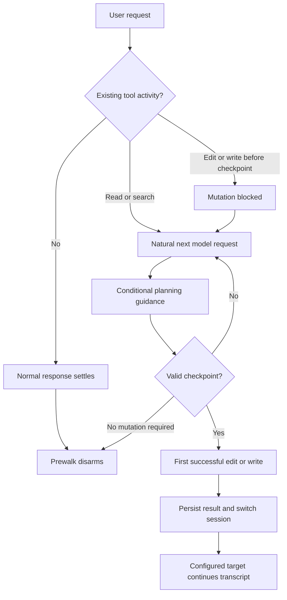
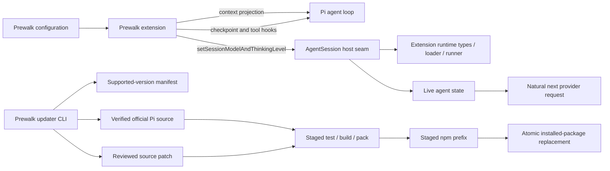
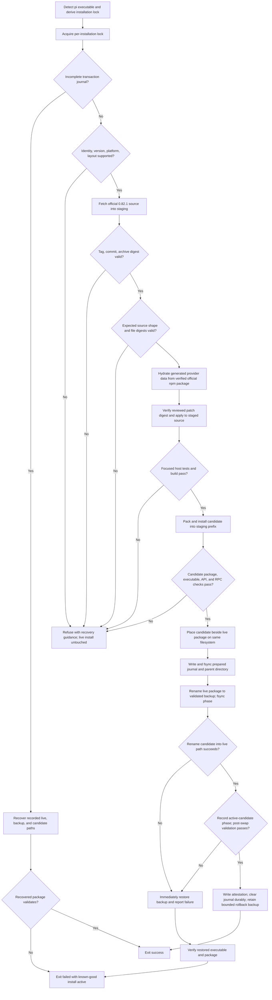
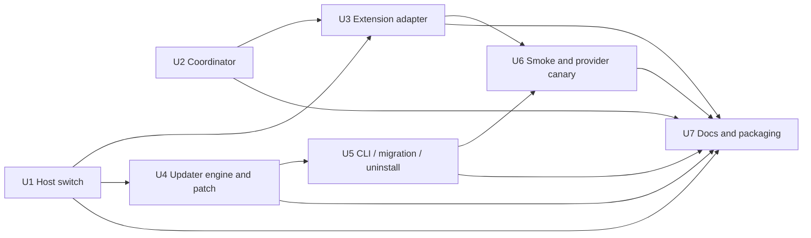

# Faithful Prewalk Session Handoff - Plan

## Goal Capsule

- **Objective:** Deliver a standalone Pi Prewalk experience in which Pi's active model plans, a configured target immediately continues after the first qualifying mutation, and the live transcript and saved defaults remain intact.
- **Product authority:** The Product Contract governs the replacement architecture. The installed restart-based package is migration evidence, not an architectural constraint.
- **Execution boundary:** Implement the public host seam in `earendil-works-pi/`, then consume and distribute it from `prewalk/`.
- **Stop conditions:** Refuse unsupported Pi versions, package managers, platforms, installation layouts, source shapes, unauthenticated targets, or unverifiable release inputs.
- **Open blockers:** None. Implementation-time unknowns are verification inputs and must not broaden support automatically.

---

## Product Contract

> **Product Contract preservation:** R1-R21 and F1-F5 retain their meaning. R22 is clarified to the user-confirmed non-probing readiness guarantee; R23 and AE10 make the already-confirmed cross-provider privacy gate explicit. No behavior expands beyond the confirmed OMP-faithful scope and safety improvements. The four Deferred-to-Planning questions are resolved by KTD1-KTD4.

### Summary

Prewalk will match Oh My Pi's coding handoff experience: the model already active in Pi plans, records a bounded checkpoint, performs the first successful edit or write, and hands the same live session to an explicitly configured target without restarting or changing saved defaults.
It will deliberately improve on literal OMP behavior by retaining the stronger checkpoint gate and avoiding speculative model turns during ordinary chat and read-only work.

### Problem Frame

Pi 0.82.1 exposes model and thinking setters to extensions, but those setters also persist global defaults.
The supported restart workaround avoids changing those defaults, but it interrupts the task, loses live runtime state, and asks the user to resume manually.
The current package also queues proactive continuation turns while planning remains incomplete, which can spend model calls on conversations that never needed repository mutation.

OMP avoids the first problem with a host-owned temporary model switch.
Pi needs an equivalent narrow capability plus an extension workflow that activates only when the existing agent loop demonstrates implementation intent.

### Key Decisions

- **Use Pi's active selection as the planner.** (session-settled: user-directed — chosen over a separate planner setting: normal defaults, CLI overrides, and manual model choices should carry through automatically.) Governs R1 and R18.
- **Provide a same-process, session-only handoff.** (session-settled: user-directed — chosen over the supported manual restart: seamless continuity and unchanged saved defaults are non-negotiable.) Governs R7-R10.
- **Add one combined host switch.** (session-settled: user-directed — chosen over separate non-persisting setters and the broad upstream patch: model and thinking must change together without altering normal Pi behavior.) Governs R7, R11, and R12.
- **Activate from agent-loop events.** (session-settled: user-directed — chosen over proactive follow-ups and manual-only operation: ordinary chat must not spend speculative model calls.) Governs R2, R3, and R6.
- **Match the coding experience with safer differences.** (session-settled: user-directed — chosen over literal OMP behavior everywhere: retain the extension-owned checkpoint and zero-waste chat behavior.) Governs R4-R6.
- **Configure the target explicitly.** (session-settled: user-directed — chosen over automatic “latest” or “fast” model selection: model naming and suitability must remain an operator decision.) Governs R13 and R18.
- **Require explicit cross-provider consent.** (session-settled: user-approved — chosen over implicit transcript transfer: the operator must acknowledge the exact provider boundary before accumulated context can cross it.) Governs R23.
- **Maintain the patch through a fail-closed updater.** (session-settled: user-approved — chosen over manual patch steps: Pi upgrades need one repeatable command with verification and rollback safety.) Governs R14-R17.

### Actors

- A1. **Operator:** Installs, configures, upgrades, invokes, or cancels Prewalk.
- A2. **Planner:** The model and thinking level active in Pi when the workflow begins.
- A3. **Prewalk extension:** Projects temporary planning guidance, validates the checkpoint, observes qualifying mutations, and coordinates the handoff.
- A4. **Pi host:** Owns the live session, transcript, model registry, event loop, saved defaults, and session-only switch.
- A5. **Target:** The explicitly configured model and thinking level that continues the task after handoff.

### Requirements

#### Planner selection and activation

- R1. Prewalk must treat Pi's effective active model and thinking level as A2 without hardcoding or separately configuring a planner.
- R2. Automatic Prewalk must not start a model request solely to classify whether the user's task needs implementation.
- R3. Automatic planning guidance may activate only within a continuation Pi was already going to make after relevant tool activity or after a blocked qualifying mutation attempt.
- R4. Prewalk must expose a manual command that explicitly arms the same workflow when A1 wants it regardless of automatic activation signals.
- R5. A conversation that reaches settlement without a valid checkpoint and qualifying mutation must disarm cleanly without switching models or queuing a follow-up.
- R6. Read-only work may receive conditional guidance during an existing tool loop, but it must finish without being pushed toward mutation and without adding a speculative model call.

#### Checkpoint and handoff

- R7. Before the first qualifying mutation is allowed, A2 must record one accepted `prewalk_checkpoint` containing 5-9 trimmed, non-empty implementation and verification items in execution order.
- R8. A rejected checkpoint must not reserve a mutation or advance the workflow, and a qualifying mutation attempted before acceptance must be blocked with guidance that lets the existing agent loop recover.
- R9. The handoff trigger must be the first successful qualifying edit or write after checkpoint acceptance; blocked, cancelled, or failed mutations must not trigger it.
- R10. After the triggering result is persisted, A4 must switch the same live session to A5's model and thinking level before the next model request, without a process restart or transcript break.
- R11. The session-only switch must apply the target model and thinking level as one handoff operation so observers never receive a partially switched state.
- R12. The handoff must not change Pi's saved model or thinking defaults and must not change normal `/model`, keyboard cycling, onboarding, or settings behavior.
- R13. A5 must continue with the exact transcript available to A2, including the accepted checkpoint and triggering mutation result, while planning-only guidance is absent from A5's projected context.

#### Configuration, patching, and upgrades

- R14. `/prewalk configure` must store and validate an explicit target provider, model, and thinking level before an automatic or manual run can reach mutation.
- R15. Pi must expose one generic session-only model-and-thinking switch through the supported extension surface; Prewalk must not patch compiled global files, import private runtime state, proxy a provider, or monkey-patch live objects.
- R16. A single updater command must fetch verified official Pi source for an explicitly supported version, verify the expected source shape, apply the narrow patch, run focused tests and a build, install only a passing result, and report what changed.
- R17. The updater must refuse unknown versions, source conflicts, failed verification, and failed builds without replacing a known-good installation or silently falling back to persistence-coupled setters.
- R18. Changing Pi's normal active or default model must automatically change the next run's planner without a Prewalk update; changing Pi's package version requires rerunning a compatible updater, while changing A5 remains an explicit configuration action.

#### Lifecycle and distribution

- R19. New session, resume, fork, reload, cancellation, compaction, extension shutdown, and handoff failure paths must clear stale planning and mutation reservations so a later unrelated turn cannot switch models.
- R20. Hidden planning guidance must remain an in-memory context projection and must not appear in session JSONL, compaction input, resume/fork history, or A5's context.
- R21. The package must remain independently installable, inspectable, updateable, and uninstallable, with a documented migration that removes or replaces the installed restart implementation and any legacy loose extension files.
- R22. Failure to resolve A5 or establish complete configured authentication must be detected without a provider request before Prewalk allows the triggering mutation. Credential rejection discovered only by the later target request remains a handoff failure path and must disarm with actionable recovery information.
- R23. A cross-provider handoff must require explicit consent bound to the exact effective planner and target recipients—including provider registration, normalized endpoint or stream implementation, and selected target—before Prewalk allows the triggering mutation; a recipient change invalidates consent.

### Key Flows



- F1. **Exploration-first implementation**
  - **Trigger:** A2 reads or searches the repository while handling an implementation task.
  - **Actors:** A2, A3, A4, A5
  - **Steps:** A3 projects guidance into the natural continuation; A2 records the checkpoint; A2 completes the first successful mutation; A4 performs the session-only switch; A5 continues.
  - **Covers:** R1-R3, R7-R13
- F2. **Direct mutation recovery**
  - **Trigger:** A2 attempts a qualifying edit or write before an accepted checkpoint.
  - **Actors:** A2, A3, A4
  - **Steps:** A3 blocks the call; A4 returns the blocked tool result through the existing loop; the natural next request receives planning guidance; A2 checkpoints and retries.
  - **Covers:** R2, R3, R7-R9
- F3. **Ordinary chat or read-only work**
  - **Trigger:** The task completes without an accepted checkpoint and successful qualifying mutation.
  - **Actors:** A1, A2, A3, A4
  - **Steps:** Existing responses and tool continuations proceed normally; A3 neither queues a follow-up nor switches the session; settlement clears the dormant workflow.
  - **Covers:** R2, R5, R6, R19
- F4. **Pi upgrade**
  - **Trigger:** A1 upgrades Pi and runs the Prewalk updater.
  - **Actors:** A1, A4
  - **Steps:** The updater verifies the release and source shape, applies the supported patch, tests and builds it, installs only the passing output, and reports the result; unsupported input leaves the known-good installation untouched.
  - **Covers:** R15-R18
- F5. **Explicit configuration or manual activation**
  - **Trigger:** A1 runs `/prewalk configure` or manually arms Prewalk.
  - **Actors:** A1, A3, A4
  - **Steps:** Configuration validates A5 before activation; a manual run follows the same checkpoint, mutation, and handoff contract as automatic activation.
  - **Covers:** R4, R14, R22

### Acceptance Examples

- AE1. **Covers R2, R5.** Given an ordinary question that uses no repository tools, when A2 answers and settles, then Pi makes no Prewalk-generated follow-up request and the model does not switch.
- AE2. **Covers R3, R6.** Given a read-only review that uses repository tools, when A2 finishes the normal tool loop without mutation, then Prewalk adds no extra model request, requires no checkpoint, and disarms at settlement.
- AE3. **Covers R7, R8.** Given a direct edit attempt before checkpoint acceptance, when A3 blocks it, then the blocked result reaches A2 through Pi's natural continuation and an invalid checkpoint still leaves the mutation blocked.
- AE4. **Covers R9-R13.** Given an accepted checkpoint and successful edit in one assistant message, when the mutation result is persisted, then A5—not A2—handles the next model request in the same process with the checkpoint and mutation visible and saved defaults unchanged.
- AE5. **Covers R9.** Given an accepted checkpoint followed by a failed or cancelled edit, when the tool result arrives, then the session remains on A2 and the next successful qualifying mutation remains the trigger.
- AE6. **Covers R14, R22.** Given an unknown target or incomplete configured authentication, when A1 configures or arms Prewalk, then non-probing validation fails before any mutation can be reserved or allowed; later credential rejection disarms as a handoff failure without claiming preflight could prove provider acceptance.
- AE7. **Covers R16, R17.** Given a Pi version or source shape absent from the updater's supported manifest, when A1 runs the updater, then it exits with a clear refusal and does not replace the current Pi installation.
- AE8. **Covers R1, R18.** Given Pi's active model changes from one Codex release to another, when the next Prewalk run begins, then the new active model plans without editing Prewalk configuration; A5 remains the configured target.
- AE9. **Covers R19, R20.** Given a session is compacted, resumed, forked, reloaded, cancelled, or inspected after a run, then no hidden planning text or stale handoff reservation survives in persisted or projected target context.
- AE10. **Covers R23.** Given planner and target resolve to different effective recipients, when the exact recipient fingerprints have not been acknowledged, then configuration or arming explains the transcript disclosure and mutation remains blocked; consent for another endpoint, registration, stream implementation, or target does not satisfy the gate.

### Success Criteria

- A provider-backed canary demonstrates the model sequence A2 → accepted checkpoint → successful mutation → A5 in one live process and transcript.
- Pi's saved settings are byte-identical before and after successful, failed, cancelled, resumed, and forked Prewalk runs.
- Ordinary chat and read-only canaries show no Prewalk-generated model request beyond calls the underlying response or tool loop already required.
- Session JSONL, compacted context, resumed/forked sessions, and A5 context contain the checkpoint and mutation records but no hidden planning guidance.
- The updater proves supported-version success, repeat-run safety, unsupported-version refusal, patch-conflict refusal, test/build failure rollback, and clean uninstall or migration.

### Scope Boundaries

#### Included

- The standalone extension package, its checkpoint coordinator, configuration command, lifecycle handling, tests, and documentation.
- A narrow Pi source change that provides the session-only handoff capability.
- A version-gated source updater and migration from the installed restart prototype.

#### Excluded

- Preserving the current restart coordinator or its state model when replacement is cleaner.
- Changing Pi's global model persistence semantics or adopting unrelated UI and settings behavior from upstream PR #5270.
- Automatically guessing a fast, small, newest, or cheapest target model.
- A separate intent-classifier model, speculative classification requests, provider proxies, compiled-package surgery, settings restoration tricks, or runtime monkey-patching.
- Supporting an unknown Pi release before its source shape and focused tests have been reviewed and added to the updater's supported set.
- Literal parity with OMP's todo gate or proactive read-only continuations when those conflict with the accepted checkpoint and zero-waste behavior.

### Dependencies and Assumptions

- Pi's official source and matching package dependencies remain obtainable for each supported updater entry.
- Pi preserves an extension event path in which blocked tools produce normal results, context projection runs before the next model request, and settlement occurs after natural continuations are exhausted.
- The operator-selected target is present in Pi's model registry with complete configured authentication before a run reaches mutation; provider acceptance is not claimed until an actual target request.
- Pi 0.82.1 is the first supported patch baseline; later Pi versions require explicit review rather than optimistic patch application.

### Outstanding Questions

#### Resolve Before Planning

- None.

#### Deferred to Planning

- Resolved by KTD1: the generic combined extension API is `setSessionModelAndThinkingLevel`.
- Resolved by KTD2: the updater uses a signed-off version manifest, staged source/build/install pipeline, same-filesystem replacement, and validated backup.
- Resolved by KTD3: automatic activation recognizes successful built-in `read`, `grep`, `find`, and `ls` activity; built-in `edit` and `write` remain the universal blocking fallback.
- Resolved by KTD4: focused host coverage belongs in `earendil-works-pi/packages/coding-agent/test/suite/agent-session-model-extension.test.ts`.

### Sources and Research

- [`research/prewalk-extension-only-feasibility.md`](../research/prewalk-extension-only-feasibility.md) — public API limitations, alternatives, and upstream status.
- [`research/prewalk-implementation-verification.md`](../research/prewalk-implementation-verification.md) — verification of the installed restart package, settings behavior, transcript persistence, and provider-backed canary.
- [`plans/2026-07-29-002-feat-prewalk-extension-only-restart-plan.md`](./2026-07-29-002-feat-prewalk-extension-only-restart-plan.md) — supported restart prototype being replaced.
- [`prewalk/src/core.ts`](../prewalk/src/core.ts) and [`prewalk/extensions/prewalk.ts`](../prewalk/extensions/prewalk.ts) — restart coordinator and adapter to replace.
- [`prewalk/test/core.test.ts`](../prewalk/test/core.test.ts), [`prewalk/test/extension.test.ts`](../prewalk/test/extension.test.ts), and [`prewalk/scripts/smoke-rpc.mjs`](../prewalk/scripts/smoke-rpc.mjs) — current characterization and restart smoke surfaces.
- [`earendil-works-pi/packages/coding-agent/src/core/agent-session.ts`](../earendil-works-pi/packages/coding-agent/src/core/agent-session.ts) — persistence-coupled setters, event persistence ordering, next-turn snapshot, and lifecycle boundaries.
- [`earendil-works-pi/packages/coding-agent/src/core/extensions/types.ts`](../earendil-works-pi/packages/coding-agent/src/core/extensions/types.ts), [`runner.ts`](../earendil-works-pi/packages/coding-agent/src/core/extensions/runner.ts), and [`loader.ts`](../earendil-works-pi/packages/coding-agent/src/core/extensions/loader.ts) — public action declaration and runtime binding path.
- [`earendil-works-pi/packages/coding-agent/test/suite/agent-session-model-extension.test.ts`](../earendil-works-pi/packages/coding-agent/test/suite/agent-session-model-extension.test.ts) — focused model, tool, context, and reload harness patterns.
- [`earendil-works-pi/packages/agent/src/agent-loop.ts`](../earendil-works-pi/packages/agent/src/agent-loop.ts) — tool-result creation, `turn_end`, next-turn preparation, context transformation, and provider request order.
- [Pinned OMP Prewalk source](https://github.com/can1357/oh-my-pi/blob/cc00ab161b2721e50d8a96a0dc9552abfd258b8b/packages/coding-agent/src/session/prewalk.ts) — temporary handoff and planning-guidance lifecycle.
- [Pinned OMP Prewalk tests](https://github.com/can1357/oh-my-pi/blob/cc00ab161b2721e50d8a96a0dc9552abfd258b8b/packages/coding-agent/test/agent-session-prewalk.test.ts) — same-process model sequence and handoff expectations.
- [Official Pi 0.82.1 release commit](https://github.com/earendil-works/pi/commit/b4f293684bba718d59cc1157679bcf6157b3a7f5) — sole initial updater source baseline.

---

## Planning Contract

### Key Technical Decisions

- KTD1. **Expose an awaited `ExtensionAPI.setSessionModelAndThinkingLevel` operation.** The generic host-owned operation follows `AgentSession.setModel`'s failure contract: it rejects on missing configured auth before live-state mutation and otherwise resolves without a boolean status. It clamps thinking against the target, applies both live values before notifications, emits the existing thinking event shape plus `model_select` with a new `session` source, and writes neither settings defaults nor session model/thinking entries. Existing setters and event meanings remain unchanged. Governs R10-R12 and R15.
- KTD2. **Drive the updater from a reviewed manifest and immutable source inputs.** The sole initial entry identifies Pi `0.82.1`, tag/release commit `b4f293684bba718d59cc1157679bcf6157b3a7f5`, the official source archive, the official published npm package used to hydrate its generated provider data, both integrity digests, expected source-file digests, the reviewed patch digest, supported `darwin/arm64` npm-global layout, focused test/build targets, and package identity. Staging completes before the installed package is touched. Governs R16, R17, and R21.
- KTD3. **Use a narrow automatic activation allowlist.** Successful built-in `read`, `grep`, `find`, and `ls` results activate projected guidance for the natural next request. `bash` is excluded because the extension cannot safely classify arbitrary shell behavior. Built-in `edit` and `write` attempts activate and block until checkpoint acceptance. Manual arming activates guidance for the next user-initiated or already-natural request and never queues one. Governs R2-R6 and R8.
- KTD4. **Keep host proof in the existing focused model-extension suite.** Extend `agent-session-model-extension.test.ts` rather than creating a broad model-selection refactor suite. Test the public API through the extension runtime and use the existing harness for provider-request and lifecycle ordering. Governs R10-R12, R15, and R22.
- KTD5. **Switch at `turn_end`, not in `tool_result`.** The `tool_result` handler records that the reserved mutation succeeded. Pi persists the resulting `message_end` before it emits `turn_end`. The `turn_end` handler then invokes the combined switch before `prepareNextTurn` snapshots model and thinking. This preserves the triggering result before handoff and makes A5 available to the natural next provider request. Governs R9, R10, and R13.
- KTD6. **Represent the workflow with one in-memory coordinator and no persisted proof token.** The coordinator owns at most one active run, run ID, phase, target, checkpoint, and mutation reservation. It does not store restart flags, custom trigger messages, handoff commands, branch proof, session paths, or planner restoration state. Governs R4-R9, R19, and R20.
- KTD7. **Treat hidden guidance as a `context` projection only.** The extension appends its planning instruction to the event-local message array while planning is active. It never calls `sendMessage`, `appendEntry`, or another persistence API for guidance. The accepted checkpoint and tool results remain normal persisted transcript content. Governs R3, R6, R7, R13, and R20.
- KTD8. **Validate non-probing target readiness at configuration, arming, mutation reservation, and switching.** Configuration and pre-mutation checks prove registry resolution plus complete configured auth; the host repeats that check before changing live values. These checks do not claim provider acceptance or OAuth freshness. No per-run provider request is used as an auth probe, and a later credential rejection follows the explicit handoff-failure path. Governs R14 and R22.
- KTD9. **Bind cross-provider privacy consent to effective recipient fingerprints.** Configuration derives planner and target identities from provider registration, normalized endpoint or stream implementation, and selected target; it persists consent only for that exact pair. Manual or automatic handoff re-derives the fingerprints, and any change blocks before mutation until the operator acknowledges the new recipient. Governs R23.
- KTD10. **Scope the temporary selection to the current live AgentSession instance.** The target remains active after handoff with no per-prompt rearm, timer, transient baseline, or planner restoration. Because the switch writes no session selection entries, a fresh process or replacement session naturally reconstructs normal Pi selection; an extension-only reload clears Prewalk state but leaves the current live model untouched. Conventional model or thinking controls supersede the live values through their existing persistence paths. Governs R10-R12, R18, and R19.
- KTD11. **Make the updater recoverable and idempotent.** It acquires and holds a per-installation lock before journal inspection, recovers or blocks any recorded transaction, validates the current install, prepares a same-filesystem candidate, then writes and fsyncs a durable journal before the rename critical section. A validated backup is retained through post-swap validation, and matching patch attestation makes repeat runs a verified no-op. Governs R16, R17, and R21.
- KTD12. **Separate non-billable updater validation from the provider canary.** The updater runs deterministic host tests, build, pack/install checks, and RPC state validation. The provider-backed sequence is an explicit release canary with an operator opt-in and bounded fixture mutation. It is never called during configuration, arming, ordinary runs, or routine updater execution. Governs R16 and the Success Criteria.

### High-Level Technical Design

#### Component topology



#### 1. Lifecycle and state machine

```mermaid
stateDiagram-v2
  [*] --> Idle

  Idle --> Armed: automatic session start or /prewalk run
  Armed --> Planning: successful read/grep/find/ls result
  Armed --> Planning: edit/write attempt is blocked
  Armed --> Planning: manual arm promotes dormant automatic run

  Planning --> Planning: rejected checkpoint
  Planning --> Checkpointed: accepted 5-9 item checkpoint
  Planning --> Disarmed: natural agent settlement
  Armed --> Disarmed: ordinary response settles

  Checkpointed --> MutationPending: target revalidated and edit/write reserved
  Checkpointed --> Disarmed: settlement or lifecycle boundary
  MutationPending --> Checkpointed: mutation fails or is cancelled
  MutationPending --> HandoffPending: reserved mutation succeeds in tool_result

  HandoffPending --> Completed: result persisted; turn_end atomically switches live model and thinking
  HandoffPending --> Disarmed: switch fails closed

  Armed --> Disarmed: cancel/compact/shutdown/reload/resume/fork/new session
  Planning --> Disarmed: cancel/compact/shutdown/reload/resume/fork/new session
  Checkpointed --> Disarmed: cancel/compact/shutdown/reload/resume/fork/new session
  MutationPending --> Disarmed: cancel/compact/shutdown/reload/resume/fork/new session

  Completed --> [*]: target stays active for remaining live generation
  Disarmed --> [*]
```



Lifecycle rules:

- Automatic mode creates no request. It only creates a dormant `Armed` run.
- Manual mode arms or promotes the dormant automatic run. It also creates no request.
- `agent_settled` disarms any non-completed run. The extension does not automatically rearm on a later prompt.
- Explicit `/prewalk run` may arm again after idle because it is operator-driven, but at most one run exists at a time.
- Extension reload, resume/session switch, fork, new session, compaction, cancellation, and shutdown clear coordinator state before stale reservations can act.
- A completed handoff clears coordinator state but leaves A5 active in the current `AgentSession` until process exit, session replacement, or a conventional user selection supersedes it; extension-only reload does not restore A2.

#### 2. Successful tool-result-to-next-request sequence

```mermaid
sequenceDiagram
  participant A2 as Planner A2
  participant Loop as Pi agent loop
  participant Ext as Prewalk extension
  participant Hist as SessionManager
  participant Host as AgentSession
  participant Obs as Observers
  participant A5 as Target provider A5

  A2->>Loop: prewalk_checkpoint with 5-9 items
  Loop->>Ext: checkpoint tool result
  Ext-->>Loop: accepted
  Loop->>Hist: persist checkpoint call and successful result

  A2->>Loop: reserved edit/write call
  Loop->>Ext: tool_call
  Ext->>Ext: re-resolve target and configured auth
  Ext-->>Loop: allow one mutation
  Loop->>Ext: tool_result(success)
  Ext->>Ext: mark HandoffPending
  Ext-->>Loop: leave result unchanged
  Loop->>Hist: persist successful mutation result

  Loop->>Ext: turn_end with persisted tool result
  Ext->>Host: setSessionModelAndThinkingLevel(A5, requested thinking)
  Host->>Host: validate auth and compute target clamp
  Host->>Host: assign live model and thinking together
  Host->>Obs: emit model/thinking notifications after both values are visible
  Host-->>Ext: success
  Ext->>Ext: remove planning projection and clear run

  Loop->>Loop: prepareNextTurn snapshots A5 and final thinking
  Loop->>Ext: context projection
  Ext-->>Loop: transcript without hidden planning guidance
  Loop->>A5: natural next provider request with checkpoint and mutation result
```

The sequence relies on the verified Pi ordering in `agent-session.ts` and `agent-loop.ts`: the successful tool result reaches session persistence before `turn_end`, while next-turn model and thinking are captured after `turn_end`.

#### 3. Fail-closed updater transaction



No operation before the rename critical section may modify the detected installation. Abrupt termination can temporarily leave the executable unavailable between renames, so recovery is durable rather than falsely described as continuously atomic: every CLI entry must acquire the installation lock before inspecting the fsynced journal, restore or finish only the recorded transaction, validate the result, and preserve exact paths on uncertainty.

### Host Switch Invariants

1. The requested target is a model-registry object supplied through the public extension API.
2. Auth validation completes before the first assignment.
3. Target thinking is clamped using the target model, not the current planner.
4. The live model and effective thinking level are assigned before any session or extension observer runs.
5. Notifications reuse the existing thinking-level event shape and emit `model_select` with a new `session` source; both run only after the final pair is visible and neither adds session-selection entries.
6. Missing configured auth rejects before live-state mutation; a no-op switch still validates readiness but does not emit duplicate selection notifications.
7. Conventional setters and cycling keep their current settings/session persistence and notification behavior.
8. The next-turn snapshot reads the new live values.
9. The host stores no transient baseline; current `AgentSession` values remain live until conventional selection or session replacement.
10. No compiled `dist/` file is patched directly; `dist/` is produced by the verified official-source build.

### Extension Coordinator Invariants

1. Only exact built-in `edit` and `write` tool names qualify as mutations.
2. Automatic activation only observes successful `read`, `grep`, `find`, and `ls` results.
3. A run accepts exactly one checkpoint result for its current run ID.
4. Checkpoint items are trimmed and each item is non-empty; total count remains 5-9.
5. A rejected checkpoint does not change phase.
6. A mutation reservation is created only after target readiness is rechecked.
7. Failed or cancelled reserved mutations return to `Checkpointed`.
8. A successful reserved mutation can produce one `HandoffPending` transition.
9. Handoff occurs only from the corresponding persisted result's `turn_end`.
10. Any lifecycle or handoff error clears the projection and reservation.

### Updater Output Structure

```text
prewalk/
├── updater/
│   ├── cli.mjs
│   ├── update.mjs
│   ├── supported-versions.json
│   └── patches/
│       └── pi-coding-agent-0.82.1-b4f293684bba718d59cc1157679bcf6157b3a7f5.patch
├── test/
│   ├── updater.test.ts
│   └── fixtures/
│       └── updater/
│           ├── pi-0.82.1-source/
│           │   └── packages/coding-agent/...
│           ├── npm-global-supported/
│           │   └── lib/node_modules/@earendil-works/pi-coding-agent/...
│           ├── npm-global-patched/
│           │   └── lib/node_modules/@earendil-works/pi-coding-agent/...
│           ├── npm-global-unsupported/
│           │   └── lib/node_modules/@earendil-works/pi-coding-agent/...
│           └── legacy-install/
│               └── agent-profile/...
└── scripts/
    ├── smoke-rpc.mjs
    └── canary-provider.mjs
```

`update.mjs` is side-effect-free on import. It receives filesystem, process execution, archive retrieval, hashing, platform, and clock adapters so fixture tests can exercise every transaction branch without touching a real global install.

### Supported-Version Manifest Contract

The first entry must bind all of the following:

- Package name `@earendil-works/pi-coding-agent`.
- Package version `0.82.1`.
- Official release tag and commit `b4f293684bba718d59cc1157679bcf6157b3a7f5`.
- Official archive URL and reviewed SHA-256 digest.
- Official npm package URL/integrity plus the allowed generated provider-data paths and reviewed hydrated digests.
- Supported platform/architecture `darwin/arm64`.
- npm-style global installation markers and expected executable/package relationship.
- Required source paths and reviewed pre-patch file digests.
- Reviewed patch path and SHA-256 digest.
- Expected post-patch source digests.
- Focused test target and official build/package targets.
- Patch attestation schema/version.
- Files permitted to differ after patching.

A new Pi version, platform, architecture, or source shape requires a new reviewed manifest entry and patch asset. The updater must not infer compatibility from semver alone.

### System-Wide Impact

- **Authentication:** Registry readiness is checked before mutation. The authoritative host check handles credential resolution without sending a provider request.
- **Privacy:** Cross-provider context transfer remains an explicit, stored acknowledgement. The target receives the same persisted transcript by design.
- **Persistence:** Checkpoints and mutation results persist. Hidden planning guidance, transient selection metadata, and coordinator state do not.
- **Model observers:** Existing model/thinking observers continue to run, but they see both final values during either notification.
- **Settings:** The generic transient switch bypasses settings writes. Conventional controls remain persistence-coupled.
- **Lifecycle:** Extension-only reload clears stale Prewalk state while preserving the current live selection. Fresh processes and replacement sessions naturally reconstruct ordinary Pi selection because no transient selection entry exists.
- **Distribution:** The installed package is built from verified official source. The updater does not modify arbitrary global files or unsupported layouts.
- **Cost:** Provider-backed verification is a release canary only.

### Execution Notes

- Characterize current host event and persistence ordering before changing it. Preserve those tests while adding the new seam.
- Implement the host source change first. Generate the reviewed patch asset from that narrow diff only after host tests pass.
- Keep coordinator state transitions pure in `prewalk/src/core.ts`; keep Pi API and filesystem effects in `prewalk/extensions/prewalk.ts`.
- Do not retain compatibility branches for `--prewalk-handoff`, `/prewalk handoff`, `/prewalk exit`, restart commands, branch proof, `ctx.abort()`, or `ctx.shutdown()`.
- Do not add proactive `sendMessage` calls. The manual command changes state and UI only.
- Do not make the updater invoke a provider.
- Do not broaden the patch to unrelated model-selection refactoring or upstream PR #5270 behavior.
- Do not edit generated `dist/` files. The updater builds them from staged source.
- Keep all installation mutation behind the manifest, lock, staging validation, and backup gates.

---

## Implementation Units

### U1. Add the generic session-scoped host switch

- **Goal:** Expose an authenticated, atomic live model-and-thinking switch and make its transient lifetime explicit.
- **Requirements:** R10-R12, R15, R18, R19, R22.
- **Flows and examples:** F1, F2; AE4, AE6, AE8, AE9.
- **Files:**
  - `earendil-works-pi/packages/coding-agent/src/core/agent-session.ts`
  - `earendil-works-pi/packages/coding-agent/src/core/extensions/types.ts`
  - `earendil-works-pi/packages/coding-agent/src/core/extensions/runner.ts`
  - `earendil-works-pi/packages/coding-agent/src/core/extensions/loader.ts`
  - `earendil-works-pi/packages/coding-agent/test/suite/agent-session-model-extension.test.ts`
  - `earendil-works-pi/packages/coding-agent/docs/extensions.md`
- **Approach:**
  - Hydrate and verify the repository's generated provider model-data snapshot before collecting the host baseline; bind that snapshot's digest in the updater manifest so focused tests run from a complete reviewed 0.82.1 source tree.
  - Add the KTD1 action type to `ExtensionAPI`, `ExtensionActions`, `ExtensionRuntime`, loader stubs/delegation, runner binding, and `AgentSession._bindExtensionCore`.
  - In `AgentSession`, validate auth before computing or mutating the transient selection.
  - Compute target-clamped thinking independently of the current model.
  - Assign both live values before model or thinking notifications.
  - Avoid `appendModelChange`, `appendThinkingLevelChange`, `setDefaultModelAndProvider`, and `setDefaultThinkingLevel`.
  - Keep no transient baseline or restoration marker in the host; replacement sessions already reconstruct selection from their normal persisted inputs.
  - Leave conventional setters and cycling unchanged so they naturally supersede the live values through their existing persistence paths.
  - Document the API as scoped to the current `AgentSession`, retained through extension reload, and absent from replacement sessions or fresh processes.
- **Patterns to follow:**
  - `AgentSession.setModel`, `setThinkingLevel`, `_emitModelSelect`, `_getThinkingLevelForModelSwitch`, and `_clampThinkingLevel`.
  - Runtime binding structure in `types.ts`, `loader.ts`, and `runner.ts`.
  - Harness setup and event capture in `agent-session-model-extension.test.ts`.
- **Test scenarios in `agent-session-model-extension.test.ts`:**
  1. An extension awaits a switch to an authenticated reasoning target; it resolves successfully, and both model and clamped thinking are final before either observer reads them.
  2. An unauthenticated target rejects with the same auth-error convention as `setModel` before either live value changes.
  3. A non-reasoning target clamps requested `high` thinking to `off` atomically.
  4. A successful transient switch adds no `model_change` or `thinking_level_change` entry and leaves settings byte-identical.
  5. A tool result is persisted, the extension switches during `turn_end`, and the natural next provider callback sees the target plus the persisted result.
  6. Extension-only reload preserves the live target while clearing extension run state; resume/session switch, fork, new session, and a fresh process reconstruct ordinary selection without transient entries.
  7. A conventional `/model`-equivalent setter or cycle after a transient switch still persists its selected model/thinking and becomes the normal live selection.
  8. Existing `setModel`, thinking cycling, onboarding-facing defaults, and `set`/`cycle`/`restore` event-source behavior remain unchanged while the new switch reports `session`.
- **Execution note:** Establish a passing focused-suite baseline from complete official 0.82.1 source, including generated provider data, before changing host behavior.
- **Verification:** Focused coding-agent suite passes; coding-agent build and type checks pass; review confirms no settings/session write is reachable from the new action.
- **Dependencies:** None.

### U2. Replace the restart coordinator with the faithful in-memory state machine

- **Goal:** Model one dormant/manual run, natural activation, checkpoint gating, mutation reservation, and handoff readiness without restart state.
- **Requirements:** R1-R9, R19, R20, R22.
- **Flows and examples:** F1-F3, F5; AE1-AE3, AE5, AE6, AE9.
- **Files:**
  - `prewalk/src/core.ts`
  - `prewalk/test/core.test.ts`
- **Approach:**
  - Remove `sessionFile`, restart command construction, trigger message constants, branch proof scanning, continuation counters, abort actions, and handoff-command phases.
  - Define phases that match the lifecycle diagram.
  - Add pure transitions for successful exploration-tool results, direct mutation blocking, checkpoint acceptance, mutation reservation, failed mutation retry, successful result marking, persisted-turn handoff, settlement, and lifecycle cancellation.
  - Keep checkpoint validation limits and strict config parsing.
  - Carry the planner identity only for privacy acknowledgement and diagnostics; never use it as a restoration target.
  - Return declarative actions for the extension adapter to validate readiness, notify, switch, or clear UI.
- **Patterns to follow:**
  - Current `validateCheckpoint`, `parseConfig`, `parseTarget`, and `PrewalkCoordinator` unit-test style.
  - Pinned OMP state transition intent, with R2, R6, R7, and R20 taking precedence where behavior deliberately differs.
- **Test scenarios in `prewalk/test/core.test.ts`:**
  1. An automatic run stays dormant through ordinary response work and disarms at settlement without requesting continuation.
  2. Successful `read`, `grep`, `find`, and `ls` results activate planning; failed results and `bash` do not.
  3. A direct `edit` or `write` attempt activates planning and is blocked before checkpoint acceptance.
  4. Checkpoints with 4 or 10 items, blank trimmed items, wrong run IDs, overlong items, or excessive total length are rejected without phase change.
  5. A valid 5-9 item checkpoint advances exactly once.
  6. Readiness failure prevents reservation; a readiness success permits one qualifying mutation.
  7. Failed or cancelled reserved mutations return to `Checkpointed`; an unrelated result cannot trigger handoff.
  8. The first successful reserved `edit` or `write` marks one handoff; additional mutation attempts remain blocked.
  9. Settlement and every R19 lifecycle event clear checkpoint, projection, and reservation state.
  10. A completed run has no planner-restoration or restart action.
- **Verification:** All coordinator transitions are deterministic and covered without Pi runtime mocks.
- **Dependencies:** None.

### U3. Rewire the extension to natural continuations and same-process handoff

- **Goal:** Consume U1 and U2 through Pi's public surface while preserving target validation, privacy, transcript order, and zero speculative calls.
- **Requirements:** R1-R14, R19, R20, R22, R23.
- **Flows and examples:** F1-F3, F5; AE1-AE6, AE8-AE10.
- **Files:**
  - `prewalk/extensions/prewalk.ts`
  - `prewalk/test/extension.test.ts`
  - `prewalk/prewalk.example.json`
- **Approach:**
  - Remove restart flag registration, trigger-message filtering, queued follow-ups, branch proof, command rendering, `ctx.abort`, `ctx.shutdown`, `/prewalk handoff`, and `/prewalk exit`.
  - Keep `/prewalk run`, `status`, `cancel`, `enable`, `disable`, and `configure`.
  - Make manual run arm or promote the existing dormant run without calling `sendMessage`.
  - Make configuration resolve the exact registry model, validate configured auth, clamp/report the requested thinking result, and obtain explicit cross-provider consent before atomically writing config.
  - Recheck registry resolution, auth, and privacy immediately before mutation reservation.
  - Project guidance only from the `context` event while the coordinator says it is active.
  - Use `tool_result` to mark activation or successful mutation outcome.
  - Use `turn_end` to call U1 only for the matching successful persisted mutation result.
  - Clear the projection before the target's next context transformation.
  - Handle switch failure with actionable notification and complete state cleanup; never switch on a later turn.
- **Patterns to follow:**
  - Existing atomic `writeConfig`.
  - Existing `ctx.modelRegistry.find` and `hasConfiguredAuth`.
  - Existing checkpoint tool registration and TypeBox bounds.
  - Existing lifecycle event registrations, expanded to match KTD10.
- **Test scenarios in `prewalk/test/extension.test.ts`:**
  1. The automatic run sends no custom/follow-up message for an ordinary prompt or settlement.
  2. Manual `/prewalk run` changes coordinator state but does not call `sendMessage`, abort, shutdown, or the host switch.
  3. A successful read result activates one projected instruction on the natural next context call; the source message list and stored transcript remain unchanged.
  4. A blocked direct edit yields checkpoint guidance through Pi's normal error result and does not reserve the mutation.
  5. A valid checkpoint result persists normal checkpoint content and permits one subsequent mutation.
  6. Covers AE4. A checkpoint and edit emitted in one assistant tool batch execute sequentially: the accepted checkpoint result reaches the coordinator before edit preflight, so the edit is eligible without bypassing the gate.
  7. A failed edit does not invoke the switch; a later successful reserved write does.
  8. A successful mutation records pending handoff in `tool_result`, then invokes `setSessionModelAndThinkingLevel` once from the corresponding `turn_end`.
  9. Target context contains checkpoint and mutation content but excludes the hidden planning prompt.
  10. Covers AE10. Configure, arm, and pre-mutation checks reject unknown models, missing auth, invalid thinking, and an unacknowledged effective recipient fingerprint pair before mutation.
  11. Switch failure, cancellation, compaction, reload, resume/session switch, fork, session tree navigation, and shutdown clear all state and UI.
  12. A later prompt does not automatically rearm a settled run.
- **Verification:** Extension tests prove no queue/abort/restart API remains; typecheck uses the patched U1 declaration.
- **Dependencies:** U1 and U2.

### U4. Build the pure, manifest-driven updater engine

- **Goal:** Produce a deterministic updater transaction that can prove source provenance, patch applicability, staged correctness, and rollback without touching the live install until commit.
- **Requirements:** R15-R17, R21.
- **Flows and examples:** F4; AE7.
- **Files:**
  - `prewalk/updater/update.mjs`
  - `prewalk/updater/supported-versions.json`
  - `prewalk/updater/patches/pi-coding-agent-0.82.1-b4f293684bba718d59cc1157679bcf6157b3a7f5.patch`
  - `prewalk/test/updater.test.ts`
  - `prewalk/test/fixtures/updater/pi-0.82.1-source/**`
  - `prewalk/test/fixtures/updater/npm-global-supported/**`
  - `prewalk/test/fixtures/updater/npm-global-patched/**`
  - `prewalk/test/fixtures/updater/npm-global-unsupported/**`
- **Approach:**
  - Implement detection, validation, planning, staging, patching, testing, building, packing, staged installation, attestation, commit, rollback, and cleanup as explicit transaction states.
  - Require the package identity, executable relationship, npm-global layout, version, platform, architecture, source-archive digest, official npm-package integrity, hydrated provider-data digests, source-file digests, and patch digest to match the manifest.
  - Fetch official source into a new staging directory and verify tag/commit/archive identity before extraction is trusted.
  - Extract source and npm archives only into fresh updater-owned directories; reject absolute paths, traversal, and symlink or hardlink targets that resolve outside staging before writing an entry.
  - Hydrate the source tree's missing generated provider data only from the verified official 0.82.1 npm package and reject any digest mismatch before testing.
  - Apply the reviewed source patch only to expected source/docs/test files.
  - Run the manifest's focused host suite and official coding-agent build before packing.
  - Install the packed candidate into a separate staging prefix and validate its public API, executable, package metadata, and non-billable RPC state behavior.
  - Commit only after the candidate and backup are both known-good, with a durable journal recording prepared, backup-active, and candidate-active phases before each critical mutation.
  - On startup, acquire the per-installation lock, then recover or block on an incomplete journal before update, status, migration, or uninstall can proceed; hold the lock through recovery or the new transaction and never clean paths whose ownership is uncertain.
  - Emit a machine-readable result summary for success, no-op, refusal, rollback, and recovery-required outcomes.
- **Patterns to follow:**
  - Official workspace scripts in `earendil-works-pi/package.json` and `packages/coding-agent/package.json`.
  - U1's tested source diff as the only patch content.
  - Dependency-injected filesystem/process patterns rather than invoking side effects at module load.
- **Test scenarios in `prewalk/test/updater.test.ts`:**
  1. The exact supported version/layout/source shape reaches a staged candidate and commits only after every validation passes.
  2. A repeat run with matching attestation verifies the installed files and exits as a no-op.
  3. Unknown package names, versions, platforms, architectures, package managers, executable links, or layouts refuse before installation mutation.
  4. A wrong source-archive digest, npm-package integrity, hydrated provider-data digest, release commit, source-file digest, or patch digest refuses before patching.
  5. A patch conflict or unexpected post-patch digest refuses before build.
  6. Hostile source or npm archive entries using absolute paths, traversal, or escaping links are rejected without writing outside the fresh staging root.
  7. Focused test, build, pack, staged install, executable, or RPC validation failures leave the original install path and bytes unchanged.
  8. A handled commit rename or post-swap validation failure restores and revalidates the backup.
  9. Concurrent updater execution fails on the lock without touching staging owned by the first process.
  10. Concurrent recovery attempts serialize on the same installation lock; only the holder may inspect or mutate journal-owned paths.
  11. Failpoints simulating abrupt termination after each journal write, directory fsync, and rename leave a recoverable record; the next CLI entry restores or validates one known-good package before doing new work.
  12. Corrupt, missing, or ambiguous journal paths stop as recovery-required and preserve all candidate/backup evidence.
  13. Interrupted or stale staging is ignored or cleaned only when its ownership marker matches this updater.
  14. The transaction report names the supported manifest entry, source commit, patch digest, backup, and final disposition without leaking credentials.
- **Verification:** Fixture tests inspect the mutation log and assert that no live-install write occurs before the commit state.
- **Dependencies:** U1, because its reviewed diff becomes the patch asset.

### U5. Add updater CLI, migration, uninstall, and recovery behavior

- **Goal:** Give A1 one auditable command surface for update, status, migration, rollback, and official uninstall restoration.
- **Requirements:** R16, R17, R21.
- **Flows and examples:** F4; AE7.
- **Files:**
  - `prewalk/updater/cli.mjs`
  - `prewalk/updater/update.mjs`
  - `prewalk/test/updater.test.ts`
  - `prewalk/test/fixtures/updater/legacy-install/**`
  - `prewalk/package.json`
- **Approach:**
  - Expose update, status, uninstall/restore, and recovery-report modes through the package `bin` entry.
  - Route every CLI mode through U4 journal recovery before inspecting or mutating the requested installation.
  - Detect the active `pi` executable first, then prove it belongs to the supported npm-style global package before offering mutation.
  - On migration, identify the restart prototype by package name/version, known source hashes, registered package source, or positively matched loose extension content.
  - Remove legacy `--prewalk-handoff` support, restart-only commands/proof code through the package replacement itself.
  - Remove loose extension files or stale package records only when exact ownership and known hashes match. Refuse modified or ambiguous artifacts and print manual recovery paths.
  - Preserve compatible target/thinking/privacy configuration after strict parsing; do not preserve runtime run IDs, restart tokens, session paths, or pending proof.
  - For uninstall, prefer a validated retained official backup. If absent, recreate an unpatched candidate from the same verified official 0.82.1 source and transaction pipeline.
  - Refuse to install “latest” or another version as an uninstall shortcut.
- **Patterns to follow:**
  - `prewalk/package.json` Pi package metadata.
  - Existing strict config parsing and atomic config writes.
  - U4 transaction and fixture adapters.
- **Test scenarios in `prewalk/test/updater.test.ts`:**
  1. CLI status reports supported unpatched, supported patched, unsupported, damaged, and recovery-required installs distinctly.
  2. Migration preserves valid target/thinking/privacy config and drops restart-only state.
  3. A known legacy loose extension and package record are removed only after exact positive identification.
  4. A user-modified or ambiguous loose extension is left untouched with recovery guidance.
  5. Uninstall restores a validated official backup and removes only updater-owned attestation/staging artifacts.
  6. Without a backup, uninstall stages and installs verified official unpatched 0.82.1.
  7. If official restoration cannot be verified, uninstall refuses and retains the patched known-good package.
  8. CLI failures return nonzero outcomes and name the untouched live installation.
  9. Any CLI mode encountering an interrupted swap completes verified recovery or exits recovery-required before processing its requested action.
- **Verification:** CLI tests use fixture prefixes only; package dry-run includes the CLI, manifest, and patch asset.
- **Dependencies:** U4.

### U6. Replace restart smoke with same-process and provider-canary verification

- **Goal:** Prove the live handoff and its persistence boundaries without making a billable probe part of normal operation.
- **Requirements:** R2, R6, R9-R13, R19, R20, R22, R23.
- **Flows and examples:** F1-F3; AE1-AE6, AE9, AE10.
- **Files:**
  - `prewalk/scripts/smoke-rpc.mjs`
  - `prewalk/scripts/canary-provider.mjs`
  - `prewalk/package.json`
- **Approach:**
  - Rewrite `smoke-rpc.mjs` to exercise the installed public combined switch in one process without restart flags.
  - Use an isolated agent profile and snapshot settings/session files before and after.
  - Keep the RPC smoke deterministic and non-billable by invoking a test extension/command path that switches state without a provider request.
  - Add `canary-provider.mjs` as an explicit release-only workflow using a bounded fixture file and operator-selected authenticated planner/target.
  - Require an explicit acknowledgement before the canary can issue provider requests.
  - Inspect provider sequence, request count, checkpoint, mutation, model/thinking state, transient test transcript, settings-byte equality, and hidden-guidance absence inside the isolated run.
  - Persist only a minimal redacted evidence summary outside the package with owner-only permissions; exclude credentials, full transcripts, settings contents, and absolute host paths, and apply a documented retention/cleanup window.
  - Never call the canary from updater, install, configure, startup, or ordinary test scripts.
- **Test scenarios:**
  1. `prewalk/scripts/smoke-rpc.mjs` proves same process/session ID, target live model/thinking, byte-identical settings, no transient selection entries, and no restart flag.
  2. The RPC smoke proves extension-only reload preserves A5 in the same `AgentSession`, while a replacement session or fresh process reconstructs normal Pi selection.
  3. `prewalk/scripts/canary-provider.mjs` proves A2 → checkpoint → successful edit/write → A5 using one natural tool loop.
  4. The provider canary proves A5 sees the checkpoint and successful mutation result but not hidden guidance.
  5. The provider canary proves ordinary chat and read-only control runs add no Prewalk request.
  6. A missing opt-in, missing auth, or unavailable target prevents the canary from sending a request.
  7. A cross-provider canary requires consent for its exact operator-selected recipient fingerprints; consent for another endpoint, provider registration, stream implementation, or target is rejected.
  8. Canary evidence contains only redacted sequence/assertion metadata, is owner-readable, omits credentials/transcript/settings/path contents, and is removed by the documented cleanup path after retention expires.
- **Verification:** Run deterministic smoke routinely; run the provider canary once for release evidence and only when its explicit cost/privacy gate is satisfied.
- **Dependencies:** U1, U3, U4, and U5.

### U7. Complete package, configuration, migration, and operator documentation

- **Goal:** Make installation, use, updater trust, migration, recovery, and temporary-selection semantics inspectable without relying on the superseded restart plan.
- **Requirements:** R14, R16-R18, R21-R23.
- **Flows and examples:** F4, F5; AE6-AE10.
- **Files:**
  - `prewalk/README.md`
  - `prewalk/package.json`
  - `prewalk/prewalk.example.json`
  - `prewalk/LICENSE`
  - `earendil-works-pi/packages/coding-agent/docs/extensions.md`
- **Approach:**
  - Update package description and file list to remove restart language and include updater/canary assets.
  - Document automatic and manual arming, natural activation tools, checkpoint behavior, first-successful-mutation handoff, and the absence of speculative calls.
  - Document explicit target/auth/privacy validation and cross-provider transcript exposure.
  - Explain that the target remains active for the current `AgentSession`, including extension-only reload, while a fresh process, resume/session switch, fork, and new session use normal Pi selection.
  - Explain that no global defaults or session selection entries are written by the transient switch.
  - Document exact initial updater support: official Pi 0.82.1 commit, supported npm-global installation and platform, refusal behavior, backup, rollback, repeat-run behavior, and uninstall.
  - Document migration identification rules and recovery when legacy files were modified.
  - Separate deterministic validation from the opt-in provider canary and state that the canary can incur provider cost.
  - Remove all handoff-command, exit/restart, proof-token, and POSIX quoting instructions.
- **Verification:** Package dry-run contains only intended runtime/updater/docs assets; README commands match actual `package.json` entries and CLI help.
- **Dependencies:** U1-U6.

---

## Dependencies and Sequencing



- U1 and U2 can be developed independently.
- U3 requires the final U1 API name and U2 state actions.
- U4 requires the reviewed U1 diff so its patch asset and digests are stable.
- U5 requires U4's transaction engine.
- U6 requires an installed U1 build and completed extension/updater integration.
- U7 is finalized after command names, manifest support, and canary gates stop changing.

---

## Migration and Rollback

### Migration from the restart prototype

1. Inventory the active Prewalk package registration, loose extension paths, configuration, and detected `pi` executable without changing them.
2. Positively identify the known restart prototype from package metadata and reviewed hashes.
3. Preserve only valid `enabled`, `target`, `thinkingLevel`, and acknowledged effective-recipient fingerprint pairs.
4. Replace the package with the same-process implementation.
5. Remove restart-only code and registrations: `--prewalk-handoff`, `/prewalk handoff`, `/prewalk exit`, restart command construction, branch proof, handoff widgets, queued trigger messages, session-file state, abort/shutdown flow, and pending proof state.
6. Remove known loose/install artifacts only when exact ownership is proven.
7. Leave modified or ambiguous artifacts untouched and report their paths.
8. Validate one extension registration, one `/prewalk` command, the public host API, unchanged settings, and absence of restart flags.

### Updater rollback

- Keep the current installation untouched through source verification, patching, tests, build, pack, staging install, and candidate validation.
- Before commit, validate the backup destination and same-filesystem candidate.
- If candidate activation or post-swap validation fails, restore the backup immediately and validate the restored executable/package.
- Retain diagnostic staging and backup paths when recovery cannot be proven.
- Never delete the last known-good package during cleanup.
- A repeat update verifies attestation and installed hashes before returning a no-op.

### Uninstall

- Restore a validated official unpatched 0.82.1 backup when available.
- Otherwise rebuild and stage unpatched 0.82.1 from the same verified archive and manifest.
- Remove updater-owned attestation and backups only after the official package is active and validated.
- Do not remove operator configuration or ambiguous loose files without explicit ownership proof.
- If verified restoration is impossible, retain the current known-good install and provide recovery guidance.

---

## Verification Contract

### Required automated checks

| Gate | Scope | Required evidence |
| --- | --- | --- |
| Host source bootstrap | Verified official 0.82.1 source plus repository-documented provider-data hydration | Generated model data is present and matches reviewed manifest digests before the focused baseline runs. |
| Prewalk unit/integration | The package's standard test script | Coordinator, extension, updater, migration, crash recovery, rollback, and refusal scenarios pass. |
| Prewalk types | The package's typecheck script | Extension compiles against the patched public API. |
| Host focused suite | The coding-agent model-extension suite | Atomic switch, rejection contract, event order, settings invariance, next-request sequence, and lifecycle isolation pass. |
| Host build | The official workspace build path recorded in the manifest | Official source builds all required packages; no direct `dist/` edit is needed. |
| Package contents | The package's dry-run archive inspection | CLI, updater module, manifest, patch, extension, core, docs, and scripts are present; fixtures and secrets are absent. |
| Deterministic RPC | The package's RPC smoke script | One process, same session, target retained through extension reload, ordinary selection in replacement sessions, unchanged settings, and no restart flow. |
| Provider canary | The explicit release-only canary | A2 → checkpoint → mutation → A5 sequence and request-count controls are captured for the operator-selected target. |

The updater's internal host commands must come from the reviewed manifest. The plan does not authorize ad hoc alternatives when a manifest command fails.

### Scenario gates

1. **OMP-faithful core:** A2 is Pi's active selection; one checkpoint precedes one first successful qualifying mutation; A5 owns the natural next request.
2. **No speculative calls:** Ordinary chat, dormant automatic runs, manual arming, and read-only completion do not call `sendMessage` or otherwise add a request.
3. **Checkpoint safety:** Every handoff has an accepted 5-9 item checkpoint; invalid checkpoints and pre-checkpoint mutations remain blocked.
4. **Result ordering:** The successful mutation result is present in session JSONL before the host switch runs.
5. **Atomic visibility:** All model and thinking observers see the final pair.
6. **Settings invariance:** `settings.json` is byte-identical across successful, failed, cancelled, reloaded, resumed, forked, and handoff-failure scenarios unless a conventional model/thinking control is explicitly invoked.
7. **Persistence isolation:** No transient model/thinking selection entry, hidden planning prompt, restart token, or coordinator state appears in JSONL, compaction input, resumed/forked context, or A5 context.
8. **Lifecycle scope:** A5 remains active through ordinary continuation and extension-only reload in the current `AgentSession`; fresh process, resume/session switch, fork, and new session use normal Pi selection.
9. **Conventional behavior:** `/model`, keyboard cycling, onboarding, existing setters, and settings persistence retain their prior behavior.
10. **Target readiness:** Registry resolution, configured-auth, thinking clamp, and privacy acknowledgement fail before mutation.
11. **Updater success:** Only the exact manifest entry can reach commit; repeat run is a verified no-op.
12. **Updater rollback:** Source, patch, test, build, pack, staged install, swap, and post-swap failures leave or restore the known-good installation.
13. **Migration:** Known restart/loose artifacts are removed; modified or ambiguous files are preserved with guidance.
14. **Uninstall:** Official unpatched 0.82.1 is restored or the operation refuses without damaging the patched package.
15. **Provider canary:** It is explicit, bounded, release-only, and absent from updater and per-run readiness paths.
16. **Cross-provider consent:** The exact effective planner and target recipient fingerprints are acknowledged before mutation or canary dispatch.

### Manual review gates

- Review the U1 diff for any call to `SettingsManager` or session model/thinking append methods from the new API.
- Review the patch asset against U1 and confirm it contains no unrelated Pi changes.
- Independently verify the official archive digest and source-file digests before publishing the manifest.
- Inspect provider-canary JSONL and request counts for hidden-guidance absence and zero extra requests.
- Inspect the retained canary summary and cleanup result for redaction, owner-only permissions, bounded retention, and absence of transcript/settings/path contents.
- Exercise updater recovery guidance against a deliberately modified legacy loose extension without deleting it.
- Confirm no secrets, auth files, global installation paths, staging directories, or provider transcripts enter the package.

---

## Definition of Done

### Global completion

- All U1-U7 files and scenarios are implemented in dependency order.
- `artifact_contract` remains `ce-unified-plan/v1`; R1-R22 and AE1-AE9 retain their meaning, and the confirmed R23/AE10 privacy gate is covered.
- The public host API validates auth, clamps target thinking, assigns both values before notifications, and performs no settings or session-selection writes.
- The target handles the natural next request after the triggering result is persisted.
- Automatic and manual modes create no speculative provider call.
- Every handoff has a valid checkpoint and first-successful-mutation proof in normal transcript content.
- Hidden guidance and coordinator state never persist.
- Conventional Pi model-selection behavior remains unchanged.
- The temporary target survives ordinary continuation and extension reload within the current `AgentSession`; replacement sessions and fresh processes use ordinary Pi selection.
- The updater supports only the reviewed official Pi 0.82.1 commit and detected npm-global platform/layout.
- Unsupported updater inputs refuse before live-install mutation.
- Repeat update, handled rollback, abrupt-termination journal recovery, migration, and official uninstall restoration are proven by fixtures and one staged installation validation.
- Cross-provider handoff remains blocked until the exact operator-selected effective recipient fingerprints are acknowledged.
- The provider-backed canary passes once under the explicit release gate and is not part of routine execution.
- Restart flags, commands, proof state, abort/shutdown handoff flow, and positively identified legacy artifacts are removed.
- README, package metadata, configuration example, CLI help, and host API docs match the shipped behavior.
- No abandoned restart compatibility branch, temporary patch experiment, generated source edit, staging artifact, or dead test fixture remains.

### Per-unit completion

- **U1:** Focused host tests and official build pass; settings and session-entry invariance are reviewed.
- **U2:** All coordinator states and invalid transitions are covered by pure tests.
- **U3:** Extension scenarios prove natural continuation, target validation, persistence isolation, and one switch.
- **U4:** Transaction fixtures prove every refusal, handled rollback, and abrupt-termination recovery branch before real installation use.
- **U5:** CLI migration and uninstall preserve ambiguous/user-modified files and retain a known-good host.
- **U6:** Deterministic RPC smoke passes; provider canary evidence records model sequence and request counts.
- **U7:** Package dry-run and documentation review contain no restart-era instructions or unsupported claims.

---

## Risks and Dependencies

- **Event-order drift:** U3 depends on `message_end` persistence preceding `turn_end` and next-turn snapshot. Lock this with U1 tests so a Pi change fails visibly.
- **Observer reentrancy:** Model/thinking observers may invoke extension actions. Both final values must be assigned before the first observer, and no observer may see a transient half-state.
- **Lifecycle semantics:** Extension reload rebuilds runtime without replacing `AgentSession`; it must clear coordinator state while leaving A5 active. Replacement sessions and fresh processes must prove they reconstruct ordinary selection without special restoration machinery.
- **Credential expiry:** Configured auth can become invalid after reservation. Rechecking before mutation and again in the host minimizes the window, but a post-mutation switch can still fail. That path must disarm permanently and report recovery.
- **Parallel tool batches:** A model may issue multiple calls in one assistant message. Sequential checkpoint execution and one mutation reservation must prevent a second qualifying mutation from slipping through.
- **Cross-provider disclosure:** The entire persisted transcript moves to A5. Consent and documentation must remain explicit.
- **Archive reproducibility:** Official hosted archives can be regenerated. A digest mismatch must refuse; it must never be “fixed” by updating the manifest without source review.
- **Archive containment:** Trusted provenance does not make archive paths safe. Both source and npm extraction must enforce staging containment before creating files or links.
- **Global npm topology:** Symlinked executables, permission boundaries, or filesystem mounts may prevent an atomic same-filesystem swap. Unsupported layouts must refuse.
- **Rollback critical section:** Two renames cannot form a universal multi-path atomic transaction. The updater must minimize the interruption window and durably journal each phase; abrupt termination may make `pi` temporarily unavailable until the next CLI entry recovers the recorded package.
- **Upstream release churn:** A newer Pi version may add a native seam or change source shape. This plan does not authorize optimistic multi-version support.
- **Provider-canary variability:** Provider availability, model names, and billing can change. The canary is release evidence, not a deterministic build gate.
- **Patch ownership:** The downstream API can diverge from upstream. Keep the patch narrow and retire it only after an official released API satisfies all KTD1/KTD10 invariants.

---

## Implementation-Time Unknowns

These are validation inputs, not scope decisions:

1. Record the official 0.82.1 source-archive SHA-256, npm-package integrity, hydrated provider-data digests, and required source-file digests after verifying commit `b4f293684bba718d59cc1157679bcf6157b3a7f5` and package identity.
2. Confirm the detected global install is `darwin/arm64`, npm-managed, and matches the manifest's executable/package topology before enabling the initial entry. Refuse rather than broaden if it differs.
3. Confirm whether the existing harness exposes settings bytes directly. If not, use its isolated agent profile rather than weakening the byte-identity assertion.
4. Confirm the exact replacement-session methods used for resume/session switch and fork in Pi 0.82.1, then prove they reconstruct selection without adding restoration code to the transient switch.
5. Resolve and authenticate the operator-selected configured target immediately before the provider canary. A missing configured target blocks release evidence; it does not trigger model substitution.
6. Recheck whether an official Pi release has adopted an equivalent API before generating the patch. A different release still requires a separate plan/manifest review.

None of these unknowns permits support for another version, platform, package manager, layout, provider proxy, or patch mechanism.
