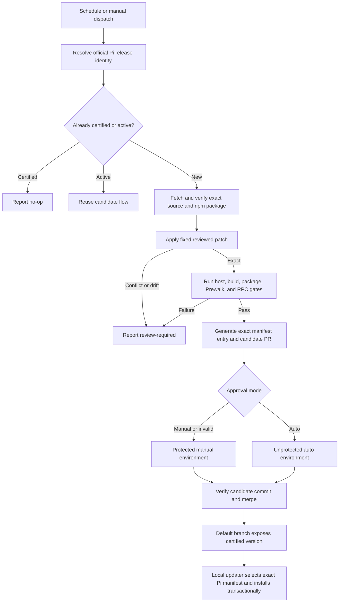
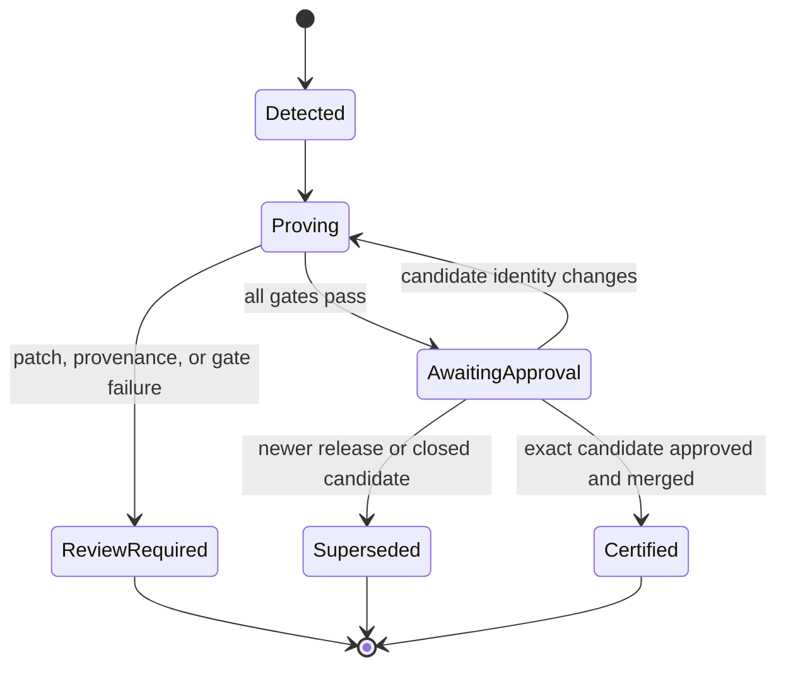

> **Superseded:** This plan described a patched-Pi updater and compatibility-PR architecture that is no longer the product direction. Use [`2026-08-03-001-feat-faithful-core-compatibility-and-drift-brief.md`](2026-08-03-001-feat-faithful-core-compatibility-and-drift-brief.md) instead. This historical plan is preserved for context and must not be implemented as written.

# Automated Pi Compatibility - Plan

## Goal Capsule

Maintain Prewalk compatibility with new official Pi releases through a deterministic, agent-free GitHub Actions pipeline. The pipeline detects a new release, applies the existing reviewed host patch without adaptation, proves the same behavioral invariants as the current updater, and proposes an exact compatibility entry. A repository setting selects manual or automatic approval, with manual as the fail-closed default. The existing local updater remains responsible for verified source builds and recoverable installation; the automation does not intercept `pi update` or invent patch changes.

---

## Product Contract

### Summary

Prewalk currently supports one exact Pi release through a digest-bound patch and a defensive local updater. This plan adds repeatable release detection and compatibility certification around that design rather than replacing it with an agent or a self-modifying patcher. Routine compatible releases should require little or no code work; incompatible releases must stop with review-required evidence.

### Problem Frame

An ordinary Pi self-update replaces the patched host. The current manifest is hard-coded to Pi `0.82.1`, so a newer official installation becomes unsupported until a new manifest entry and patch compatibility have been reviewed. Repeating those checks manually is slow and error-prone, while automatically rewriting the patch would undermine the updater's fail-closed security model.

The desired outcome is narrow: automate detection, deterministic proof, metadata preparation, and an approval-controlled merge. Semantic changes that invalidate the fixed patch remain human engineering work. Upstream acceptance of a native session-only model-and-thinking API remains the permanent exit from downstream patch maintenance.

### Requirements

#### Release discovery and candidate preparation

- R1. The system detects a newer official `@earendil-works/pi-coding-agent` release on a non-hourly daily schedule and by manual dispatch, then binds the candidate to exact package version, release tag, source commit, source archive, and npm package identities.
- R2. Repeated detection of the same version is idempotent: it updates or reuses one candidate branch and pull request rather than creating duplicates.
- R3. The candidate applies one checked-in, reviewed session-only handoff patch exactly. Patch conflicts, changed paths, digest drift, or source-shape drift produce a review-required result and no compatibility entry.
- R4. Automation never uses an LLM, coding agent, provider request, generated patch, fuzzy conflict resolution, private Pi runtime mutation, or compiled-file surgery.

#### Compatibility proof

- R5. A candidate is certifiable only after source provenance, patch scope, focused Pi host tests, offline build, package construction, staged candidate validation, Prewalk tests and typecheck, and synthetic same-session RPC checks all succeed.
- R6. Compatibility proof preserves the existing observable invariants: authenticated atomic live model/thinking change, no saved-default or transient-selection persistence, correct event ordering, extension-reload retention, replacement-session restoration, and unchanged conventional model controls.
- R7. Provider-backed canaries remain explicit operator-only evidence and never participate in scheduled detection, approval, merge, or routine release gates.
- R8. A compatibility entry is generated from the proven candidate and includes all exact digests and gate descriptors required by the existing manifest. Semver alone never certifies compatibility.

#### Approval and publication

- R9. Every successful candidate produces a reviewable pull request containing only compatibility metadata and any required test fixture or documentation updates. Automation never changes the canonical patch; a release that requires patch-content changes remains review-required until that patch is updated separately through normal review.
- R10. A repository-level approval setting supports `manual` and `auto` modes. Missing, empty, or invalid values resolve to `manual`.
- R11. Manual and automatic modes consume the same immutable candidate record, which binds the upstream release identity, source and npm digests, canonical patch digest, gate descriptors and outcomes, generated compatibility diff, workflow run, and candidate commit. Approval changes whether the proven pull request waits for a reviewer; it cannot bypass, weaken, rerun around, or waive a failed gate.
- R12. Manual mode pauses the merge job behind a reviewer-protected GitHub environment. Auto mode uses an unprotected environment and merges only the exact checked candidate after all required checks remain green.
- R13. Concurrent runs are serialized per candidate version. A newer upstream release, changed candidate commit, closed pull request, or superseded run invalidates stale approval and requires proof against the current identity.

#### Updater and operator experience

- R14. The local updater selects compatibility data by the detected Pi version and continues to validate platform, architecture, package manager, executable topology, patch digest, source digests, candidate package, attestation, and recovery state before mutation.
- R15. Existing updater transaction, rollback, uninstall, hostile-archive, ownership, and redaction guarantees remain intact across multiple supported versions.
- R16. The project documents the supported update order and recovery path without shadowing, wrapping, or intercepting Pi's built-in update command.
- R17. The workflow uses standard GitHub-hosted runners and remains suitable for free execution in the public repository. Manual dispatch remains available because GitHub can delay schedules and disables inactive public-repository schedules after 60 days.

### Scope Boundaries

#### In scope

- Deterministic release detection, exact candidate preparation, compatibility gates, candidate pull requests, and approval-controlled merge.
- A simple repository setting that switches manual versus automatic approval without code changes.
- Multi-version manifest selection in the current updater.
- Tests and operator documentation for the new maintenance flow.

#### Deferred to Follow-Up Work

- Publishing a prebuilt patched Pi distribution. The current verified-source local build remains the smaller trust surface.
- A dedicated command that orchestrates Pi extension update, Pi self-update, and Prewalk repatching in one process.
- Additional platforms, architectures, package managers, or installation topologies beyond independently reviewed manifest entries.

#### Out of scope

- Agent-authored or automatically repaired patches.
- Automatic compatibility claims after a patch conflict or changed host invariant.
- Provider canaries in CI or any test that spends model credits.
- Direct modification of Pi's updater or interception of `pi update`.
- Treating a source patch as permanent after Pi ships an equivalent public API.

### Acceptance Examples

- AE1. A new Pi release retains the reviewed source shape; the fixed patch applies, every deterministic gate passes, and one compatibility pull request is opened with an exact new manifest entry.
- AE2. The approval setting is absent; the candidate waits at the protected manual environment until an authorized reviewer approves it.
- AE3. The approval setting is `auto`; the exact green candidate merges without a reviewer, but only after the same checks required by manual mode.
- AE4. The patch applies but a persistence or RPC invariant fails; no manifest entry is proposed or merged, regardless of approval mode.
- AE5. Pi changes a patched file or lands a native equivalent API; the run reports review-required and preserves the currently supported release unchanged.
- AE6. Two scheduled runs detect the same version; one candidate flow proceeds and the other exits without a duplicate pull request or stale merge.
- AE7. A user runs the updater against a Pi version absent from the certified manifest; it refuses before modifying the live installation.

---

## Planning Contract

### Key Technical Decisions

- KTD1. Keep patch adaptation outside automation. The workflow may apply and test the checked-in patch, but any changed patch content requires a reviewed repository change. This preserves R3-R4 even when Git can apply the old diff cleanly.
- KTD2. Reuse the current updater's verified-source build and staged installation instead of distributing prebuilt patched Pi packages. This avoids introducing a second artifact trust root, platform build matrix, and installation format while satisfying R14-R15.
- KTD3. Resolve candidate identity from both the official release source and npm package metadata, then bind all generated data to the exact commit and package digests. A disagreement is source drift, not a value to guess through.
- KTD4. Use a repository variable with `manual` and `auto` values to select between two GitHub environments. `(session-settled: user-directed — chosen over a permanently manual gate: the operator wants automatic approval to be easy to turn on or off without editing workflow code.)` Invalid configuration selects the protected manual environment.
- KTD5. Keep proof and approval distinct. An unprivileged proof job runs upstream code with no persisted repository credentials or secrets, bounded time and storage, and read-only repository access. A separate write-capable job executes no upstream code; it accepts only schema-valid allowlisted outputs whose candidate-record digest matches the proof. The gated merge consumes that exact record and commit.
- KTD6. Keep provider validation outside certification. The synthetic provider and RPC harness prove host/extension control flow deterministically; real-provider variability, privacy, and cost make the canary unsuitable for R5.
- KTD7. Continue from the same compatibility workflow after a merge rather than depending on a workflow recursively triggered by actions performed with `GITHUB_TOKEN`. This avoids token-trigger ambiguity and keeps the privileged merge boundary explicit.
- KTD8. Treat an upstream native API as a review-required transition. Automation must not stack the downstream patch onto an equivalent upstream implementation or silently decide that the patch is obsolete.

### High-Level Technical Design

#### Compatibility and approval flow

#### Candidate lifecycle

### System-Wide Impact

- **Prewalk maintainers:** receive a compact compatibility pull request for routine releases and actionable failure evidence for changed releases.
- **Operators:** choose approval posture in repository settings and continue using the existing updater's fail-closed installation behavior.
- **Pi installation:** remains untouched by GitHub Actions; only the local updater performs a validated, recoverable replacement.
- **GitHub repository:** gains scheduled automation, two deployment environments, narrowly scoped workflow permissions, branch checks, and repository-variable configuration.
- **Security boundary:** untrusted upstream bytes are processed before privileged merge access. The merge job consumes only a proven repository commit and never executes newly fetched upstream code.

### Risks and Mitigations

- **A patch can apply while behavior changes elsewhere.** Encode session-state, persistence, lifecycle, and RPC invariants as required tests; default approval to manual and stop on any changed gate descriptor.
- **Workflow-created pull requests and token-trigger behavior can be surprising.** Attach proof to the candidate commit and keep merge/reconciliation in the owning workflow rather than relying on a secondary implicit trigger.
- **Upstream tests and build scripts are untrusted code.** Run them only in a credential-free, read-only proof job with explicit timeouts; cross into a write-capable job through a bounded, allowlisted, digest-bound candidate record that is parsed but never executed.
- **Auto approval increases blast radius.** Limit it to exact green candidates, select it through one validated variable, preserve branch checks, and make invalid configuration manual.
- **Schedules are not delivery guarantees.** Use an off-hour schedule, expose manual dispatch with an explicit version input, and document GitHub's 60-day inactivity behavior.
- **Concurrent or stale runs may merge the wrong evidence.** Serialize by version, invalidate superseded records, and use an atomic expected-head merge so a pull request changed after approval cannot win a check-to-merge race.
- **Generated manifest churn could hide meaningful changes.** Make generation deterministic and constrain candidate pull requests to the expected compatibility files.
- **Upstream may ship the required API.** Detect the public operation before patching and require a maintainer decision to retire or revise the patch.

---

## Implementation Units

### U1. Deterministic compatibility candidate builder

**Goal:** Extract release identity resolution, patch application, gate execution, and manifest-entry generation into a CI-safe deterministic command that never touches the live Pi installation.

**Requirements:** R1-R8; AE1, AE4, AE5.

**Dependencies:** None.

**Files:**

- `scripts/compatibility/prepare-candidate.mjs` — create
- `scripts/compatibility/release-identity.mjs` — create
- `scripts/compatibility/report.mjs` — create
- `updater/patches/session-only-model-handoff.patch` — create as the canonical reviewed patch asset
- `updater/supported-versions.json` — modify without changing the meaning of the existing `0.82.1` entry
- `package.json` — add deterministic compatibility scripts
- `test/compatibility.test.ts` — create
- `test/fixtures/compatibility/` — create bounded release, drift, conflict, and gate-result fixtures

**Approach:**

1. Separate installation discovery and live replacement from candidate preparation so CI can reuse provenance, archive-safety, hashing, patch-scope, gate, packaging, and validation logic without global mutation.
2. Resolve the requested or latest release to an exact cross-checked identity and return a no-op for an existing certified entry.
3. Apply only the canonical reviewed patch and verify its changed paths against the manifest allowlist.
4. Generate a stable manifest entry and redacted evidence summary only after every gate passes; emit a distinct review-required disposition for any drift or host-native API transition.

**Execution note:** Begin with fixtures that characterize the current `0.82.1` manifest and patch output before extracting shared updater logic.

**Patterns to follow:** `updater/update.mjs` manifest validation and gate ordering; `updater/node-adapters.mjs` archive, hashing, packaging, and synthetic RPC adapters; `test/updater.test.ts` injected failure and redacted-report patterns.

**Test scenarios:**

1. Covers AE1. Given matching official release and npm identities whose source accepts the canonical patch, candidate preparation runs all gate groups and emits one deterministic manifest entry with expected digests.
2. Given a version already present with identical identity and patch digest, preparation returns a certified no-op and writes no candidate files.
3. Covers AE4. Given an exact patch application followed by a failing focused host or RPC gate, preparation returns review-required and emits no manifest entry.
4. Covers AE5. Given a source-file digest mismatch, changed patch path, patch conflict, archive traversal, or native equivalent API, preparation fails before packaging and preserves existing compatibility data.
5. Given disagreement between release tag/commit and npm package version or integrity, preparation reports provenance drift rather than selecting either identity.
6. Given identical inputs in separate clean directories, generated manifest and evidence outputs are byte-identical and contain no credentials or absolute host paths.
7. Given a request to invoke a provider canary, routine candidate preparation rejects the unsupported gate rather than making a provider request.

**Verification:** A candidate can be prepared entirely in temporary CI storage, reproduces the existing `0.82.1` data, and cannot write a new entry after any provenance, patch, test, build, package, or RPC failure.

### U2. Multi-version fail-closed updater selection

**Goal:** Allow the installed updater to consume multiple independently certified compatibility entries while preserving every current installation and recovery guarantee.

**Requirements:** R14-R16; AE7.

**Dependencies:** U1.

**Files:**

- `updater/cli.mjs` — replace the hard-coded `0.82.1` lookup with exact detected-version selection
- `updater/update.mjs` — expose shared candidate preparation boundaries without weakening commit/recovery logic
- `updater/node-adapters.mjs` — separate CI-safe staging adapters from live installation adapters where required
- `updater/cli.d.mts` — update command contracts
- `updater/update.d.mts` — update shared contracts
- `test/updater-cli.test.ts` — extend version selection and refusal coverage
- `test/updater.test.ts` — extend multi-version transaction coverage

**Approach:**

1. Detect the live package identity before selecting a manifest, then require an exact version entry whose platform, architecture, manager, topology, source, patch, and gate descriptors all validate.
2. Keep transaction locking, journal recovery, candidate validation, backup, swap, rollback, attestation, no-op verification, uninstall, and owned cleanup downstream of exact selection.
3. Make unsupported and ambiguous versions produce concise redacted guidance to update the Prewalk package or await compatibility review; never fall back to the nearest semver entry.

**Patterns to follow:** `runCli()` and `executeCliMode()` in `updater/cli.mjs`; `runUpdater()`, `commitCandidate()`, and recovery helpers in `updater/update.mjs`; topology checks in `updater/node-adapters.mjs`.

**Test scenarios:**

1. Covers AE7. Given an installed Pi version absent from `versions`, every operational mode refuses before staging or renaming the live package.
2. Given two valid manifest entries, the updater selects only the exact detected version and loads only that entry's patch.
3. Given an entry whose version matches but platform, architecture, manager, topology, patch digest, or gate descriptor differs, the updater refuses before live mutation.
4. Given a matching patched attestation, repeated update verifies installed-file hashes and returns a no-op for the selected version.
5. Given a selected newer version and an interrupted swap, recovery restores or completes only paths owned by that manifest and does not cross-use the older entry.
6. Given uninstall without a valid retained backup, the updater rebuilds the exact selected official release and never substitutes latest Pi.
7. Existing hostile archive, lock ownership, concurrent recovery, rollback, journal corruption, attestation tampering, and redaction tests continue to pass for the original entry.

**Verification:** Both the original and a fixture second version follow exact selection, full staging, transaction, recovery, and uninstall behavior; unsupported versions remain unchanged.

### U3. Scheduled compatibility proof and candidate pull request

**Goal:** Run candidate preparation on GitHub's public standard runners and create one auditable compatibility pull request only for a fully proven release.

**Requirements:** R1-R9, R13, R17; AE1, AE4-AE6.

**Dependencies:** U1, U2.

**Files:**

- `.github/workflows/pi-compatibility.yml` — create scheduled, manual, candidate, and pull-request lifecycle
- `scripts/compatibility/github-candidate.mjs` — create idempotent branch/pull-request reconciliation
- `test/compatibility-workflow.test.ts` — create structural and policy tests for the workflow
- `README.md` — document workflow status and manual dispatch entry point

**Approach:**

1. Run at an off-hour daily schedule and by manual version input, with concurrency scoped to the candidate version.
2. Run all fetched upstream code in a dedicated proof job with no secrets, no persisted checkout credential, read-only repository permissions, and bounded execution time and storage.
3. Cross into a separate write-capable job through a bounded candidate record that cryptographically binds upstream identities, patch and gate descriptors, generated diff, workflow run, and evidence digest. The write job parses only allowlisted data and executes no upstream content.
4. Reconcile by exact upstream identity and candidate-record digest so retries update one pull request, certified versions no-op, and superseded runs cannot overwrite newer evidence.
5. Attach a compact redacted report listing exact identities and gate outcomes; retain verbose logs only within bounded Actions retention.

**Patterns to follow:** Existing package scripts and deterministic smoke harness; GitHub's documented least-privilege `GITHUB_TOKEN`, schedule, manual-dispatch, concurrency, and environment patterns.

**Test scenarios:**

1. Covers AE1. A new compatible version creates one branch and pull request containing only expected manifest, fixture, and documentation changes; the canonical patch remains byte-identical.
2. Covers AE6. Concurrent and retried runs for the same version converge on one candidate; a stale run cannot replace a newer candidate SHA.
3. A certified version exits successfully without a branch, pull request, or write-token use.
4. Covers AE4. Any failed candidate gate produces a review-required summary and no write-capable job.
5. Manual dispatch of an explicit older, unknown, or already certified version returns the correct refusal or no-op disposition.
6. The proof job has no write token or secrets, and a malicious upstream build script cannot use persisted checkout credentials to modify the repository.
7. The workflow contains no provider credentials, model invocations, agent actions, unpinned mutable script input, or billable larger runner requirement.
8. A candidate artifact containing an unexpected path, executable payload, oversized output, malformed record, or mismatched digest is rejected by the write job before repository mutation.
9. Invalid upstream archive content and fork-originated pull-request data never reach a privileged execution step.

**Verification:** A dry-run fixture and a repository test branch prove no-op, success, review-required, retry, and stale-run behavior without touching the default branch.

### U4. Configurable approval and exact candidate merge

**Goal:** Let the repository owner switch between reviewer approval and automatic merge without changing code or weakening compatibility proof.

**Requirements:** R10-R13; AE2, AE3, AE6.

**Dependencies:** U3.

**Files:**

- `.github/workflows/pi-compatibility.yml` — add gated merge jobs sharing one candidate contract
- `scripts/compatibility/approval-policy.mjs` — create strict mode resolution and candidate verification
- `test/compatibility-workflow.test.ts` — extend approval, stale SHA, and permission scenarios
- `docs/compatibility-maintenance.md` — create environment and repository-variable setup guide

**Approach:**

1. Resolve the repository variable to `manual` or `auto`, defaulting every missing or malformed value to `manual`.
2. Route manual mode through a reviewer-protected environment and auto mode through an unprotected environment; both invoke the same merge logic with the same permissions.
3. Immediately before merge, verify the pull request head SHA, full candidate-record digest, required checks, open state, approval identity, and absence of supersession; merge through an expected-head compare-and-merge operation so a concurrent head change fails atomically.
4. After merge, verify the default branch contains the exact compatibility entry within the same workflow instead of relying on an implicit token-triggered follow-up run.

**Patterns to follow:** GitHub environment required-reviewer protections, repository configuration variables, branch protection checks, and explicit `GITHUB_TOKEN` permissions.

**Test scenarios:**

1. Covers AE2. Missing, empty, misspelled, or unsupported approval values select manual mode and cannot enter the auto environment.
2. Covers AE3. Auto mode merges the exact green candidate after all checks without a reviewer.
3. Manual mode cannot merge before the protected environment is approved, and an approval for one candidate-record digest does not carry to a changed SHA, workflow rerun, regenerated diff, or superseding release.
4. Either mode refuses merge when a required check fails, is cancelled, is missing, or belongs to a different candidate commit.
5. A closed, modified, superseded, or already merged pull request produces an idempotent terminal result without merging another branch.
6. Changing the repository variable affects only approval posture; candidate preparation, patch scope, gates, and evidence remain identical.
7. The merge job has only the repository permissions required to verify and merge the candidate, does not execute fetched upstream code, and fails an atomic merge when the expected head no longer matches.

**Verification:** Repository administrators can toggle approval mode in settings, manual mode demonstrably waits, auto mode demonstrably proceeds, and both merge the same proven candidate contract.

### U5. Operator documentation and compatibility lifecycle

**Goal:** Make routine upgrades, unsupported-version recovery, approval switching, and eventual upstream API retirement understandable without exposing unsafe shortcuts.

**Requirements:** R16-R17; AE5, AE7.

**Dependencies:** U2-U4.

**Files:**

- `README.md` — update supported-host and installation/update guidance
- `docs/compatibility-maintenance.md` — document routine, failed, and native-API transition flows
- `prewalk.example.json` — modify only if compatibility status needs a user-facing configuration example
- `test/package.test.ts` — verify published documentation and workflow assets are included as intended

**Approach:**

1. Explain that Pi updates remove the host patch, how to update the Prewalk package and re-run the certified updater, and how unsupported versions fail safely.
2. Document the one-setting manual/auto approval toggle, environment prerequisites, public-repository free-runner assumption, manual dispatch fallback, and schedule inactivity behavior.
3. Provide a maintainer response matrix for certified no-op, clean candidate, patch conflict, source drift, failed invariant, stale candidate, and native API detection.
4. Keep the optional provider canary separate with its existing privacy and cost warnings.

**Patterns to follow:** Existing `README.md` fail-closed language and `docs/plans/2026-07-29-003-feat-faithful-prewalk-session-handoff-plan.md` safety boundaries.

**Test scenarios:**

1. Package dry-run includes the compatibility scripts and required runtime documentation but excludes CI fixtures, evidence bundles, credentials, staging output, and provider transcripts.
2. Documentation names both approval values, states that invalid values are manual, and never suggests that approval can waive a failed check.
3. Update guidance does not claim to intercept Pi's command or silently preserve the patch across a Pi self-update.
4. Native-API guidance sends the maintainer to review/retirement rather than applying the downstream patch automatically.

**Verification:** A new maintainer can enable the workflow, choose approval posture, interpret every terminal status, and recover from an unsupported Pi update using documented, fail-closed steps.

---

## Verification Contract

### Required Gates

1. **Static contract:** Typecheck, formatting/lint, workflow syntax/policy checks, deterministic manifest generation, patch allowlist, and package-content audit pass.
2. **Prewalk behavior:** Existing coordinator and extension suites remain green, including checkpoint, mutation ordering, handoff, privacy, cancellation, and lifecycle behavior.
3. **Updater safety:** Existing and new updater suites prove archive containment, provenance, exact version selection, gate order, staged validation, lock/journal recovery, rollback, attestation, uninstall, ownership, and redacted output.
4. **Pi host behavior:** Focused extension runner and agent-session model extension suites prove auth-before-mutation, atomic state visibility, thinking clamp, event behavior, no-op behavior, and no persistence.
5. **Build and package:** Official source builds offline, the coding-agent package packs and installs into isolated staging, and the staged package passes API and executable inspection.
6. **RPC integration:** Synthetic same-process RPC proves session continuity, target model/thinking state, mutation-result ordering, byte-identical saved settings, no transient selection entries, reload retention, and replacement-session restoration without a provider request.
7. **Workflow lifecycle:** Fixture or test-repository runs prove schedule/manual discovery, credential-free proof execution, bounded artifact handoff, candidate idempotency, review-required failure, manual waiting, auto merge, stale record/SHA refusal, atomic expected-head merge, and exact post-merge reconciliation.

### Evidence Rules

- Every compatibility pull request identifies the exact Pi version, tag, commit, archive and npm identities, patch digest, changed-path allowlist, workflow run, candidate SHA, named gate outcomes, and one digest over the complete candidate record.
- Evidence is redacted and contains no credentials, provider payloads, full transcripts, absolute workstation paths, or live installation contents.
- Failed gates retain enough bounded logs for diagnosis but never create or modify a supported-version entry.
- Approval is recorded by the GitHub environment/merge history and is bound to both the candidate-record digest and candidate SHA; it is not duplicated as an editable manifest claim.

---

## Definition of Done

- A public-repository GitHub Actions workflow detects a new official Pi release on schedule and by manual dispatch without invoking agents or providers.
- The fixed reviewed patch either applies exactly and passes all deterministic gates or stops with review-required evidence.
- One idempotent compatibility pull request carries the exact generated manifest data for a successful candidate.
- The repository owner can switch between manual and automatic approval through one validated repository setting, with manual as the default.
- Both approval modes merge only the exact green candidate and cannot waive or bypass failed checks.
- The local updater supports exact multi-version selection while retaining all existing transaction, rollback, recovery, uninstall, and redaction guarantees.
- Documentation accurately explains cost assumptions, approval configuration, Pi update behavior, unsupported-version recovery, and native-API retirement.
- Existing 147-test Prewalk baseline and focused Pi host/RPC/build/package gates remain green, with provider canary and live global mutation intentionally outside routine CI.

---

## Sources and Research

- `updater/update.mjs` — existing provenance, staging, gate ordering, transaction, and recovery boundaries.
- `updater/cli.mjs` — current hard-coded manifest selection and operator modes.
- `updater/node-adapters.mjs` — existing source fetch, archive safety, build, pack, staged install, package inspection, and synthetic RPC facilities.
- `updater/supported-versions.json` — exact `0.82.1` compatibility contract to preserve and generalize.
- `test/updater.test.ts` and `test/updater-cli.test.ts` — current fail-closed and recovery coverage.
- `docs/research/prewalk-extension-only-feasibility.md` — rejected extension-only/private-state alternatives and required host seam.
- `docs/research/prewalk-implementation-verification.md` — RPC persistence and same-session verification findings.
- `docs/plans/2026-07-29-003-feat-faithful-prewalk-session-handoff-plan.md` — updater, manifest, privacy, and lifecycle invariants.
- [GitHub Actions billing](https://docs.github.com/en/billing/concepts/product-billing/github-actions) — standard GitHub-hosted runners are free for public repositories; private repositories use plan allowances.
- [Events that trigger workflows](https://docs.github.com/en/actions/reference/workflows-and-actions/events-that-trigger-workflows) — schedule/default-branch behavior, delay risk, 60-day public-repository inactivity disablement, and manual dispatch.
- [Managing environments for deployment](https://docs.github.com/en/actions/how-tos/deploy/configure-and-manage-deployments/manage-environments) — required reviewers, prevention of self-review, and public-repository plan availability.
- [Using configuration variables](https://docs.github.com/en/actions/how-tos/write-workflows/choose-what-workflows-do/use-variables) — repository/environment variable access and empty-value behavior.
- [Using `GITHUB_TOKEN`](https://docs.github.com/en/actions/security-for-github-actions/security-guides/automatic-token-authentication) — explicit least-privilege workflow authentication.
