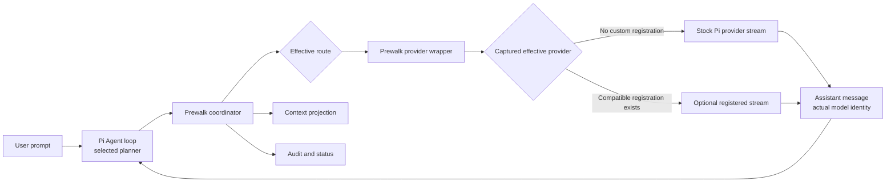

# Standalone Extension-Only Prewalk with Optional Provider Composition

> **Historical plan notice (2026-08-08):** This planning artifact predates the
> cross-provider executor work and the executor-context watchdog. Its current
> implementation claims are preserved as planning history, not as the release
> contract. Use [`docs/research/2026-08-07-omp-behavior-matrix.md`](../research/2026-08-07-omp-behavior-matrix.md)
> and `README.md` for the current behavior and remaining boundaries.

## Goal Capsule

Deliver a faithful extension-only reproduction of Oh My Pi's current Prewalk behavior that works on stock Pi without `pi-codex-conversion` or any other third-party provider extension. Sol-to-Luna remains the default and benchmark pair: Sol establishes the implementation trajectory, then Luna inherits the same live transcript after the OMP handoff gate while Pi continues to select and save Sol.

Prewalk may compose with an already registered provider stream, including `@howaboua/pi-codex-conversion`, but that composition is optional. Provider-neutral same-provider and same-API pairs such as Opus-to-Sonnet are configurable in this release. Cross-provider routing remains deferred.

Normal Pi compaction must preserve the OMP trajectory without a Prewalk-specific summary or prompt-rehydration subsystem. Codex Conversion native Responses compaction is a separately characterized optional profile because its current implementation reconstructs input from persisted session entries and selects its compaction model from Pi's selected model.

---

## Product Contract

> **Product Contract preservation:** R1 through R25 and R27 through R28 retain the previously confirmed OMP fidelity, lifecycle, visibility, reload-state, and benchmark intent. R1, R2, R11 through R21, R23, and R25 are generalized from fixed labels to a validated configured pair while retaining Sol-to-Luna as the default. R26 is replaced with the current standalone-first compatibility contract. R29 through R36 record the user's correction that Codex Conversion and its native compaction must remain optional integrations.

> **2026-07-30 planner-authority amendment:** Pi's selected runtime model and reasoning are authoritative when each Prewalk epoch starts. Prewalk configuration stores only the executor model and executor reasoning defaults. Every reference below to a "configured planner," a planner picker, or a saved planner is superseded by that rule. Before handoff, Pi's normal Shift+Tab control updates the epoch's planner reasoning. After handoff, Prewalk consumes Shift+Tab for executor reasoning. An explicit model change cancels the active epoch, and the next epoch derives its planner from Pi's newly selected model. The executor must still share the snapshotted planner's provider and API and satisfy the existing capacity and authorization checks.

### Summary

Prewalk replaces the patched runtime with a supported stock-Pi extension. It reproduces current OMP planning, todo, continuation, mutation, and handoff behavior; routes only primary Agent-loop requests through the effective planner or executor; and leaves Pi's selected and saved model unchanged.

The provider seam has two valid lanes:

1. When no extension has registered a provider stream, Prewalk delegates through stock Pi's public provider implementation.
2. When another extension has registered a config-based `streamSimple`, Prewalk wraps and delegates through that stream without importing, configuring, or depending on the owning package.

The installed provider implementation changes transport behavior, not whether Prewalk can operate.

A complete extension-native `Provider` registration is outside the safe composition surface in Pi 0.83.0 because installing a config-based wrapper would delete that native registration. Prewalk must detect this case, leave it untouched, and fail closed with actionable status.

### Problem Frame

The current local implementation originated around a patched Pi model-control API. Stock Pi's public `setModel()` persists its choice, so it cannot produce an ephemeral executor while preserving the planner as the model selected on a new or reopened session.

Pi 0.83.0 already exposes the public provider registry, effective provider lookup, model and credential lookup, lifecycle events, context projection, compaction preparation, custom entries, commands, UI controls, and status rendering required for a standalone provider overlay. Its built-in `openai-codex` provider includes Sol, Luna, OAuth, and a stock `streamSimple` implementation.

The current dirty provider-overlay implementation incorrectly throws when an `openai-codex` pair has no prior custom stream. That behavior is not a product requirement. It also omits the provider API when installing the no-prior-registration lane, which stock Pi rejects. Implementation must replace this coupling rather than preserve it.

### Fidelity Authority and Adaptations

- **Canonical behavior:** OMP `main` at revision [`4df68d60438423b384b2b47fb3d6835641624757`](https://github.com/can1357/oh-my-pi/tree/4df68d60438423b384b2b47fb3d6835641624757) is the behavioral authority for the coordinator, three prompt files, gate, and applicable tests.

- **Prompt reuse:** OMP and this work are MIT-licensed. Prewalk injects the exact prompt bytes as ordinary hidden custom messages through Pi's public `sendMessage()` surface, matching OMP's direct steering model. The planning nudge is removed from effective context at handoff. Continuation and executor-checklist messages remain ordinary hidden history.

- **Handoff adaptation:** OMP uses a host-owned temporary model switch. Prewalk substitutes the executor model only at the public provider seam because Pi's persistent model selection would violate the reopen contract.

- **Mutation adaptation:** Current OMP recognizes completed `edit` and `write` results. Prewalk additionally requires success-only handling and recognizes direct or shell-driven `apply_patch` because Pi may expose patching through either tool path.

- **Secondary research:** [`ThewindMom/pi-prewalk` at `5f0a80432679867ff04cbcee20620b4a7168070b`](https://github.com/ThewindMom/pi-prewalk/tree/5f0a80432679867ff04cbcee20620b4a7168070b) informs configuration, status, mutation, context, and test edge cases only. Its persistent `setModel()` flow, stale prompt differences, compatibility fallbacks, and fake-harness-only proof do not govern this release.

- **Optional provider research:** `howaboua-pi-stuff` `main` at [`18c8366a0af0a88c25e5309ec634cda3157687ab`](https://github.com/IgorWarzocha/howaboua-pi-stuff/tree/18c8366a0af0a88c25e5309ec634cda3157687ab), package version 3.0.4, is the authority for optional Codex Conversion composition and native compaction characterization. It is not an implementation foundation.

### Key Decisions

- **Stock Pi standalone is the primary release path.** Prewalk must install, configure, run, reload, cancel, compact, and uninstall with no Codex Conversion package present.

- **Provider composition is capability-based.** Prewalk wraps the effective provider stream available through Pi's public registry. It never branches on an extension package name or reads another extension's private configuration.

- **Sol-to-Luna remains the default.** The shipped example, status examples, authenticated canary, and comparative benchmark use Sol-to-Luna.

- **Same-provider configuration is in scope.** `/prewalk configure` may select any validated planner/executor pair sharing a provider and API, including Opus-to-Sonnet. Cross-provider pairs remain deferred.

- **Normal Pi compaction follows OMP's message lifecycle.** Prewalk scrubs only the planning nudge at handoff. Continuation and executor-checklist messages remain normal hidden history, and Prewalk does not create a separate summary or stage-aware prompt-rehydration path.

- **Native Codex compaction is conditional.** Current Codex Conversion 3.0.4 compacts the selected planner model from persisted entries. Prewalk must not claim executor-owned native compaction or silently enable an unproven profile.

- **The human owns persistent routing configuration.** The native `/prewalk configure` wizard and documented JSON file are the only configuration paths. The model cannot invoke a tool that changes the persisted pair.

- **OMP is the simplicity baseline.** Prewalk adds a subsystem only when stock Pi's extension boundary requires an adaptation or this product contract requires an observable user control. Every deviation from OMP must name that reason and carry a focused test; no speculative fallback, generalized compatibility layer, or duplicate state is allowed.

### Actors

- A1. **Pi user:** Selects the planner, configures a pair, observes effective routing, and retains control over cancellation and model selection.
- A2. **Configured planner:** Explores the task, creates the todo trajectory, and lands the first successful mutation.
- A3. **Configured executor:** Inherits the same session transcript and continues after the gate.
- A4. **Prewalk extension:** Owns arming, hidden guidance, gate tracking, provider routing, status, minimal reload state, and scoped cleanup.
- A5. **Pi host:** Owns the selected model, saved settings, transcript, extension lifecycle, model registry, provider registry, and normal compaction.
- A6. **Optional config-based provider implementation:** May supply a public `ProviderConfig.streamSimple` that Prewalk preserves through delegation. Its absence is normal.

### Requirements

**Session lifecycle**

- R1. On `startup`, `new`, `resume`, or `fork`, an eligible session with the configured planner already selected must reset prior live-run state and arm one automatic handoff. `reload` must restore the same run epoch without creating another automatic arm.

- R2. Prewalk must never change Pi's selected or saved model. An explicit user model change cancels Prewalk, removes its effective route, preserves the user's selection, and suppresses automatic re-arming until the next live session.

- R3. The hidden planning, continuation, and executor-checklist messages must match OMP's three canonical prompt files byte for byte, retain required attribution, and return to requirements review before any byte changes.

- R4. Automatic arming lets the planner complete its first assistant turn before injecting the planning prompt. Manual arming injects it before the next eligible planner turn without starting a provider request.

- R5. The planning prompt remains hidden from A1, requires the bundled normal todo workflow when `todo` is active, and continues the same planner run rather than ending on a plan. When `todo` is inactive, the prompt bytes remain unchanged and the gate bypasses the todo requirement.

- R6. OMP's bounded continuation transitions apply: planning starts with one pending continuation, tool progress re-arms one continuation, a prose-only turn consumes it, and another prose-only turn without intervening tool progress ends normally.

**Gate and mutation**

- R7. Prewalk bundles Pi's normal persistent `todo` implementation. Like OMP, the coordinator keys only on whether the resolved `todo` tool is active and whether a non-error `todo` result occurred. Pi's normal first-registration-wins rule determines which `todo` implementation is active; Prewalk does not add an ownership-policing subsystem.

- R8. After the gate opens, the first successful `edit`, `write`, direct `apply_patch`, stock `bash` execution of `apply_patch`, or terminal `exec_command` execution of `apply_patch` becomes the planner's handoff mutation. Failed, cancelled, partial, still-running, quoted, commented, or print-only operations do not trigger.

- R9. Multiple eligible tool results in one assistant turn produce one deterministic handoff after all results from that turn are available.

- R10. Before the executor's first primary Agent-loop request, the planning nudge is absent from effective context while the visible transcript, todo trajectory, planner mutation and result, continuation history, and exact executor checklist remain available. Because stock Pi session entries are append-only, the extension may apply a narrow public-context or compaction-preparation filter for the planning nudge after handoff; it must not filter continuation or checklist history or build a general prompt-scrubbing framework.

**Effective model and status**

- R11. Compact status contains only the configured planner and executor labels, their reasoning levels, the effective side, and one short declarative state clause in the shape `prewalk: planner / executor`. Color reinforces the state but is never the only signal. Selected-model, trigger, provider-lane, failure, and recovery details belong in `/prewalk status`, not the footer. The default renders as `prewalk: 5.6 Sol / Luna`.

| ID | State | Required status behavior |
| --- | --- | --- |
| R12. | Armed planner | Mark the planner active and explain in detailed status that todo is still required when active. Default: `prewalk: [5.6 Sol] / Luna`. |
| R13. | Gate-ready planner | Mark the planner active with `ready`, and explain that the next successful eligible mutation schedules the switch after that turn. |
| R14. | Active executor | Mark the executor active. Every later primary request in the live session routes to it. Default: `prewalk: 5.6 Sol / [Luna]`. |
| R15. | Completed handoff | Keep the executor active and report the trigger after its first primary stream succeeds. Auxiliary streams cannot activate or complete the handoff. |
| R16. | Cancelled | When Pi still selects the planner, mark the planner with `cancelled`. After another model is selected, mark neither side and show the selected model. Scrub stale guidance and do not re-arm in the live session. |
| R17. | Failed | Mark the route that actually failed and show a stable reason in detailed status. A pre-handoff failure stays on the planner. An executor failure keeps the executor route until cancellation or session replacement. |

- R18. Prewalk must not patch Pi, import private Pi modules, call persistent `setModel()` for handoff, create a synthetic router model, retain patch/updater machinery, or inspect another extension's private state.

- R19. The provider overlay must capture the effective public provider implementation before installation. It delegates through stock Pi or a captured config-based `streamSimple`, installs a wrapper with the configured API, validates terminal provider/model identity, and restores the captured stream only while its wrapper still owns the current stream slot. If a later config-only registration changes other fields but leaves Prewalk's wrapper installed, cleanup preserves those newer fields while restoring the captured stream. If another stream or native provider takes ownership, Prewalk leaves it untouched. It must not depend on the local fork-only `streamImplementationId` API.

- R20. Planner and executor models must resolve through Pi's public model registry with independent authorization. The pair may use different providers and APIs, and a smaller executor is allowed because Prewalk validates the exact outgoing request against the executor's context reserve immediately before transport. Model metadata and auth validate when arming. Executor pressure triggers public Pi compaction and a bounded checklist retry; a later provider-native overflow remains visible rather than silently selecting a different model.

- R21. Executor-authored assistant messages and usage records retain the executor's actual provider and model identity even though Pi continues to select and save the planner.

- R22. Prewalk persists one minimal versioned run-state snapshot per meaningful transition, and the latest valid snapshot is the sole reload authority. Phase is authoritative; effective route and prompt eligibility derive from phase except that a failed state records which route failed. The snapshot uses stable allowlisted fields and never contains prompt bodies, transcript content, credentials, request payloads, raw provider or tool errors, headers, filesystem paths, or provider responses. Because no standalone release exists yet, implementation replaces the unreleased record shape and rejects obsolete records instead of carrying a compatibility parser.

**Validation and measured outcomes**

- R23. Current OMP tests are the primary parity suite. Every canonical coordinator and startup-degradation scenario is classified as directly applicable, Pi-adapted, or excluded with a written rationale.

- R24. Secondary tests add valuable edge coverage for successful and failed mutations, direct and shell-driven `apply_patch`, false positives, parallel results, inactive todo, cancellation, hidden-prompt scrubbing, reload, and bounded continuation without redefining OMP-owned behavior.

- R25. Validation includes both a mocked extension harness and real Pi Agent-loop integration. Agent-loop coverage runs actual extension events and provider composition rather than hand-calling callbacks.

- R26. Compatibility evidence targets installed Pi 0.83.0 as the standalone baseline. Optional Codex Conversion evidence targets package 3.0.4 at upstream revision `18c8366a`, and neither its installation nor a specific load order may be required for standalone success.

- R27. Before removing the experimental label, the paid benchmark compares planner-only, executor-only, and Prewalk on one frozen corpus of at least 20 independently validated tasks, with five attempts per task and arm. It reports pass rate, provider cost, elapsed duration, prohibited lookup attempts, and every failed or invalid run.

- R28. The benchmark policy is frozen before model runs. Prewalk must stay within 5 percentage points of planner-only quality, improve median provider cost or elapsed duration by at least 15 percent against planner-only, exceed executor-only quality by at least 10 percentage points, keep the non-winning cost or duration metric within 5 percent, and not exceed planner-only's prohibited-lookup rate. An explicitly experimental package may ship before these results exist, but no normal release verdict or public numeric quality, cost, or time claim is permitted before R27's five-attempt study.

**Standalone, optional composition, configuration, and compaction**

- R29. With no third-party provider extension installed, the default Sol-to-Luna flow must complete through stock Pi's built-in `openai-codex` provider. Missing Codex Conversion must never produce a configuration or startup failure.

- R30. When an extension has registered a compatible config-based stream for the configured provider, Prewalk must preserve that effective transport through public delegation. It must work when the registration exists before Prewalk arms, survive both package-list orders where Pi lifecycle semantics permit it, fail visibly on later provider drift, and never overwrite the later owner. A complete extension-native provider registration must remain untouched and produce `unsupported-provider-composition`.

- R31. A missing config uses the built-in Sol-to-Luna default in memory without writing a file. A malformed config is a distinct setup error. `/prewalk configure` uses Pi's native `ctx.ui.select` and `confirm` surfaces in this order: planner, filtered compatible executor, filtered executor reasoning, and one confirmation summarizing the result. No free-form input is required. When a run is active, confirmation states that a successful save cancels and resets that run. Prewalk validates and atomically saves the new config before cancelling the old run; a cancelled wizard or failed save changes neither the persisted config nor the live run. Headless users can edit the documented JSON schema.

- R32. `/prewalk help` and `/prewalk --help` explain setup, status, automatic and manual runs, ready/switching language, cancellation, reset, configuration, reasoning, provider constraints, compaction profiles, troubleshooting, and uninstall behavior. `/prewalk reset run` cancels the current run and starts a fresh manual epoch with the current configuration when the configured planner is selected. `/prewalk reset config` atomically restores the saved reset profile as the active configuration; the packaged reset profile is Sol-to-Luna, while `/prewalk configure` may replace the saved reset profile only through a separate explicit confirmation. A failed reset write preserves the current configuration and run. `/prewalk status|run|cancel|reset|configure` remain discoverable.

- R33. Normal Pi compaction must preserve OMP's ordinary hidden-message behavior. After handoff, the planning nudge must not re-enter executor context through a later compaction; continuation and executor-checklist messages remain eligible for normal summarization. Prewalk never injects a replacement stage prompt after compaction, and compaction never activates, completes, cancels, or reroutes a handoff. A version-pinned real Pi test must cover manual, threshold, and overflow preparation before any broader filtering is introduced.

- R34. Native Codex Responses compaction is not part of standalone Prewalk's core completion contract. With Codex Conversion 3.0.4, Prewalk must document and characterize that native compaction reads persisted session entries and targets `ctx.model`, which remains the planner. Full support requires a public prepared-message or exclusion contract plus an explicit planner-versus-executor compaction policy.

- R35. Release validation has independent lanes for stock Pi alone, a config-based registered stream, optional Codex Conversion with native V2 disabled, and normal Pi compaction. A complete native-provider test proves fail-closed preservation. A native V2 characterization test documents the current boundary without making the standalone lane red.

- R36. Codex Conversion must not be a runtime, peer, install, configuration, or startup dependency. It may exist as a pinned development-only compatibility fixture.

### Key Flows

1. **Standalone automatic flow:** A1 starts stock Pi with the configured planner selected. Prewalk arms without a request, reproduces the OMP trajectory, captures the first successful mutation, and delegates the next primary request to the executor through the stock provider implementation.

2. **Optional provider composition:** An extension has already registered a compatible config-based stream. Prewalk captures it, adds its routing wrapper, and delegates planner and executor calls through the captured stream. A complete native provider is left untouched and reported as unsupported composition.

3. **Native configuration:** A1 runs `/prewalk configure`, selects a planner, compatible executor, and supported executor reasoning, confirms the change, and receives clear guidance to select the planner if Pi currently selects another model.

4. **Handoff and shared transcript:** The planner opens todo and completes the first mutation. At `turn_end`, status changes to `switching after this turn`. The next primary request uses the executor with the same live session and truthful executor identity.

5. **Cancellation and model selection:** A1 cancels or selects another Pi model. Prewalk restores only its owned provider registration, removes the effective route, preserves Pi's selection, and suppresses same-session automatic re-arming.

6. **Reload:** The outgoing instance conditionally restores its captured stream without overwriting newer provider fields. The replacement reads the latest valid run-state snapshot and installs a fresh wrapper without adding an arm or request.

7. **Normal Pi compaction:** Pi compacts the ordinary transcript with the selected planner. After handoff, Prewalk ensures only that the old planning nudge cannot re-enter executor context; continuation and checklist history follow Pi's normal summarization behavior. No prompt is re-injected and the route and phase remain unchanged.

8. **Optional native Codex compaction:** When native V2 is enabled, Prewalk reports the compatibility limitation rather than claiming executor-owned compaction. Current behavior is characterized and an upstream contract is required before it becomes a supported profile.

### Acceptance Examples

- AE1. **Stock Pi, no Conversion**
  - **Given:** Pi 0.83.0 loads Prewalk with no custom `openai-codex` registration.
  - **When:** Sol completes the OMP todo and first-mutation gate.
  - **Then:** The next primary request uses Luna through stock Pi, Pi still selects Sol, and the Luna assistant message identifies Luna.
  - **Covers:** R1 through R10, R19 through R21, R26, and R29.

- AE2. **Optional Conversion composition**
  - **Given:** Codex Conversion 3.0.4 has registered a compatible effective stream and native V2 is disabled.
  - **When:** The same flow executes.
  - **Then:** Both planner and executor calls preserve Conversion transport behavior, but Prewalk contains no package-specific import, config read, or runtime requirement.
  - **Covers:** R19, R20, R26, R30, R35, and R36.

- AE3. **Provider-neutral Anthropic pair**
  - **Given:** A1 configures Opus-to-Sonnet with a shared provider/API and supported executor reasoning.
  - **When:** The pair validates and the planner is selected.
  - **Then:** Status uses the configured labels, the OMP gate remains unchanged, and the executor request resolves its own credentials and identity.
  - **Covers:** R11 through R21 and R31.

- AE4. **Invalid pair or reasoning**
  - **Given:** The models differ in provider or API, credentials are missing, or the executor does not support the chosen reasoning level.
  - **When:** A1 tries to save.
  - **Then:** The wizard explains the specific validation failure and leaves the prior config untouched.
  - **Covers:** R20 and R31.

- AE5. **Provider drift**
  - **Given:** Prewalk owns its wrapper.
  - **When:** Another extension replaces or materially changes the provider registration.
  - **Then:** Prewalk fails visibly, sends no misrouted request, and does not restore over the new owner.
  - **Covers:** R17, R19, and R30.

- AE5a. **Complete native provider protection**
  - **Given:** Another extension owns a complete native provider registration for the configured provider.
  - **When:** Prewalk evaluates the route.
  - **Then:** It leaves that provider untouched, reports `unsupported-provider-composition`, and sends no request through a replacement compatibility stream.
  - **Covers:** R17, R19, R30, and R35.

- AE6. **Normal Pi compaction**
  - **Given:** Prewalk is planning, active, completed, cancelled, or failed.
  - **When:** Pi compacts the session.
  - **Then:** State and routing do not change. After handoff, the old planning nudge is absent from executor context, while continuation and checklist history may be summarized normally. Prewalk injects no replacement prompt.
  - **Covers:** R10, R22, R33, and R35.

- AE7. **Native V2 characterization**
  - **Given:** Codex Conversion native V2 is enabled after handoff.
  - **When:** Its `session_before_compact` handler runs.
  - **Then:** Tests prove the current planner-owned target and persisted-entry input boundary. Prewalk does not label this profile fully supported.
  - **Covers:** R34 and R35.

- AE8. **Configuration cancellation**
  - **Given:** A1 starts the wizard with an existing valid config.
  - **When:** A1 cancels any step or rejects final confirmation.
  - **Then:** No file or live-run state changes.
  - **Covers:** R31.

- AE9. **Active-run reconfiguration**
  - **Given:** A run is armed or executor-routed.
  - **When:** A1 confirms a different pair.
  - **Then:** Prewalk atomically saves the new config, records a configuration-change cancellation for the old run, restores its wrapper, and starts a manual run only if Pi already selects the new planner. If the save fails, the old config and run remain unchanged.
  - **Covers:** R2, R19, R22, and R31.

- AE10. **Explicit reset paths**
  - **Given:** A1 has a custom active pair and a separately confirmed reset profile.
  - **When:** A1 runs `/prewalk reset run` or `/prewalk reset config`.
  - **Then:** Run reset creates a fresh manual epoch from the active pair, while config reset atomically restores the saved profile. Either write failure preserves the prior config and run.
  - **Covers:** R31 and R32.

- AE11. **Measured claims**
  - **Given:** The experimental package is ready for efficacy study.
  - **When:** Planner-only, executor-only, and Prewalk each run the frozen corpus five times.
  - **Then:** The report includes every required measure and failure and applies R28's release and public-claim thresholds. Until then, the package remains explicitly experimental and makes no numeric efficacy claim.
  - **Covers:** R27 and R28.

### Success Criteria

- Stock Pi 0.83.0 completes a real Agent-loop Sol-to-Luna handoff with no Codex Conversion package loaded.
- Before a normal release, the same behavioral suite passes through a config-based registered stream, and optional Codex Conversion 3.0.4 composition passes with native V2 disabled. These independent tracks do not block the first standalone experimental proof.
- The configured planner remains Pi's selected and saved model while executor messages, usage, status, and run state report the effective route truthfully.
- OMP prompts and applicable parity behavior remain exact, and every adaptation or exclusion is explicit.
- Normal Pi compaction preserves the useful trajectory without resurrecting the planning nudge after handoff and without a Prewalk-owned summary or prompt-rehydration subsystem.
- Native V2 is documented and tested as a current compatibility boundary, not silently advertised as supported.
- Package metadata and startup paths contain no runtime or peer dependency on Codex Conversion.
- A linked paid evaluation runs five attempts across the configured default planner, executor, and Prewalk arms before the experimental label or public-claim restriction can be removed.

### Scope Boundaries

**In scope**

- Standalone stock Pi provider routing.
- Sol-to-Luna defaults and benchmark.
- Configurable same-provider, same-API planner/executor pairs.
- Native Pi configuration UI, help, status, reasoning selection, cancellation, reset, and reload.
- Optional composition with config-based public provider streams, including Codex Conversion with native V2 disabled.
- OMP-parity normal Pi compaction behavior and native V2 characterization.
- OMP parity, Pi mutation adaptations, real Agent-loop coverage, installed smoke, and authenticated default-pair canary.

**Deferred**

- Cross-provider pairs and cross-provider credential normalization.
- Full native V2 support until Pi or Codex Conversion exposes a public prepared-message or exclusion contract and the compaction-model policy is settled.
- Complete native-provider wrapping until Pi exposes a public provider-layering API.
- Same-model effort-only handoffs and OMP task-agent configuration.
- An upstream Pi or Codex Conversion proposal, which follows concrete compatibility evidence and does not block standalone release.
- Paid comparative evaluation execution, which follows the implementation and controls normal-release and public-claim eligibility.

**Out of scope**

- Patching Pi, private imports, persistent handoff selection, synthetic router models, updater machinery, and package-specific private integration.
- Changing Codex Conversion settings from Prewalk.
- Treating native V2 planner-owned compaction as executor-owned.
- Preserving compatibility with the abandoned patched product.

### Dependencies and Assumptions

- OMP revision `4df68d60438423b384b2b47fb3d6835641624757` is the canonical fidelity authority.
- Pi 0.83.0 is the installed standalone target and exposes the required public provider and lifecycle APIs.
- Stock Pi's `openai-codex` provider includes Sol and Luna and can resolve their OAuth authorization.
- Codex Conversion 3.0.4 at `18c8366a` is an optional compatibility target only.
- Pi extensions share one trusted process. Provider ownership is enforced by captured public registration identity and drift checks, not isolation from malicious extensions.
- Pi's resolved active `todo` implementation owns todo behavior; Prewalk observes only active-tool presence and non-error results, matching OMP.
- Pi's public `sendMessage()` persists hidden custom messages and delivers their exact bytes to the model. The public sequential context hook can narrowly omit the planning nudge after handoff without changing continuation or checklist history.
- The benchmark curator freezes and validates the corpus without exposing gold patches or solution references to model runs.

### Planning Resolutions

No product decisions block implementation planning.

- Stock Pi standalone is the release baseline.
- Sol-to-Luna is the shipped default, while same-provider/API pairs are configurable now.
- Codex Conversion is optional transport composition.
- Normal Pi compaction follows OMP's ordinary message lifecycle and adds no stage-aware rehydration behavior.
- Native V2 remains unsupported for full fidelity until a public interoperability contract exists.
- The unresolved future product decision is whether native compaction should target Pi's selected planner or Prewalk's effective executor after handoff. It does not block standalone Prewalk.

---

## Planning Contract

### Key Technical Decisions

- KTD1. **Resolve transport through Pi's public provider surface.** Before installing its wrapper, Prewalk checks for a complete extension-registered native provider and fails closed without mutation when one exists. Otherwise it captures the effective provider through `ctx.modelRegistry.getProvider()` and any prior config registration. The wrapper delegates both planner and executor requests through the captured effective `streamSimple`, and installation supplies `api: planner.api`. It does not import Pi's deprecated compatibility entrypoint or use local fork-only recipient identity APIs.

- KTD2. **Own only the installed stream slot.** Routing verifies that Prewalk's wrapper is still the effective stream. Cleanup restores the captured stream while rebasing later config-only fields when the wrapper still occupies that slot. A later stream or native-provider owner ends Prewalk ownership, and cleanup leaves that registration untouched.

- KTD3. **Keep pairs same-provider and same-API.** This avoids cross-provider transport normalization and lets one provider wrapper substitute model metadata while Pi resolves each model's credentials independently. The executor must have at least the planner's context window. The wizard derives executor reasoning from Pi's supported levels and maps `off` to omission of the stream reasoning option. Startup validates metadata and auth; handoff validates the fully prepared executor context, exact checklist, and output reserve against executor capacity.

- KTD4. **Port OMP's compact coordinator.** One phase machine is authoritative for arming, todo readiness, switching, executor activation, completion, cancellation, and failure. It stores only the run identity, automatic/manual mode, continuation flag, todo-seen flag, trigger, and failed route that cannot be derived from phase. Prewalk bundles Pi's normal persistent todo implementation, but the gate follows OMP by observing whichever `todo` tool Pi resolved as active and its non-error results.

- KTD5. **Use direct hidden messages like OMP.** The extension sends the exact planning, continuation, and checklist prompts as hidden custom messages. At handoff, the sequential context hook omits only the planning nudge from the executor request. The latest minimal run-state snapshot is the reload authority and diagnostic record; there is no separate audit log, prompt-marker state machine, generic context scrubber, or post-compaction prompt re-injection.

- KTD6. **Select normal mutations directly at `turn_end`.** Pi's ordered terminal `toolResults` are the authority for edit, write, direct patch, and completed shell results, matching OMP's turn-boundary inspection. Only genuinely yielded `exec_command` or Code Mode continuations use a small session-id correlation map.

- KTD7. **Derive routing from phase.** Pi owns the selected planner and the coordinator owns phase. The wrapper derives planner or executor routing from that phase and records a separate route only for an ambiguous failed state. A one-use, non-persisted token created by the sequential context hook authorizes exactly the next primary Agent-loop request; every unmarked, stale, auxiliary, or concurrent stream stays on Pi's selected planner.

- KTD8. **Make configuration human-only and atomic.** `/prewalk configure` uses registry-backed selections rather than free-form input, validates before confirmation, writes an owner-only temp file, and atomically replaces the config only after confirmation. A successful replacement precedes cancellation of an active run, so write failure preserves the old config and run. Active configuration and the optional user-replaceable reset profile share one strict document. `/prewalk reset run` creates a fresh run from active config; `/prewalk reset config` atomically restores the saved reset profile. No model-facing tool changes configuration.

- KTD9. **Keep normal compaction ordinary.** Prewalk does not own summarization or reconstruct stage prompts after compaction. A version-pinned real Pi contract test proves that the post-handoff planning nudge stays out of manual, threshold, and overflow compaction paths; any narrow in-place preparation filtering required by stock Pi is limited to that nudge. Current Codex Conversion native V2 reads persisted entries and uses `ctx.model`; it receives a characterization test and documentation. Full support waits for a public prepared-input/exclusion hook and an explicit compaction-model policy.

- KTD10. **Prove Sol-to-Luna before generalizing.** Unit and harness tests cover deterministic state and UI. The first vertical slice is the default Sol-to-Luna pair through stock-Pi routing, a real Agent loop, and installed smoke. Same-provider pair configuration follows that proof. Registered-stream composition, Codex Conversion characterization, and complete native-provider protection run as independent pre-release compatibility tracks. The authenticated default-pair canary proves actual model identities. The comparative benchmark is a separate paid evaluation.

- KTD11. **Delete the patch product.** No patched declarations, updater, recipient identity shim, checkpoint tool, or compatibility fallback remains in the shipped package. Historical plans stay historical.

### High-Level Technical Design



Prewalk never creates a second session or copied summary. The executor receives the same branch, user messages, planner messages, todo results, first mutation, and tool result. Only phase-invalid hidden guidance is removed.

### Constraints and Invariants

- Production TypeScript narrows unknown input with guards and uses no type casts.
- The wrapper never calls itself, changes providers, or delegates an executor request with planner credentials.
- Auxiliary streams remain on Pi's selected planner and cannot activate or complete handoff.
- A failed executor stream never retries through the planner.
- Internal run-state snapshots never enter provider or compaction input. Hidden planning, continuation, and checklist messages follow R10 and R33.
- A config change cannot rewrite the pair or reasoning recorded for an existing run epoch.
- Status remains understandable without color.
- Provider errors are reduced to stable allowlisted reasons.
- Routine verification is non-billable and isolated from the user's normal agent directory.

---

## Implementation Units

### U1. Standalone package and configuration contract

**Paths:** `package.json`, `package-lock.json`, `tsconfig.json`, `prewalk.example.json`, `src/config.ts`, `test/package.test.ts`, `test/config.test.ts`

**Changes:**

- Target published Pi 0.83.0 APIs and remove patched path mappings and updater dependencies.
- Define one strict document containing the active planner, executor, enabled state, executor reasoning, and optional reset profile.
- Keep Sol-to-Luna with low executor reasoning as the in-memory and example default. A missing file does not write or fail; a malformed file enters a distinct setup error.
- Ensure Codex Conversion appears only as an optional development fixture, never runtime or peer metadata.
- Reject unknown fields and invalid models without compatibility fallbacks.

**Verification:** Package tests prove stock-Pi-only installability, strict config parsing, no prohibited dependencies or imports, and no production casts.

**Dependencies:** None.

### U2. Canonical prompts, todo, and compact coordinator

**Paths:** `prompts/**`, `THIRD_PARTY_NOTICES.md`, `src/core.ts`, `src/todo.ts`, `src/context.ts`, `test/core.test.ts`, `test/todo.test.ts`, `test/prompts.test.ts`, `test/context.test.ts`

**Changes:**

- Preserve the three OMP prompt assets byte for byte with revision, digests, and attribution.
- Implement OMP automatic/manual injection, bounded continuation, todo gate, and run state.
- Inject the prompts directly as hidden custom messages and scrub only the planning nudge from executor context at handoff.
- Keep one authoritative phase machine and one minimal run-state snapshot representation.
- Restore todo and run state from the active branch without projecting internal state records to either model.

**Verification:** Exact-byte prompt tests, canonical OMP coordinator scenarios, todo reconstruction, single-source-of-truth state assertions, and effective-context presence/absence assertions.

**Dependencies:** U1.

### U3. Successful mutation classification and complete-turn selection

**Paths:** `src/mutation.ts`, `test/mutation.test.ts`, `test/fixtures/mutations/**`

**Changes:**

- Normalize successful `edit`, `write`, direct `apply_patch`, stock `bash`, and available Code Mode traces.
- Classify ordinary terminal results directly from Pi's ordered `turn_end` payload.
- Correlate only genuinely yielded command sessions or Code Mode continuations by session identity.
- Reject failure, cancellation, partial output, comments, quoted examples, and print-only content.
- Select one assistant-authored mutation at `turn_end`.

**Verification:** Fixture tests cover direct, shell, parallel, yielded, failed, false-positive, and incomplete traces.

**Dependencies:** U2.

### U4. Standalone provider resolver and ownership-safe config-stream overlay

**Paths:** `src/provider-overlay.ts`, `test/provider-overlay.test.ts`

**Changes:**

- Detect a complete extension-registered native provider and fail closed without changing it.
- Capture the effective public provider plus any prior config registration.
- Install a wrapper with the configured API using only upstream Pi 0.83.0 public fields.
- Delegate through stock Pi when no custom config stream exists and through a captured config-based stream when one does.
- Resolve executor metadata, credentials, and supported reasoning independently.
- Validate the delegate's terminal provider/model identity and fail visibly rather than rewriting a mismatch.
- Restore the captured stream while preserving later config-only fields when Prewalk's wrapper still owns the stream slot. Leave a later stream or native-provider owner untouched.

**Verification:** The stock built-in lane passes first. Independent compatibility tests then cover config-based streams, complete extension-registered native-provider preservation, both load orders, recursion prevention, auth isolation, auxiliary planner streams, terminal identity mismatch, rebased restore, later-stream ownership, and executor failure with no planner fallback.

**Dependencies:** U1.

### U5. Native configure/help UI, status, run state, and lifecycle

**Paths:** `extensions/prewalk.ts`, `src/state.ts`, `src/status.ts`, `test/extension.test.ts`, `test/status.test.ts`, `test/state.test.ts`

**Changes:**

- Register `/prewalk status|run|cancel|reset|configure|help|--help`, `/todos`, and the todo tool.
- Build the registry-backed configuration wizard and reset-profile controls with validation, atomic save-before-cancel ordering, and separate confirmation before replacing the reset profile.
- Keep compact status to pair, reasoning, active side, and one short state clause. Put selected model, derived route, trigger/failure, transport lane, and recovery action in `/prewalk status`.
- Distinguish missing-config default, disabled, malformed config, inactive because another model is selected, unsupported native composition, and runtime failure.
- Use `switching after this turn` for the committed handoff transition.
- Replace the unreleased record representation with one minimal versioned run-state snapshot and reject obsolete local records. Do not create a separate audit-log subsystem.
- Rehydrate reload, cancel on explicit model selection or confirmed config change, and restore provider ownership safely.

**Verification:** Harness tests cover every UI branch, help content, config write failure, active-run reconfiguration, all statuses, redaction, reload states, explicit selection, and zero requests at arm time.

**Dependencies:** U2, U3, and U4.

### U6. OMP-parity compaction and optional native V2 boundary

**Paths:** `extensions/prewalk.ts`, `src/context.ts`, `test/compaction.test.ts`, `test/codex-conversion.test.ts`, `README.md`, `docs/research/2026-07-30-prewalk-extension-composition.md`

**Changes:**

- Verify normal Pi compaction without a Prewalk-owned summary or prompt-rehydration path.
- Prove the planning nudge cannot re-enter executor context after handoff through manual, threshold, or overflow compaction. If stock Pi requires in-place preparation filtering, limit it to that nudge and pin the behavior with a real Pi contract test.
- Preserve continuation and checklist messages as ordinary hidden history.
- Characterize Codex Conversion 3.0.4 native V2 input and planner-model selection without reading private runtime config.
- Document native V2 as unsupported for full Prewalk fidelity and define the upstream contract needed to change that status.

**Verification:** Normal compaction passes before and after handoff without resurrecting the planning nudge or adding a replacement prompt. Native V2 characterization proves current planner ownership and no false compatibility claim.

**Dependencies:** U2, U4, and U5.

### U7. OMP parity and real Agent-loop matrix

**Paths:** `test/fixtures/omp-prewalk-parity.json`, `test/omp-parity.test.ts`, `test/agent-loop.test.ts`, `test/codex-conversion.test.ts`

**Changes:**

- Pin every OMP scenario by upstream name, revision, classification, local test, and rationale.
- Drive actual Pi sessions through planner exploration, todo, mutation, executor continuation, reload, cancellation, failure, and compaction.
- Make stock Pi with Prewalk as the only provider-related extension the primary lane.
- Treat optional config-stream, Codex Conversion 3.0.4, and complete native-provider lanes as independent pre-release compatibility tracks rather than prerequisites for the standalone Agent-loop proof.
- Add a same-provider Anthropic pair to prove provider-neutral behavior.

**Verification:** The standalone lane asserts shared transcript, call order, selected planner stability, executor identity, the one-use primary-request token, planning-nudge scrubbing, derived route state, and provider restoration. Each optional lane adds only its transport-specific assertions.

**Dependencies:** The standalone lane depends on U5 and the normal-compaction portion of U6. Optional lanes may finish independently before a normal release.

### U8. Installed smoke, authenticated canary, and user documentation

**Paths:** `scripts/smoke-rpc.mjs`, `scripts/canary-provider.mjs`, supporting scripts and tests, `README.md`, current research docs, obsolete updater and patch paths

**Changes:**

- Make the installed smoke run stock Pi plus Prewalk first.
- Add optional registered-stream composition smoke without making it a prerequisite.
- Keep the authenticated canary on the default Sol-to-Luna pair with explicit cost consent and a hard ceiling of four total provider requests.
- Stage authorization in a newly created owner-only temporary Pi directory, keep secrets out of arguments and logs, and remove the directory on success, failure, timeout, and handled signals.
- Remove obsolete patch/updater paths.
- Document standalone installation first, optional Conversion composition second, wizard/help commands, reasoning, status, compaction, reset, troubleshooting, and uninstall.

**Verification:** Smoke proves standalone discovery, handoff, reload, cancellation, and byte-identical Pi settings. Canary proves real Sol/Luna identity, refuses a fifth request, and retains no credential or transcript artifacts on any exit path.

**Dependencies:** Standalone smoke and documentation depend only on the standalone U7 lane. Optional composition documentation follows its independent compatibility track.

### Follow-on comparative evaluation

The paid comparative study is a linked evaluation plan, not an implementation unit or a blocker for an explicitly experimental package. This implementation must expose the stable arm selection, identity, usage, cost, and elapsed-time evidence that the evaluation consumes.

The follow-on evaluation preserves:

- The frozen 20-task planner-only, executor-only, and Prewalk corpus and analysis policy.
- Five attempts per task and arm before a normal release verdict or public numeric claim.
- Credential-free, network-restricted workers isolated from gold patches.
- Reporting that includes every failure and rejects mutable corpora, unequal arms, permissive sandboxes, secret-shaped evidence, premature unblinding, or unsupported claims.

Paid runs begin only after U8. Their outcome does not change whether the extension implementation is complete, but it controls removal of the experimental label and any quality, cost, or time claim.

---

## Verification Contract

### Test Layers

| Layer | Required evidence |
| --- | --- |
| Static and unit | Pi 0.83.0 types, lint, strict config, prompt bytes, run state, todo, mutation, context, status, and provider resolver. |
| Mocked extension harness | Every command, wizard, callback, lifecycle, status, and failure branch that does not require a real Agent loop. |
| Real stock Pi Agent loop | Prewalk is the only provider-related extension; actual turns prove planner then executor, shared transcript, unchanged selected planner, and normal compaction. |
| Optional config-stream loop | Config-based stream delegation, both load orders, rebased stream restore, and provider drift. |
| Native-provider protection | A complete extension-registered native provider remains untouched and produces actionable unsupported-composition status. |
| Optional Codex Conversion loop | Version 3.0.4 with native V2 disabled preserves Conversion behavior without becoming a dependency. |
| Native V2 characterization | Current raw-session input and selected-planner compaction are documented as a limitation. |
| Installed RPC smoke | Stock Pi package discovery, status, cancellation, reload, config, and settings stability. |
| Authenticated canary | Bounded default-pair calls prove real model identities with explicit cost consent. |
| Follow-on comparative evaluation | The linked five-attempt, 20-task, three-arm study provides 300 runs before a normal release verdict or public numeric claim. |

### Deterministic Commands

Implementation and review must invoke the repository's `run-tests-on-request` skill for every test execution. The final deterministic sequence is:

```sh
npm run lint
npm run typecheck
npm test
npm run test:agent-loop
npm run smoke:rpc
npm pack --dry-run
```

This planning pass runs none of these commands.

### Failure Injection

- No custom provider registration uses stock Pi successfully.
- Missing Codex Conversion does not fail startup or configuration.
- Whichever `todo` implementation Pi resolves first supplies the gate, and an inactive `todo` bypasses it.
- Invalid pair, API, credentials, context limits, or reasoning leaves prior config untouched.
- Cancelled configuration, failed configuration writes, and failed reset writes leave both the prior config and live run untouched.
- Provider drift sends no misrouted request and overwrites no later owner.
- Executor authorization or streaming failure never falls back to the planner.
- Parallel tools and yielded command traces produce one deterministic trigger.
- Reload at every state preserves one epoch and one route.
- Normal compaction never resurrects the planning nudge after handoff or changes handoff state; continuation and checklist history remain ordinary input.
- Native V2 characterization never reports unsupported behavior as compatible.
- Explicit model selection and confirmed reconfiguration cancel safely.

---

## Definition of Done

- Stock Pi 0.83.0 runs Prewalk end to end with no Codex Conversion package installed.
- Codex Conversion is absent from runtime, peer, install, config, and startup requirements.
- Optional config-based provider streams and Codex Conversion 3.0.4 compose through public delegation without package-specific code before a normal release; the first standalone package may remain explicitly experimental while those independent tracks finish.
- Sol-to-Luna remains the polished default and benchmark pair, while a configured same-provider/API Anthropic pair passes the real Agent-loop matrix.
- Pi keeps the planner selected and saved; every executor request, transcript entry, usage record, status, and run-state snapshot reports the effective identity truthfully.
- OMP prompt bytes and applicable behaviors are covered, and every adaptation or exclusion is documented.
- Normal Pi compaction preserves OMP's message lifecycle without a custom summary or prompt-rehydration subsystem. Native V2 is accurately characterized and remains outside the supported contract until the required upstream surface exists.
- Provider ownership, reload, cancellation, configuration, reasoning, help, status, and failure behavior pass deterministic verification.
- Obsolete patch and updater machinery is removed.
- Paid benchmark execution remains outside implementation completion; five attempts per task and arm gate a normal release verdict and public numeric claims.

---

## Ready for Implementation Checks

- **Complete:** Every observable standalone, optional-composition, configuration, lifecycle, status, compaction, fidelity, and validation behavior maps to a requirement and implementation unit.
- **Consistent:** Stock Pi is the baseline everywhere. Codex Conversion is optional everywhere. Native V2 is never described as a core dependency or silently supported.
- **Focused:** The plan includes same-provider/API configurability but defers cross-provider routing and upstream compaction work.
- **Usable:** Paths are repo-relative, units are sequenced, acceptance examples are executable, and deterministic commands are explicit.

---

## Sources and Research

- [OMP canonical revision](https://github.com/can1357/oh-my-pi/tree/4df68d60438423b384b2b47fb3d6835641624757)
- [OMP Prewalk coordinator](https://github.com/can1357/oh-my-pi/blob/4df68d60438423b384b2b47fb3d6835641624757/packages/coding-agent/src/session/prewalk.ts)
- [OMP Prewalk tests](https://github.com/can1357/oh-my-pi/blob/4df68d60438423b384b2b47fb3d6835641624757/packages/coding-agent/test/agent-session-prewalk.test.ts)
- [ThewindMom/pi-prewalk secondary research](https://github.com/ThewindMom/pi-prewalk/tree/5f0a80432679867ff04cbcee20620b4a7168070b)
- [Pi provider registration documentation](https://github.com/earendil-works/pi/blob/main/packages/coding-agent/docs/extensions.md#piregisterprovidername-config)
- [Pi 0.83.0 provider composer](https://github.com/earendil-works/pi/blob/v0.83.0/packages/coding-agent/src/core/provider-composer.ts#L399-L498)
- [Pi 0.83.0 provider registration semantics](https://github.com/earendil-works/pi/blob/v0.83.0/packages/coding-agent/src/core/model-runtime.ts#L541-L608)
- [Pi 0.83.0 public model registry](https://github.com/earendil-works/pi/blob/v0.83.0/packages/coding-agent/src/core/model-registry.ts#L95-L143)
- `upstream/pi/packages/ai/src/providers/openai-codex.ts`
- `upstream/pi/packages/ai/src/providers/data/openai-codex.json`
- [Codex Conversion 3.0.4 source at verified main revision](https://github.com/IgorWarzocha/howaboua-pi-stuff/tree/18c8366a0af0a88c25e5309ec634cda3157687ab/packages/pi-codex-conversion)
- [Codex Conversion provider-overlay precedent](https://github.com/IgorWarzocha/howaboua-pi-stuff/blob/18c8366a0af0a88c25e5309ec634cda3157687ab/packages/pi-codex-conversion/src/providers/code-mode-proxy-provider.ts)
- [Codex Conversion native compaction](https://github.com/IgorWarzocha/howaboua-pi-stuff/blob/18c8366a0af0a88c25e5309ec634cda3157687ab/packages/pi-codex-conversion/src/adapter/compaction/compaction.ts)
- [Codex Conversion native compaction serializer](https://github.com/IgorWarzocha/howaboua-pi-stuff/blob/18c8366a0af0a88c25e5309ec634cda3157687ab/packages/pi-codex-conversion/src/adapter/compaction/serializer.ts)
- [Pi compaction documentation](https://github.com/badlogic/pi-mono/blob/main/packages/coding-agent/docs/compaction.md)
- [Stencil Prewalk research](https://stencil.so/blog/prewalk)
- [OpenAI coding-evaluation audit](https://openai.com/index/separating-signal-from-noise-coding-evaluations/)
- [Anthropic agent evaluation guidance](https://www.anthropic.com/engineering/demystifying-evals-for-ai-agents)
- `docs/research/2026-07-30-prewalk-extension-composition.md`
- `docs/plans/2026-07-29-003-feat-faithful-prewalk-session-handoff-plan.md`
- `docs/plans/2026-07-30-001-feat-automated-pi-compatibility-plan.md`
