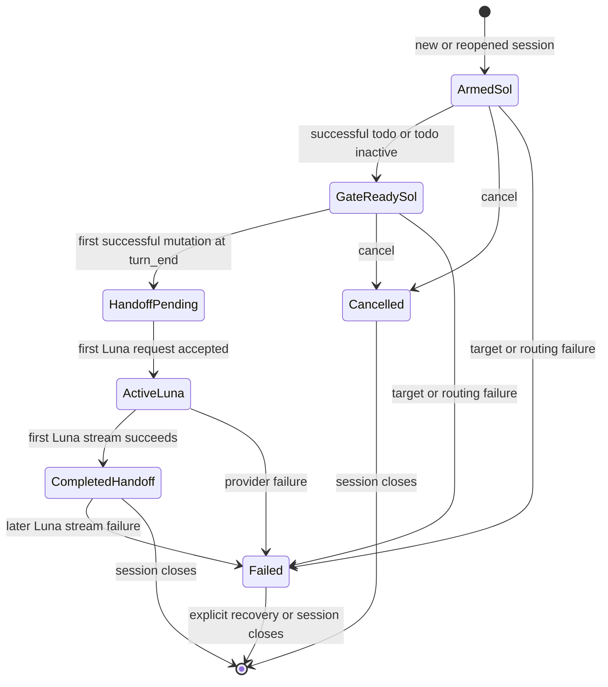
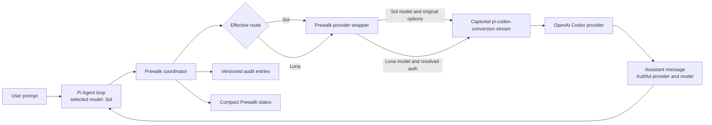
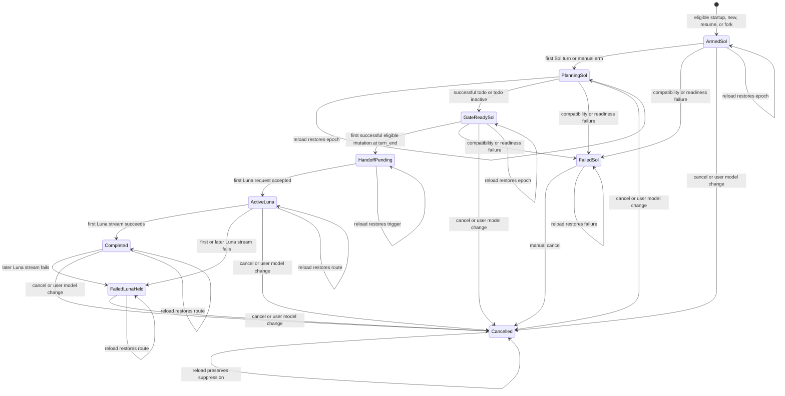

# Extension-Only Sol-to-Luna Prewalk - Plan

## Goal Capsule

Deliver a faithful Sol-to-Luna reproduction of Oh My Pi's current Prewalk behavior as a supported stock-Pi extension. Sol establishes the implementation trajectory, then Luna inherits the same live transcript after the todo-and-first-mutation gate without changing Pi's selected or saved model.

This plan owns the polished Sol-to-Luna release only. Provider-agnostic pairs such as Opus-to-Sonnet remain follow-up work.

There are no unresolved implementation blockers. This plan fixes the benchmark protocol, audit contract, bundled todo behavior, provider-overlay ownership, and reload semantics without broadening phase one.

---

## Product Contract

> **Product Contract preservation:** R1 through R28 retain their confirmed meaning. R1, R2, R7, R15 through R17, R19, R22, R27, and R28 are clarified by the user-confirmed OMP-faithful todo and reload behavior, the public-API limits around explicit user model changes and effective-context scrubbing, and the approved benchmark gate. The Deferred-to-Planning questions are resolved by KTD1 through KTD12.

### Summary

Prewalk will replace the patched runtime with a stock-Pi extension that wraps the installed `openai-codex` stream, reproduces current OMP planning and handoff behavior, and ships the normal todo capability that stock Pi lacks. Sol remains selected and saved while the wrapper routes Luna after the gate, and the same live run survives extension reload without persisting Luna as Pi's model choice.

### Problem Frame

The current local implementation depends on a patched Pi model-control API and patch-maintenance machinery. Stock Pi's public `setModel()` path persists its choice, so it cannot produce an ephemeral Luna executor while keeping Sol as the model a new or reopened session selects.

Earlier research was pinned to an older OMP revision, and the standalone `ThewindMom/pi-prewalk` project has since explored several relevant Pi-specific edges. The requirements need a current authority order so useful secondary ideas do not silently replace OMP behavior.

Pi 0.82.1 exposes public provider registration, model and credential lookup, lifecycle events, tool events, steering messages, custom entries, and status rendering. Focused Agent-loop proofs have already shown that a provider overlay can return Luna-authored messages while Pi's host-selected model remains Sol.

### Fidelity Authority and Adaptations

- **Canonical behavior:** OMP `main` at revision [`8db0228f4d38ff5d41b30038b6d227b01ea0fc8a`](https://github.com/can1357/oh-my-pi/tree/8db0228f4d38ff5d41b30038b6d227b01ea0fc8a) is the phase-one behavioral baseline. Its Prewalk coordinator, three prompt files, and applicable tests govern R3 through R10 and R22.

- **Prompt reuse:** OMP and this work are MIT-licensed, and stock Pi can inject hidden steering messages through its public extension surface. No prompt adaptation is currently necessary, so R3 requires the three OMP prompts verbatim.

- **Handoff adaptation:** OMP uses a host-owned temporary model switch. This extension must route provider requests instead because Pi's supported persistent model selection would violate the Sol-on-reopen contract. Governs R10, R18, and R19.

- **Mutation adaptation:** Current OMP recognizes completed `edit` and `write` results. This release additionally requires success-only handling and recognizes direct or shell-driven `apply_patch`, because a failed mutation does not establish the first valid move and Pi may expose patching through either tool path. Governs R7 and R8.

- **Secondary research:** [`ThewindMom/pi-prewalk` at `5f0a80432679867ff04cbcee20620b4a7168070b`](https://github.com/ThewindMom/pi-prewalk/tree/5f0a80432679867ff04cbcee20620b4a7168070b) informs Pi-specific edge cases only. Its persistent `setModel()` flow, shortened prompts, resume semantics, compatibility fallbacks, and fake-harness-only validation do not govern this release. Governs R23 through R25.

| Secondary area | Adopted research value | Explicit boundary |
| --- | --- | --- |
| Configuration | Strict target, type, and authorization failures inform R17 and R20. | Configuration must never select or persist Luna, and phase one does not generalize model pairs. |
| Status | Gate and trigger details inform the state coverage in R12 through R17. | The compact planner/executor presentation in R11 is authoritative. |
| Mutation detection | Success-only results, patch command recognition, false-positive rejection, and parallel-result handling inform R7 through R9. | OMP remains the gate authority, and no other secondary trigger is inherited. |
| Context scrubbing | Filtering stale hidden prompts after handoff, cancellation, and reopen informs R10 and R16. | The visible transcript and useful working trajectory remain intact. |
| Tests | Edge scenarios inform R24. | A hand-called fake harness cannot satisfy R25. |

### Key Decisions

- **Use only stock Pi extension and provider APIs** (session-settled: user-directed - chosen over patching Pi or waiting for a new host API: the extension must install and operate independently). Governs R2, R10, R18, R19, and R21.

- **Ship Sol-to-Luna before generalizing providers** (session-settled: user-directed - chosen over provider-agnostic phase one: the fixed pair must work beautifully before the mechanism broadens). Governs R1, R2, R10, R20, R25, and R26.

- **Use the latest verified OMP implementation as the authority** (session-settled: user-directed - chosen over older local research and secondary implementations: fidelity must track the source that owns Prewalk). Governs R3 through R10 and R22.

- **Reuse OMP's prompts exactly** (session-settled: user-directed - chosen over paraphrased prompts: the license and public Pi message surface permit exact reuse). Governs R3 and R9.

- **Extend mutation recognition only where Pi requires it** (session-settled: user-directed - chosen over inheriting every secondary behavior: successful direct and shell-driven patching are real Pi mutations). Governs R7, R8, R22, and R23.

- **Expose effective routing through compact Prewalk status** (session-settled: user-directed - chosen over changing Pi's native selector: native selection must remain Sol). Governs R11 through R17.

- **Treat published Prewalk results as benchmark targets** (session-settled: user-approved - chosen over treating external figures as release guarantees: this model pair needs its own evidence). Governs R26 and R27.

### Actors

- A1. **Pi user:** Starts or reopens a coding session, observes the active Prewalk side, and expects the handoff to require no manual transcript relay.
- A2. **Sol planner:** Explores the task, writes the implementation plan, creates the todo trajectory, and lands the first successful mutation.
- A3. **Luna executor:** Inherits the live transcript, todo state, and first valid mutation, then continues implementation and verification.
- A4. **Prewalk extension:** Owns arming, hidden guidance, gate tracking, effective provider routing, status, audit records, and scoped cleanup.
- A5. **Pi host:** Owns the selected model, saved settings, transcript, extension lifecycle, model registry, and provider registry.
- A6. **Existing Codex provider extension:** Supplies the installed `openai-codex` stream behavior that Prewalk must preserve.

### Requirements

**Session lifecycle**

- R1. On `startup`, `new`, `resume`, or `fork`, an eligible session must begin with Sol already selected, reset prior live-run state, and arm one automatic handoff. `reload` must restore the same live-run epoch and state without creating another automatic arm.

- R2. Prewalk must never change Pi's selected or saved model. It is eligible only while Pi has selected Sol, and arming must not create a provider request. An explicit user model change must cancel Prewalk, remove its effective route, preserve the user's selection, and suppress automatic re-arming until the next live session.

- R3. The hidden planning, continuation, and executor-checklist messages must match OMP's three prompt files verbatim at the canonical revision, retain required MIT attribution, and return to requirements review before any prompt-byte deviation.

- R4. Automatic arming must let Sol complete its first assistant turn before injecting the hidden planning prompt, while manual arming must inject that prompt before the next eligible Sol turn.

- R5. The planning prompt must remain hidden from A1, require the bundled normal todo workflow when `todo` is active, and continue the same Sol run rather than ending on a plan. When `todo` is inactive, the prompt bytes remain unchanged but the coordinator applies R7's explicit gate bypass.

- R6. OMP's bounded continuation state transitions must apply: planning starts with one pending continuation, tool progress re-arms one continuation, a prose-only turn consumes it, and another prose-only turn without intervening tool progress ends normally.

**Gate and mutation**

- R7. Prewalk must ship an OMP-compatible `todo` tool, active by default and persisted through normal tool-result history. A successful active `todo` result must open the gate, a failed result must leave it closed, and an inactive `todo` tool must bypass the gate exactly as current OMP does. Another extension owning the `todo` name is an explicit compatibility failure, not an alternate implementation.

- R8. After R7 opens the gate, the first successful `edit`, `write`, direct `apply_patch`, stock `bash` execution of `apply_patch`, or terminal `exec_command` execution of `apply_patch` must become Sol's handoff mutation. Failed, cancelled, partial, or still-running mutations, quoted mentions, shell comments, and commands that only print patch text must not trigger.

- R9. Multiple eligible tool results in one assistant turn must produce one deterministic handoff after all results from that turn are available.

- R10. Before Luna's first primary Agent-loop request, the planning prompt must be absent from effective context while the transcript, todo trajectory, Sol's mutation and result, and OMP's verbatim executor checklist remain available. Prewalk planning, continuation, and checklist messages must also be filtered from compaction input so auxiliary summarization cannot preserve stale guidance.

**Effective model and status**

- R11. The compact footer must be based on `prewalk: 5.6 Sol / Luna`, and the effective side must remain unambiguous without relying on color alone.

| ID | State | Required status behavior |
| --- | --- | --- |
| R12. | Armed Sol | Render `prewalk: [5.6 Sol] / Luna`; detailed status reports that todo is still required when it is active. |
| R13. | Gate-ready Sol | Render `prewalk: [5.6 Sol] / Luna (ready)`; detailed status reports that the next successful eligible mutation completes the handoff. |
| R14. | Active Luna | Render `prewalk: 5.6 Sol / [Luna]`; every subsequent request in the live session routes to Luna. |
| R15. | Completed handoff | Keep Luna marked active and report the trigger after Luna's first primary Agent-loop stream completes successfully. Compaction, title generation, and other auxiliary streams must not activate or complete the handoff. This state describes completion of the handoff, not completion of the user's coding task. |
| R16. | Cancelled | When Pi still selects Sol, render `prewalk: [5.6 Sol] / Luna (cancelled)`. After an explicit selection of another model, render `prewalk: 5.6 Sol / Luna (cancelled; Pi: <provider/model>)` with no Prewalk side marked active. Keep subsequent requests on the user's selected model, scrub stale Prewalk guidance from effective context, and prevent automatic re-arming in the same live session. Cancellation must remain available before and after handoff. |
| R17. | Failed | Render `prewalk: [5.6 Sol] / Luna (failed)` for a pre-handoff failure and `prewalk: 5.6 Sol / [Luna] (failed)` for a thrown or streamed Luna failure. Include the reason in detailed status. A pre-handoff failure leaves routing on Sol; a Luna failure keeps the Luna route held until A1 cancels into R16 or starts a replacement session. |

**Persistence, identity, and composition**

- R18. Prewalk must not patch Pi, import private Pi modules, call persistent `setModel()` for the handoff, create a synthetic router model, or retain patch and updater machinery.

- R19. The provider overlay must capture and wrap the `openai-codex` stream registered by A6, preserve that stream's transport behavior, verify wrapper ownership before routing or restoration, and restore the captured stream only while Prewalk still owns the current registration. Missing, late, or drifting provider ownership must fail visibly without replacing another extension's registration.

- R20. Luna must resolve through Pi's public model registry with configured authorization before handoff. Planner and executor requests must use their correct model metadata and credentials without cross-request leakage.

- R21. Luna-authored assistant messages and usage records must retain Luna's actual provider and model identity even though Pi's native selector and saved settings continue to name Sol.

- R22. Prewalk must append versioned extension-owned audit records for every state transition needed to reproduce the live run across `reload`, including arm, prompt injection, continuation budget, todo readiness, handoff trigger, Luna activation, completion, cancellation, and failure. Records and user-visible failure details must use an allowlist of stable codes and non-sensitive fields. They must never contain prompt bodies, transcript content, credentials, request payloads, provider responses, raw provider or tool errors, filesystem paths, or native Pi model-selection semantics.

**Validation and measured outcomes**

- R23. Current OMP tests are the primary parity suite. Every scenario in `packages/coding-agent/test/agent-session-prewalk.test.ts` and `packages/coding-agent/test/prewalk-startup-degradation.test.ts` at the canonical revision must be classified as directly applicable, Pi-adapted, or excluded with a fixed-pair rationale.

- R24. Secondary tests may add edge coverage for successful and failed mutations, direct and shell-driven `apply_patch`, false-positive patch text, parallel results, inactive todo, cancellation, prompt scrubbing, state restoration, and bounded continuation. They must not redefine behavior owned by R3 through R10.

- R25. Validation must include both a mocked extension harness and real Pi Agent-loop integration. Agent-loop coverage must run the actual extension events and provider stream composition rather than simulating them with hand-called callbacks.

- R26. Compatibility evidence must target the currently installed Pi 0.82.1 and `@howaboua/pi-codex-conversion` 3.0.3, including the real provider-registration order in the active Pi configuration.

- R27. Benchmarks must compare Sol-only, Luna-only, and Sol-to-Luna Prewalk on one frozen corpus of at least 20 independently validated tasks, with five repetitions per arm. They must report pass rate, provider cost, elapsed duration, solution-source lookup attempts, and every failed or invalid run.

- R28. Before any model run, the benchmark manifest and analysis policy must be frozen. Release requires Prewalk's pass rate to remain within 5 percentage points of Sol-only, median provider cost or elapsed duration to improve by at least 15 percent against Sol-only, and pass rate to exceed Luna-only by at least 10 percentage points. The non-winning cost or duration metric must not regress by more than 5 percent, and the solution-source lookup-attempt rate must not exceed Sol-only.

### Key Flows

- F1. **Automatic Sol trajectory**
  - **Trigger:** A1 opens a new or existing session that is eligible for automatic Prewalk.
  - **Actors:** A1, A2, A4, A5
  - **Steps:** Per R1 through R6, Pi selects Sol, Prewalk arms without an extra request, Sol gets its first turn, and the exact hidden OMP planning and continuation behavior advances toward a valid mutation.
  - **Outcome:** Sol owns exploration, planning, todo creation, and the first valid implementation move.

- F2. **Todo-gated provider handoff**
  - **Trigger:** R7's todo gate is open and a mutation candidate completes.
  - **Actors:** A2, A3, A4, A5, A6
  - **Steps:** Prewalk applies R8 and R9, scrubs context per R10, then changes effective routing without changing Pi's selected model.
  - **Outcome:** Luna receives the next request with the complete useful trajectory and truthful model identity.

- F3. **Status and live continuation**
  - **Trigger:** Prewalk changes state before or after handoff.
  - **Actors:** A1, A3, A4
  - **Steps:** The compact footer and detailed command status apply R11 through R17 while transcript attribution follows R21.
  - **Outcome:** A1 can tell which model is effectively active and whether the handoff is waiting, ready, complete, cancelled, or failed.

- F4. **Close and reopen**
  - **Trigger:** The live session ends or A1 reopens it later.
  - **Actors:** A1, A4, A5, A6
  - **Steps:** Prewalk records the outcome, removes only its provider overlay, and applies R1, R18, R19, and R22 on the next live session.
  - **Outcome:** Pi reopens on its saved user-selected model with no stale Luna route or hidden planning prompt. Prewalk creates a fresh armed epoch only when that model is Sol; otherwise it remains inactive.

- F5. **Extension reload**
  - **Trigger:** A1 runs Pi's extension reload while Prewalk is armed, planning, ready, handoff-pending, active, completed, cancelled, or failed.
  - **Actors:** A1, A4, A5, A6
  - **Steps:** The outgoing extension restores the captured base stream only if it still owns the wrapper. The replacement extension reads the latest state for the current live-run epoch, reinstalls the wrapper over A6, restores the continuation budget and effective route, and filters stale Prewalk guidance.
  - **Outcome:** Reload does not create a second automatic arm, lose a valid gate, route a failed Luna run through Sol, or confuse old hidden guidance with the current run.

- F6. **Explicit user model change**
  - **Trigger:** A1 uses Pi's normal model selector or cycle control during any Prewalk state.
  - **Actors:** A1, A4, A5
  - **Steps:** Prewalk records cancellation, clears its effective route and prompt state, conditionally restores its provider wrapper, and leaves Pi's selected and saved model untouched.
  - **Outcome:** The user's explicit choice wins, and Prewalk does not re-arm automatically until a replacement live session.



### Acceptance Examples

- AE1. **Normal OMP sequence**
  - **Given:** A new session is armed and `todo` is active.
  - **When:** Sol performs read-only exploration, receives the exact planning prompt, creates todo successfully, and completes a successful edit.
  - **Then:** Sol owns every request through the edit, Luna owns the next request, only Luna sees the checklist, and the planning prompt is absent from Luna's context.
  - **Covers:** R1 through R10, R14, R15, and R21.

- AE2. **Gate and failure handling**
  - **Given:** Sol is armed with an active todo tool.
  - **When:** An edit succeeds before todo, todo later fails, and another edit succeeds.
  - **Then:** All requests remain on Sol until a later successful todo and successful eligible mutation occur.
  - **Covers:** R7 and R8.

- AE3. **Pi patch paths**
  - **Given:** R7's gate is open.
  - **When:** A direct `apply_patch` succeeds or a successful shell command executes `apply_patch` as a command or pipeline stage.
  - **Then:** Exactly one handoff occurs, while failed patch results, quoted examples, comments, and printed patch text do not trigger.
  - **Covers:** R8, R9, and R24.

- AE4. **Parallel tool results**
  - **Given:** R7's gate is open.
  - **When:** One assistant turn returns parallel successful and failed mutation results.
  - **Then:** Prewalk waits for the complete turn, chooses the first successful eligible result deterministically, records one trigger, and routes one next request to Luna.
  - **Covers:** R8 through R10 and R22.

- AE5. **Bounded continuation**
  - **Given:** The planning prompt has been injected.
  - **When:** Sol alternates prose-only turns and tool-progress turns without an eligible mutation.
  - **Then:** Each tool-progress segment earns at most one continuation, and consecutive prose-only turns terminate without a loop.
  - **Covers:** R6 and R23.

- AE6. **Inactive todo**
  - **Given:** `todo` exists in Pi's registry but is not active for the session.
  - **When:** Sol completes its first successful eligible mutation.
  - **Then:** The todo gate does not block and the next request routes to Luna.
  - **Covers:** R7, R8, and R23.

- AE7. **Status truthfulness**
  - **Given:** Pi's native selector continues to display Sol.
  - **When:** Prewalk moves through armed, ready, active, completed, cancelled, or failed state.
  - **Then:** The compact status matches R12 through R17, and Luna-authored transcript messages identify Luna.
  - **Covers:** R11 through R17 and R21.

- AE8. **Cancellation and reopen**
  - **Given:** An armed run has injected the hidden planning prompt.
  - **When:** A1 cancels and later reopens the session.
  - **Then:** The stale prompt never reaches effective context, the cancelled live session does not re-arm, and the reopened session starts cleanly on Sol under R1.
  - **Covers:** R1, R10, R16, R18, and R22.

- AE9. **Provider composition**
  - **Given:** `@howaboua/pi-codex-conversion` registers `openai-codex` before Prewalk.
  - **When:** A real Pi Agent loop runs Sol through handoff and then requests Luna.
  - **Then:** Both requests traverse the existing Codex stream behavior with isolated model metadata and authorization, while only the second assistant message identifies Luna.
  - **Covers:** R19 through R21, R25, and R26.

- AE10. **Target or provider failure**
  - **Given:** Luna is unavailable, unauthorized, or fails during delegated streaming.
  - **When:** Prewalk tries to arm or route.
  - **Then:** A pre-handoff readiness failure leaves Sol effective. A delegated Luna failure leaves Luna effective until cancellation. Both branches enter their route-specific failed status, send no substitute executor request, and leave Pi settings unchanged.
  - **Covers:** R17, R18, R20, and R22.

- AE11. **Measured claims**
  - **Given:** A release candidate is ready for benchmarking.
  - **When:** Sol-only, Luna-only, and Sol-to-Luna runs execute the declared corpus.
  - **Then:** Each arm runs five times on every frozen task, the report includes every R27 measure and failed run, and release claims do not exceed the thresholds actually satisfied.
  - **Covers:** R27 and R28.

- AE12. **Faithful reload before handoff**
  - **Given:** Sol has received the planning prompt, consumed or re-armed part of the continuation budget, and may have opened the todo gate.
  - **When:** A1 reloads extensions.
  - **Then:** The replacement extension restores the same live-run epoch, plan-injection state, continuation budget, todo readiness, status, and one-arm guarantee without adding a provider request.
  - **Covers:** R1, R3 through R7, R12, R13, R19, and R22.

- AE13. **Faithful reload after handoff**
  - **Given:** Luna is active, completed, or failed with its route held.
  - **When:** A1 reloads extensions and then sends another prompt.
  - **Then:** The wrapper is safely restored over the existing conversion stream, the request still routes to Luna, and cancellation remains the only path back to Sol within that live session.
  - **Covers:** R14 through R17, R19, R21, and R22.

- AE14. **User model choice wins**
  - **Given:** Prewalk is armed or Luna-routed.
  - **When:** A1 selects another model through Pi.
  - **Then:** Prewalk cancels, removes only its own routing state, preserves A1's new model choice, and does not re-arm automatically in that live session.
  - **Covers:** R2, R16, R18, R19, and R22.

### Success Criteria

- All directly applicable OMP parity scenarios and every documented Pi adaptation pass in both validation layers required by R23 through R25.
- A real installed-Pi run demonstrates AE1, AE7, AE8, and AE9 on Pi 0.82.1 with `@howaboua/pi-codex-conversion` 3.0.3.
- Every request, transcript entry, status state, audit record, and reopen path reports the effective model truthfully under R11 through R22.
- The benchmark manifest contains at least 20 independently validated tasks and five repetitions per arm, freezes R28's thresholds before results are known, and publishes the full R27 comparison without omitting failed or invalid runs.
- The runtime contains none of R18's prohibited patch, private-import, persistent-switch, synthetic-model, or updater paths.

### Scope Boundaries

**In scope**

- The fixed model pair and live-session lifecycle defined by R1, R2, and R10.
- The OMP fidelity and parity boundary defined by R3 through R10 and R23.
- The Pi-specific mutation coverage defined by R7 through R9 and R24.
- OMP-faithful bundled todo behavior and full live-run restoration across Pi extension reload.
- The status, composition, validation, and benchmark outcomes defined by R11 through R22 and R25 through R28.

**Deferred**

- Provider-agnostic configuration, Opus-to-Sonnet routing, cross-provider authorization, provider capability normalization, and same-model thinking-only handoffs.
- Any optional upstream Pi proposal justified by implementation evidence.

**Out of scope**

- The prohibited integration and maintenance paths in R18.
- Adopting `ThewindMom/pi-prewalk` as the implementation foundation or preserving its Pi 0.80.x compatibility behavior.
- OMP task-agent configuration and same-model effort transitions excluded by R23's fixed-pair classification.
- Exact promises for external benchmark figures beyond R27 and R28.
- Redesigning Pi's native model selector or transcript format instead of satisfying R11 and R21.

<!-- ce-section: work-relationships -->
### How This Work Fits Together

This artifact owns the fixed Sol-to-Luna release. The surrounding work below is the current understanding, not a committed roadmap.

- **Provider-agnostic Prewalk depends on this release.**
  - It reuses the proven behavioral contract, provider-overlay seam, status semantics, and validation layers.
  - It may add provider-pair configuration, cross-provider credential rules, capability checks, same-model effort transitions, and Opus-to-Sonnet coverage.

- **An upstream Pi proposal can proceed independently after evidence exists.**
  - It may address native selector identity, audit semantics, or safer provider-overlay composition.
  - It must not block the extension-only release.

- **Earlier patch-maintenance work is historical context only.**
  - It shares the original Prewalk goal but has no runtime or release dependency relationship with this artifact.

### Dependencies and Assumptions

- The current OMP authority is revision `8db0228f4d38ff5d41b30038b6d227b01ea0fc8a`, fetched from `origin/main` on 2026-07-30. The scoped coordinator, prompt, and parity-test diff from the previously inspected `52bd191b34c7e9044b82cda51f92e0df51693855` revision is empty.
- The current secondary research authority is `ThewindMom/pi-prewalk` revision `5f0a80432679867ff04cbcee20620b4a7168070b`.
- Installed Pi 0.82.1 retains the public provider-registration, model-registry, authorization, lifecycle, context, tool, steering, custom-entry, and status APIs used by this contract.
- `@howaboua/pi-codex-conversion` 3.0.3 remains registered before this local extension and continues to own the base `openai-codex` stream.
- Pi extensions share one trusted host process. Registration order and wrapper identity prove composition ownership, not cryptographic provenance or isolation from another installed extension; conversion 3.0.3 and the installed extension set are part of the release trusted computing base.
- Sol and Luna remain available and authorized through `openai-codex` with compatible context and output limits for the fixed-pair release.
- The package owns the phase-one `todo` tool and requires its name to be free of conflicting extension ownership.
- Public Pi APIs can filter extension-owned hidden messages from effective model context but cannot delete previously persisted session entries. In this contract, scrubbing always means effective-context removal.
- The benchmark task curator freezes and validates the corpus without exposing gold patches or solution references to benchmark runs or evaluators.

### Planning Resolutions

No product or planning questions remain open.

- Resolved by KTD8: the benchmark uses at least 20 independently validated tasks, five repetitions per arm, paired randomized execution, and the thresholds in R28.
- Resolved by KTD6: audit entries are versioned state-transition records that omit prompts, transcript content, credentials, payloads, and responses.
- Resolved by KTD3: Prewalk bundles the OMP-compatible normal todo capability and treats conflicting ownership as incompatible.
- Resolved by KTD9: task-agent and same-model effort tests appear in the parity matrix as explicit phase-one exclusions.

---

## Planning Contract

### Key Technical Decisions

- KTD1. **Wrap the conversion stream through Pi's public provider registry.** On session startup, Prewalk requires an existing `openai-codex` registration with the API and `streamSimple` supplied by `@howaboua/pi-codex-conversion` 3.0.3. It captures that handler, registers one stable wrapper, delegates Sol requests unchanged, and delegates Luna-routed primary Agent-loop requests through the captured handler with the registry-resolved Luna model and Luna authorization. Agent lifecycle state distinguishes primary turns from compaction, title generation, and other auxiliary requests, which delegate without advancing handoff state. Cleanup restores the captured handler only when the current registration is still identity-equal to Prewalk's wrapper. There is no generic provider stack, synthetic model, or transport reimplementation. Governs R15 and R18 through R21.

- KTD2. **Port current OMP's turn-boundary coordinator instead of adapting the checkpoint coordinator.** The replacement state machine tracks the current live-run epoch, automatic or manual mode, whether the planning prompt was injected, the bounded continuation budget, todo readiness, ordered mutation candidates, effective route, first Luna stream outcome, cancellation, and failure. Automatic mode schedules the exact planning steer after Sol's first completed assistant turn. Manual mode makes the same prompt eligible for the next natural Sol request without starting a request itself. Governs R1 through R10.

- KTD3. **Ship the normal todo capability inside Prewalk.** Phase one owns the `todo` name and provides the current OMP operations needed to initialize, advance, complete, block, abandon, append, remove, and view phased work. Todo snapshots persist in normal tool results, restore from the active session branch, auto-promote one task, and issue bounded incomplete-work reminders through public Pi events. The renderer and reminder plumbing adapt to stock Pi's public extension APIs, while OMP-only sticky HUD and task-agent integration stay excluded. An inactive todo still bypasses the gate, and another extension owning the same name fails compatibility validation. Governs R5, R7, R10, R18, and R23.

- KTD4. **Ship OMP's three Prewalk prompts as attributed byte-for-byte assets.** The planning, continuation, and executor-checklist files are copied from the canonical revision with their SHA-256 digests and MIT attribution. Hidden custom-message metadata carries the run identity; prompt content remains unchanged. The `context` and pre-compaction hooks remove stale Prewalk planning, continuation, and checklist messages from effective model and summarization context, then expose only the message valid for the current primary turn. Session JSONL remains append-only because stock Pi has no supported entry-deletion API. Governs R3 through R6, R10, R16, and R18.

- KTD5. **Classify mutations conservatively and decide at `turn_end`.** Tool-result hooks record successful candidates by tool-call ID but never hand off immediately. At the completed assistant-turn boundary, the coordinator reads the assistant-authored tool-call order, applies current OMP's same-turn todo semantics, and selects the first successful eligible mutation once. Direct `apply_patch`, stock `bash`, and Code Mode `exec_command` require completed success evidence. Shell recognition accepts only an unquoted executable `apply_patch` token in a command position and rejects comments, printed text, partial failures, still-running sessions, and dynamically constructed commands that cannot be proven. Governs R7 through R9, R21, R23, and R24.

- KTD6. **Persist reload state as extension-owned audit transitions.** Each custom entry records only an allowlisted schema version, run ID, live-run epoch, event kind, phase, effective route, mode, planner and executor identities, overlay fingerprint, and optional trigger or stable reason code. Status, notifications, audit entries, canary evidence, and benchmark artifacts share the same allowlist-based output policy. They never persist prompt text, transcript text, credentials, request payloads, file contents, raw provider or tool errors, headers, filesystem paths, or provider responses outside benchmark model output explicitly retained for blinded scoring. `reload` rehydrates the latest epoch and reinstalls the wrapper without adding an arm or request; `startup`, `new`, `resume`, and `fork` start a fresh epoch and ignore prior live-run state. Each transition is appended once. Governs R1, R11 through R17, R19, and R22.

- KTD7. **Separate the visible phase from the effective route.** The footer renderer owns the route-specific compact strings in R12 through R17, while `/prewalk status` adds mode, run ID, todo requirement, trigger, selected Pi model, and failure reason. Luna routing begins when the wrapper accepts the first delegated request. Completion is recorded only when that first Luna stream succeeds. A thrown or streamed Luna failure changes the phase to failed but keeps the route and Luna marker active. `/prewalk cancel` and an explicit Pi model-selection event remove the route; a non-Sol selection renders as the explicit Pi model with neither Prewalk side active. Prewalk never changes the user's selected model itself. Governs R2 and R11 through R17.

- KTD8. **Freeze a paired three-arm benchmark before model execution.** The corpus manifest contains at least 20 independently audited public coding tasks, with repository revision, prompt, test command, timeout, and validation evidence. Because recent audits found material defects in public SWE-bench Pro, inclusion requires gold-patch success plus prompt, test, and baseline review rather than dataset membership alone. A trusted controller owns provider credentials and model calls. It delegates repository tools to disposable credential-free workers with only the task checkout mounted, task-process networking denied, no host or agent-directory mounts, no credential helpers, and bounded CPU, memory, storage, and time. Evaluators with gold-patch access run separately from workers. Every task runs five times under each arm in randomized paired order with fixed prompts, tool slate, retry policy, cache policy, timeouts, and network controls. The task is the statistical unit; clustered paired analysis reports pass rate, median cost, median elapsed time, confidence intervals, and blocked solution-source lookup attempts. A pre-run power check may increase the frozen corpus but may not lower the confirmed minimums or change R28 after results exist. Governs R27 and R28.

- KTD9. **Make OMP parity classification executable evidence.** The canonical matrix lists every test in OMP's main coordinator and startup-degradation suites by upstream name and revision. The first eight coordinator scenarios and both startup scenarios are direct or Pi-adapted coverage. The four same-model effort/no-op scenarios and all task-agent Prewalk scenarios are explicit non-applicable cases because phase one is a fixed top-level Sol-to-Luna route. The matrix cannot silently drop a canonical case. Governs R23 and R24.

- KTD10. **Use three validation layers plus a separate benchmark.** Unit and mocked-extension tests prove pure state, prompts, mutation classification, todo behavior, audit entries, and UI output. Real Agent-loop tests use stock Pi's exported session factory, extension loader, model runtime, and deterministic streams so callbacks are not hand-called. A release-only authenticated canary loads conversion 3.0.3 before Prewalk, snapshots settings, sends bounded real Sol and Luna requests, and records redacted identity evidence. The benchmark is a separate opt-in operation and never runs during routine tests, install, startup, or the canary. Governs R21 and R23 through R28.

- KTD11. **Keep phase-one configuration deliberately fixed.** `prewalk.json` stores only whether automatic Prewalk is enabled. Planner, executor, provider, and Luna reasoning are fixed to `openai-codex/gpt-5.6-sol`, `openai-codex/gpt-5.6-luna`, `openai-codex`, and `low`. Startup validates exact model IDs, API compatibility, context and output limits, authorization, tool ownership, provider registration order, and wrapper ownership. A failed invariant is visible and blocks arming; it does not activate compatibility or provider-agnostic fallbacks. Governs R1, R2, R17, R18, R20, and R26.

- KTD12. **Delete the patch product rather than preserving compatibility with it.** The updater executable, version manifest, reviewed patch, updater fixtures, patched type mapping, checkpoint tool, cross-provider fingerprints, generic target configuration, and their tests leave the shipped package. Runtime code compiles against the published stock Pi 0.82.1 declarations. Historical plans remain historical artifacts, while current README and research pages clearly identify the extension-only design as authoritative. Governs R18, R25, and R26.

### High-Level Technical Design

#### Provider and agent-loop topology



Pi continues to own the selected Sol model, session, transcript, tool execution, and provider lifecycle. Prewalk owns only its state machine, hidden custom messages, todo tool, wrapper, status, and audit entries. The captured conversion stream remains the only transport implementation.

#### Live-run and reload state



`FailedSol` and `FailedLunaHeld` use different active-side markers because their effective routes differ. Replacement session events create a new epoch; only `reload` resumes the current one.

### Constraints and Invariants

- Production TypeScript must narrow unknown data through guards and must not use type casts. Tests may use casts only where harness construction requires them.
- No compatibility branch may detect or consume the patched `setSessionModelAndThinkingLevel` API.
- The wrapper must never call itself, route Luna through a different transport, or restore over a provider stream it no longer owns.
- No prompt sentinel or run metadata may alter the canonical three OMP prompt bodies.
- Tool-result arrival order must not determine the mutation trigger.
- A failed Luna stream must never be retried through Sol.
- Reload reconstruction may read only Prewalk-owned custom entries from the current branch and epoch.
- Routine verification must remain non-billable and isolated from the user's normal agent directory.
- Allowlist tests must assert exact permitted keys and reject secret-shaped headers, payloads, paths, raw errors, and later schema expansion across status, notifications, audit, canary, and benchmark outputs.

---

## Implementation Units

### U1. Stock-Pi package baseline and fixed phase-one contract

**Goal:** Make unsupported patched declarations and generic configuration impossible before implementing new behavior.

**Paths:**

- `tsconfig.json`
- `package.json`
- `package-lock.json`
- `prewalk.example.json`
- `.gitignore`
- `test/package.test.ts`

**Changes:**

- Remove the TypeScript path mapping to the patched sibling Pi checkout.
- Remove the updater binary, `tar`, and generic target, thinking, and cross-provider configuration from the package contract.
- Pin stock Pi packages at 0.82.1 and add exact development coverage for `@howaboua/pi-codex-conversion` 3.0.3 and the configured Biome version.
- Reduce durable configuration to strict `{ "enabled": boolean }` behavior with unknown fields rejected.
- Add package tests that fail if patched APIs, updater paths, target configurability, private Pi imports, or non-test production casts reappear.

**Behavior and verification:**

- The package typechecks only against published stock Pi.
- Package metadata and tests exclude updater, patch, private-import, sibling-type, and generic-recipient paths before later units add release assets.

**Dependencies:** None.

### U2. Canonical prompts, OMP-compatible todo, and coordinator

**Goal:** Replace the checkpoint workflow with current OMP's observable planning, continuation, todo, and gate semantics.

**Paths:**

- `prompts/prewalk-plan.md`
- `prompts/prewalk-continue.md`
- `prompts/prewalk-checklist.md`
- `prompts/todo.md`
- `THIRD_PARTY_NOTICES.md`
- `src/core.ts`
- `src/todo.ts`
- `test/core.test.ts`
- `test/todo.test.ts`
- `test/prompts.test.ts`

**Changes:**

- Copy the canonical OMP prompt assets, record their revision and digests, and preserve MIT attribution.
- Define the live-run state and bounded continuation transitions without `prewalk_checkpoint`.
- Implement the phased todo operations, snapshot persistence, branch restoration, auto-promotion, bounded completion reminder, public Pi renderer, and `/todos` view needed by the shared Sol-to-Luna trajectory.
- Keep the gate open when todo is inactive, but require a successful result when it is active.
- Detect conflicting `todo` ownership before automatic or manual arming.

**Behavior and verification:**

- Prompt tests compare exact bytes and hashes.
- Coordinator tests port OMP's automatic injection, manual arm, successful and failed todo, prose-only continuation, bash-only bound, tool-progress re-arm, and inactive-todo cases.
- Todo tests prove valid operations, invalid operations as error results, branch reconstruction, one in-progress task, reminder bounds, and transcript-visible state inherited by Luna.

**Dependencies:** U1.

### U3. Successful mutation classification and complete-turn selection

**Goal:** Apply the Pi-specific success and `apply_patch` adaptations without false positives or race-dependent handoffs.

**Paths:**

- `src/mutation.ts`
- `test/mutation.test.ts`
- `test/fixtures/mutations/*.json`

**Changes:**

- Normalize direct built-in `edit` and `write`, direct conversion `apply_patch`, stock `bash`, and Code Mode `exec_command` outcomes into one conservative candidate model.
- Track tool calls and results by ID, distinguish terminal success from failure, partial failure, cancellation, and still-running sessions, and preserve assistant-authored call order.
- For Code Mode, consume `tool_execution_update` plus terminal `exec` and `wait` results, retain nested traces by cell and trace ID, and correlate yielded `exec_command` sessions through later `write_stdin` calls without relying on one outer Pi tool-call ID.
- Parse only the shell command positions required to prove an executed `apply_patch`; reject quoted examples, comments, print commands, aliases, nested dynamic shells, and incomplete traces.
- At `turn_end`, apply current OMP's same-turn todo behavior and choose the first successful eligible mutation exactly once.

**Behavior and verification:**

- Fixture-driven tests cover direct and shell patch success, nonzero exits, partial patch results, parallel mixed results, yielded cells, persistent command sessions, more than 50 nested traces, missing terminal results, comments, quoting, pipelines, and printed patch content.
- Reordering result arrival without changing assistant-authored order does not change the chosen trigger.

**Dependencies:** U2.

### U4. Public provider overlay and truthful Luna streaming

**Goal:** Route Luna through the existing Codex conversion stream while Pi continues to select and save Sol.

**Paths:**

- `src/provider-overlay.ts`
- `test/provider-overlay.test.ts`

**Changes:**

- Capture the registered conversion config after extension loading and require its expected API, OAuth, and stream handler.
- Install one stable wrapper whose routing state can change without re-registering at handoff.
- Resolve Luna and its authorization through the public model registry before delegated streaming.
- Forward the delegated stream's events and terminal result without rewriting provider, model, usage, stop reason, or error identity.
- Detect thrown and streamed Luna failures, keep the Luna route held, and restore the captured handler only under identity ownership.
- Detect registration drift before a request; pre-handoff drift fails on Sol, while post-handoff drift aborts rather than leaking a request to Sol.

**Behavior and verification:**

- Unit tests prove unchanged Sol delegation, Luna substitution, target auth resolution, no cross-request leakage, Luna-authored results, no Sol fallback, recursion prevention, conditional restoration, missing conversion failure, and later-owner preservation.

**Dependencies:** U1.

### U5. Extension orchestration, status, audit, and reload fidelity

**Goal:** Connect the coordinator, todo tool, mutation evidence, wrapper, hidden prompts, and Pi lifecycle into one faithful extension.

**Paths:**

- `extensions/prewalk.ts`
- `src/audit.ts`
- `src/status.ts`
- `test/extension.test.ts`
- `test/status.test.ts`
- `test/audit.test.ts`

**Changes:**

- Register the todo tool and Prewalk commands, then install the provider wrapper after verifying conversion-first order.
- Use hidden `sendMessage` steers for the exact planning, continuation, and checklist prompts, with run identity only in metadata.
- Filter stale Prewalk messages in the `context` hook without touching other extension messages or visible history.
- Filter every Prewalk hidden message from pre-compaction input and ensure auxiliary provider streams cannot activate or complete the Luna handoff.
- Record mutation evidence during tool events and commit the handoff at `turn_end`.
- Render every compact and detailed status state, including the two failed routing modes.
- Append idempotent audit transitions and rebuild the current epoch on `reload`.
- Start new epochs for `startup`, `new`, `resume`, and `fork`; cancel on explicit model selection; support cancellation before and after handoff; and conditionally restore the wrapper during shutdown.

**Behavior and verification:**

- The mocked harness covers every callback and UI acceptance path that does not require a real Agent loop, installed provider transport, authenticated provider request, or benchmark run. It also covers exact prompt scheduling, zero requests at arm time, status strings, cancellation, audit redaction, reload of every state, replacement sessions, provider drift, and explicit user selection.

**Dependencies:** U2, U3, and U4.

### U6. OMP parity matrix and real Pi Agent-loop proof

**Goal:** Prove behavior through stock Pi's real lifecycle instead of only hand-called extension callbacks.

**Paths:**

- `test/fixtures/omp-prewalk-parity.json`
- `test/omp-parity.test.ts`
- `test/agent-loop.test.ts`
- `test/codex-conversion.test.ts`

**Changes:**

- Pin every canonical OMP scenario by upstream test name, revision, classification, local test, and exclusion rationale.
- Construct isolated sessions with stock Pi's public `ModelRuntime`, `DefaultResourceLoader`, `createAgentSession`, and in-memory session manager.
- Load conversion 3.0.3 before Prewalk and replace only the network boundary with deterministic streams.
- Drive actual agent turns through Sol exploration, todo, mutation, Luna continuation, reload, cancellation, and failure.
- Trigger compaction before and after handoff, cancellation, and reload to prove auxiliary streams stay out of route activation and completion while Prewalk guidance stays out of summaries.

**Behavior and verification:**

- Assert provider call order, no request at arming, Sol ownership through the mutation, Luna ownership afterward, exact effective contexts, todo trajectory, audit entries, status, unchanged selected model and settings bytes, transcript identity, reload continuity, and conditional stream restoration.
- Excluded same-model and task-agent cases remain visible in the matrix and cannot be mistaken for unimplemented parity.

**Dependencies:** U5.

### U7. Installed smoke, authenticated canary, and package documentation

**Goal:** Prove the shipped package works in the installed Pi composition and remove the obsolete patch product completely.

**Paths:**

- `scripts/smoke-rpc.mjs`
- `scripts/rpc-support.mjs`
- `scripts/rpc-support.d.mts`
- `scripts/canary-provider.mjs`
- `scripts/canary-guard.mjs`
- `scripts/canary-support.mjs`
- `scripts/canary-support.d.mts`
- `test/scripts.test.ts`
- `README.md`
- `docs/research/prewalk-extension-only-feasibility.md`
- `docs/research/prewalk-implementation-verification.md`
- `updater/**` (delete)
- `test/updater.test.ts` (delete)
- `test/updater-cli.test.ts` (delete)
- `test/fixtures/updater/**` (delete)
- `src/protocol.mjs` (delete)
- `src/protocol.d.mts` (delete)
- `src/recipient-identity.mjs` (delete)
- `src/recipient-identity.d.mts` (delete)

**Changes:**

- Rewrite non-billable RPC smoke around stock Pi, isolated agent directories, conversion-first loading, provider ownership, status, reload, cancellation, and byte-identical settings.
- Rewrite the release-only canary around a bounded temporary fixture and explicit provider-cost confirmation. Capture only redacted model sequence, usage totals, status, trigger type, settings hashes, and pass/fail evidence.
- Stage only the `openai-codex` credential material needed by the canary into an owner-only temporary agent directory, never copy the complete credential store, and remove the project, agent directory, and credential material on success, failure, timeout, signal, or provider rejection.
- Remove every updater, patch, generic recipient, checkpoint, and compatibility artifact from runtime, tests, scripts, package metadata, and current documentation.
- Finalize the shipped file list after the prompt, extension, smoke, and canary assets exist. Benchmark assets remain U8's package responsibility.
- Mark the older feasibility and implementation-verification conclusions as superseded where they reject provider overlays or describe patched behavior.
- Document installation order, fixed model requirements, todo ownership, status meaning, reload behavior, cancellation, troubleshooting, routine checks, canary consent, and uninstall behavior.

**Behavior and verification:**

- Smoke and package tests prove that no code path requires a patched Pi installation.
- The authenticated canary proves actual Sol and Luna model identities through conversion 3.0.3, with no settings mutation and no hidden prompt in Luna's effective context.
- Canary tests prove minimum credential selection, owner-only file modes, unconditional cleanup after injected failures, and absence of secret-shaped values in retained evidence.

**Dependencies:** U6.

### U8. Frozen comparative benchmark and release report

**Goal:** Validate the local Sol-to-Luna claims without copying external headline numbers.

**Paths:**

- `benchmark/corpus.json`
- `benchmark/README.md`
- `scripts/benchmark-prewalk.mjs`
- `scripts/benchmark-report.mjs`
- `test/benchmark.test.ts`
- `benchmark/results/` (generated and ignored)

**Preparation after U6:**

- Curate at least 20 tasks only after gold-patch, baseline, prompt, test, and environment validation; record exclusions and corpus digest before model runs.
- Build and contract-test the manifest, trusted controller, disposable worker image, narrow IPC boundary, evaluator isolation, network denial, mount allowlist, resource limits, and redacted artifact schemas before release polish completes.

**Execution after U7:**

- Run Sol-only, Luna-only, and Prewalk five times per task with randomized paired ordering and identical non-model settings.
- Rebuild each frozen base revision as a fresh single-commit repository with no upstream refs, reflogs, alternate object stores, gold patches, or solution-bearing objects. Run task tools without provider credentials, host or agent-directory mounts, network access, or repository credential helpers. Block access to task solutions and gold patches, record attempted prohibited lookups and sandbox violations, and retain failures and timeouts in the denominator.
- Generate raw JSONL and keep arm identities blinded through evaluation and aggregate metric finalization. After evaluator outputs and metrics are frozen, unblind the three arm labels for the final report, threshold decisions, and explicit unsupported claims.

**Behavior and verification:**

- Benchmark contract tests reject a mutable or incomplete corpus, missing repetitions, changed arm settings, omitted failed runs, premature unblinding, post-result threshold changes, leaked secret-shaped values, permissive mounts or networks, inherited credentials, reachable solution history, sandbox escape, and reports that do not evaluate every R28 gate after the final unblind.
- Package verification includes the frozen benchmark manifest, benchmark documentation, runner, and report generator while continuing to exclude generated results.
- The report may claim only the benefits that pass the precommitted thresholds.

**Dependencies:** Preparation depends on U6 and may proceed alongside U7. Provider runs, final analysis, release reporting, and benchmark package verification depend on U7.

---

## Verification Contract

### Test Layers

| Layer | Purpose | Required evidence |
| --- | --- | --- |
| Static and unit | Types, lint, prompt bytes, coordinator, todo, mutation parser, audit, status, provider wrapper | All deterministic tests pass against published Pi 0.82.1 types. |
| Mocked extension harness | Extension callbacks and UI outputs under controlled event sequences | Every callback and UI acceptance path that does not require a real Agent loop, installed transport, authenticated request, or benchmark run has an assertion. |
| Real Agent loop | Pi message persistence, turn ordering, context projection, provider routing, reload, model identity | Actual `createAgentSession` turns prove Sol then Luna without changing selected Sol and satisfy AE9's loop-level portion. |
| Installed RPC smoke | Package discovery and real configured extension order without provider cost | Isolated process proves conversion-first overlay, status, cancellation, reload, and settings stability. |
| Authenticated canary | Real conversion transport and real Sol/Luna identities | Explicit opt-in evidence proves the live handoff and contains no credentials or transcript. |
| Comparative benchmark | Quality, cost, duration, and evaluation integrity | At least 300 runs satisfy AE11 and either pass or reject each precommitted release threshold. |

### OMP Parity Classification

| Canonical scenario | Classification | Phase-one expectation |
| --- | --- | --- |
| First edit/write after successful todo; bash and todo do not trigger | Pi-adapted | Require successful mutation and add direct or shell `apply_patch`. |
| Edit before todo does not switch; later edit after todo does | Direct | Preserve current OMP gate. |
| Failed todo keeps the gate closed | Direct | Preserve current OMP gate. |
| Text-only plan reply forces continuation | Direct | Preserve exact continuation prompt and budget. |
| Completed bash-only work receives one bounded continuation | Direct | Preserve current OMP bound. |
| Tool progress re-arms continuation | Direct | Preserve current OMP transition. |
| Registered but inactive todo bypasses gate | Direct | Preserve current OMP behavior. |
| Manual `/prewalk` pre-arms the next eligible mutation | Direct | Adapt command wiring only. |
| Same-model effort downgrade | Excluded | Fixed Sol-to-Luna changes model identity. |
| Genuine same-model no-op | Excluded | Fixed pair cannot be a same-model no-op. |
| Clamped same-model no-op | Excluded | Configurable same-model effort is deferred. |
| Same-model auto-to-inherit transition | Excluded | Configurable effort modes are deferred. |
| Startup target lacks configured auth | Direct | Fail visibly and leave Sol usable. |
| Startup target resolves with configured auth | Direct | Arm once without a provider request. |
| Task-agent Prewalk scenarios | Excluded | Phase one covers the top-level live Pi session only. |

### Deterministic Commands

Implementation and review must invoke the repository's `run-tests-on-request` skill for test execution. The implementation adds the missing lint and focused scripts so the final deterministic sequence is:

```sh
npm run lint
npm run typecheck
npm test
npm run test:agent-loop
npm run smoke:rpc
npm pack --dry-run
```

Focused development commands may target the touched Vitest files first, but the full sequence above is required before completion.

### Release-Only Provider Canary

The canary is billable and requires an exact consent token. It runs only after deterministic verification passes:

```sh
npm run canary:provider -- \
  --confirm-provider-cost I_UNDERSTAND_PROVIDER_REQUESTS \
  --auth-file "${PI_CODING_AGENT_DIR:-$HOME/.pi/agent}/auth.json" \
  --pi "$(command -v pi)" \
  --evidence-dir ./canary-evidence
```

The canary must use a temporary project and owner-only agent directory, validate installed Pi 0.82.1 and conversion 3.0.3, stage only the required `openai-codex` credential material, limit the mutation fixture, reject unexpected tools, hash settings before and after, and retain only allowlisted evidence. Cleanup must remove the project, agent directory, and staged credentials after success, failure, timeout, signal, or provider rejection.

### Comparative Benchmark

After corpus freeze and a dry-run contract check, the benchmark requires separate consent for at least 300 task runs:

```sh
npm run benchmark -- \
  --manifest benchmark/corpus.json \
  --repetitions 5 \
  --confirm-provider-cost I_UNDERSTAND_AT_LEAST_300_PROVIDER_RUNS
```

The runner must refuse fewer than 20 tasks, fewer or more than five repetitions, changed thresholds, an unfrozen manifest, missing environment digests, or an output directory containing prior arm results. The report command consumes immutable raw evidence and never reruns or edits model outputs.

Provider calls run in the trusted controller. Repository tools run in disposable credential-free workers whose task checkout is rebuilt as a fresh single-commit repository, with only that checkout mounted, task-process networking denied, no host or agent-directory mounts, no credential helpers, and enforced resource limits. Evaluators with solution access run in separate workers after each task attempt is sealed.

### Failure Injection

- Missing or late conversion registration leaves routing on Sol and enters visible failed state.
- Conflicting todo ownership blocks arming.
- Luna authorization loss before handoff fails on Sol; provider rejection after handoff holds the Luna route.
- Direct, shell, and Code Mode patch failures remain eligible for a later successful trigger.
- Parallel tool completion order cannot change the authored trigger.
- Provider registration drift never causes a silent Sol request or overwrites a later provider owner.
- Reload at every state reproduces the same epoch, status, continuation budget, and effective route.
- Compaction before and after handoff never preserves stale Prewalk guidance, changes effective routing, or marks the handoff complete.
- Explicit user model selection cancels without changing the user's selection.
- Session replacement never restores a prior Luna route.
- Stale Prewalk messages never enter effective context, while visible transcript and todo results remain.

---

## Definition of Done

- The artifact's Product Contract, KTDs, implementation units, test matrix, and commands are internally consistent and trace every R1 through R28 requirement to executable work.
- Stock Pi 0.82.1 loads the package with no patch, private import, sibling type mapping, persistent model handoff, synthetic model, updater, or compatibility fallback.
- Current OMP prompt bytes and every applicable canonical behavior are covered, with every exclusion named and justified.
- The bundled todo provides the plan trajectory and bounded reminders needed by Sol and Luna, while inactive-todo behavior still matches OMP.
- Sol remains Pi's selected and saved model; actual post-gate requests and assistant identities are Luna until cancellation or session replacement.
- Compact status, detailed status, audit entries, reload, cancellation, explicit user selection, and both failure routes remain truthful.
- The provider wrapper composes with conversion 3.0.3, restores only its own stream, and never falls back to Sol after a Luna failure.
- Mocked and real Agent-loop suites, installed RPC smoke, packaging checks, and the authenticated canary all pass through the required verification workflow.
- The frozen three-arm benchmark runs at least 20 tasks five times per arm and publishes every result. Release proceeds only if all R28 thresholds pass; otherwise the implementation may still ship only after claims and release criteria return to requirements review.
- README and current research documentation describe the extension-only architecture as authoritative, while historical plans remain untouched.

---

### Sources and Research

- [OMP canonical revision](https://github.com/can1357/oh-my-pi/tree/8db0228f4d38ff5d41b30038b6d227b01ea0fc8a), especially:
  - [`packages/coding-agent/src/session/prewalk.ts`](https://github.com/can1357/oh-my-pi/blob/8db0228f4d38ff5d41b30038b6d227b01ea0fc8a/packages/coding-agent/src/session/prewalk.ts)
  - [`prewalk-plan.md`](https://github.com/can1357/oh-my-pi/blob/8db0228f4d38ff5d41b30038b6d227b01ea0fc8a/packages/coding-agent/src/prompts/system/prewalk-plan.md)
  - [`prewalk-continue.md`](https://github.com/can1357/oh-my-pi/blob/8db0228f4d38ff5d41b30038b6d227b01ea0fc8a/packages/coding-agent/src/prompts/system/prewalk-continue.md)
  - [`prewalk-checklist.md`](https://github.com/can1357/oh-my-pi/blob/8db0228f4d38ff5d41b30038b6d227b01ea0fc8a/packages/coding-agent/src/prompts/system/prewalk-checklist.md)
  - [`packages/coding-agent/test/agent-session-prewalk.test.ts`](https://github.com/can1357/oh-my-pi/blob/8db0228f4d38ff5d41b30038b6d227b01ea0fc8a/packages/coding-agent/test/agent-session-prewalk.test.ts)
  - [`packages/coding-agent/test/prewalk-startup-degradation.test.ts`](https://github.com/can1357/oh-my-pi/blob/8db0228f4d38ff5d41b30038b6d227b01ea0fc8a/packages/coding-agent/test/prewalk-startup-degradation.test.ts)
- [ThewindMom/pi-prewalk secondary revision](https://github.com/ThewindMom/pi-prewalk/tree/5f0a80432679867ff04cbcee20620b4a7168070b), especially `src/index.ts`, `src/prompts.ts`, `test/index.test.ts`, and `test/harness.ts`.
- [Stencil's Prewalk research](https://stencil.so/blog/prewalk), used for benchmark categories and external reference results.
- [OpenAI's SWE-bench Pro audit](https://openai.com/index/separating-signal-from-noise-coding-evaluations/), used to require independent task validation rather than trusting dataset membership.
- [SWE-bench Pro open-source harness](https://github.com/scaleapi/SWE-bench_Pro-os), used as a source of candidate containerized coding tasks and evaluation mechanics, not as an automatically trusted corpus.
- [Pi v0.82.1](https://github.com/badlogic/pi-mono/tree/v0.82.1), used to verify the supported extension surface.
- [Pi's stock todo extension example at v0.82.1](https://github.com/badlogic/pi-mono/tree/v0.82.1/packages/coding-agent/examples/extensions/todo), used to ground public extension registration and normal tool-result persistence.
- `extensions/prewalk.ts` and `src/core.ts`, which define the patched local behavior being replaced.
- `docs/plans/2026-07-29-003-feat-faithful-prewalk-session-handoff-plan.md`, which records the earlier patched handoff direction.
- `docs/plans/2026-07-30-001-feat-automated-pi-compatibility-plan.md`, which records patch-maintenance work excluded from this release.
