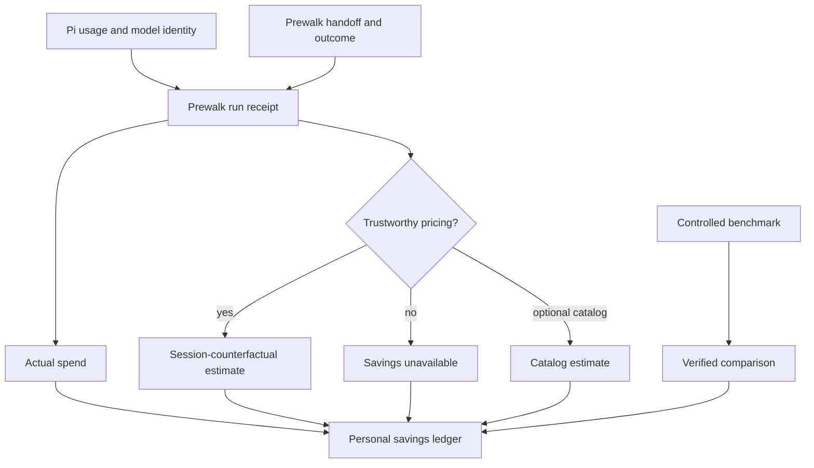
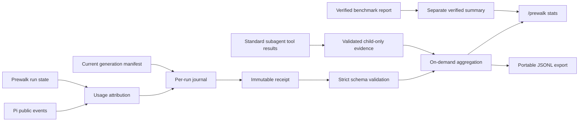
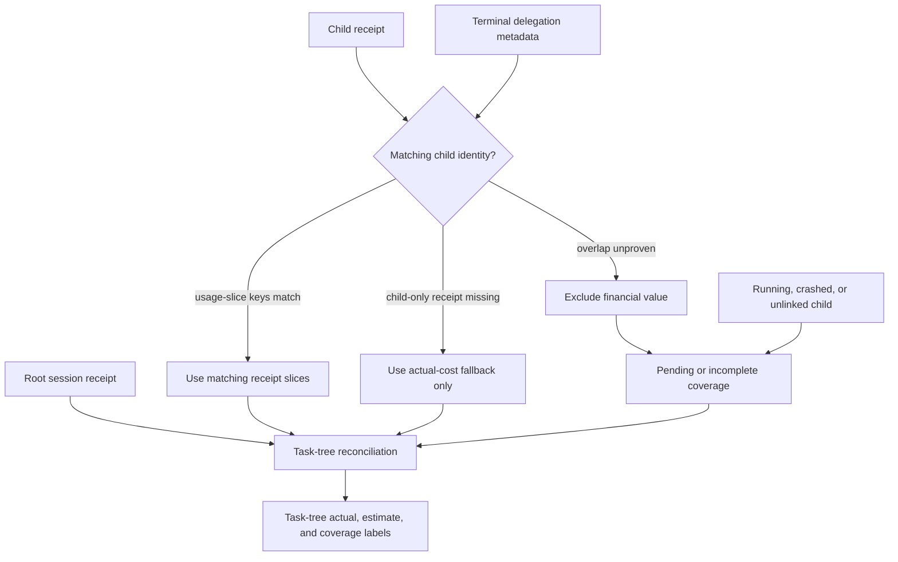
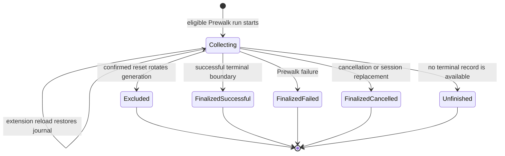
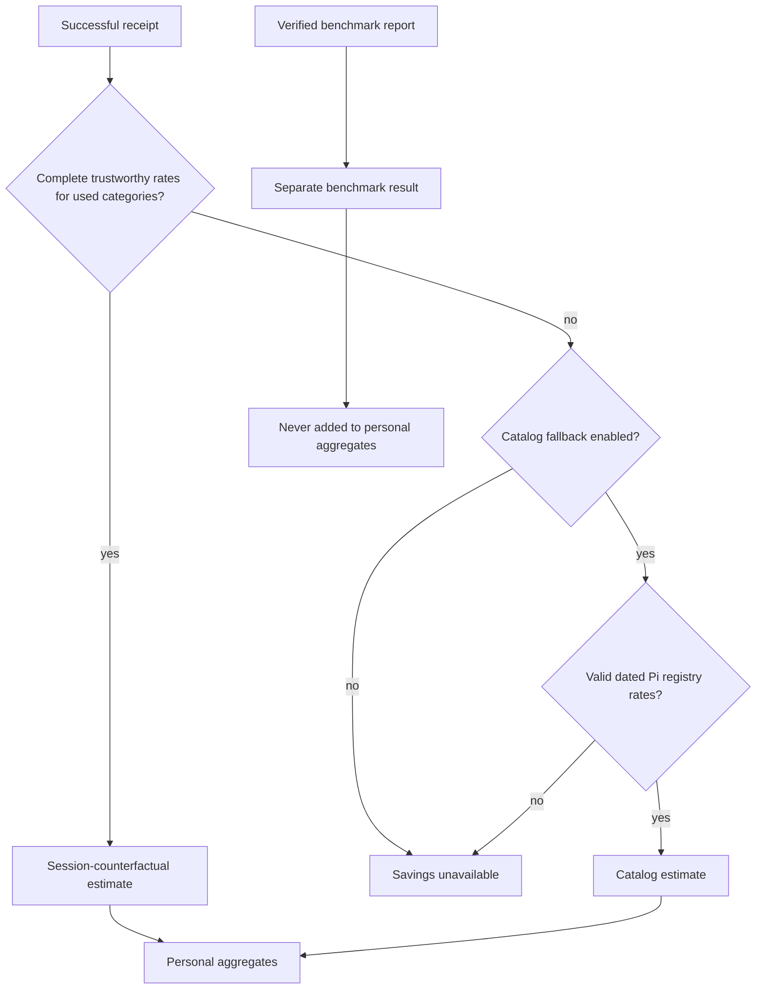
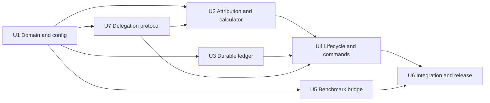

# Prewalk Personal Savings Analytics - Plan

## Goal Capsule

- **Objective:** Give each Prewalk user a trustworthy local ledger of actual spend and estimated savings across sessions, with inspectable receipts or explicitly labeled fallback evidence behind every aggregate and receipt precedence where overlap is proven.
- **Product authority:** Pi-reported usage and cost are authoritative for actual spend. Counterfactual estimates and benchmark-verified results remain visibly distinct.
- **Privacy boundary:** Analytics stay local and retain numeric operational data only.
- **Execution profile:** Build the complete confirmed analytics scope in Prewalk while treating the standard upstream `pi-subagents` tool contract as an optional public input. Invoke the `run-tests-on-request` skill for implementation verification.
- **Tail ownership:** The final unit owns real Pi Agent-loop coverage, packaging, documentation, and cleanup of abandoned implementation attempts.
- **Open blockers:** None at planning time. U2 and U4 task-tree work wait for U7 to publish the versioned public delegation projection, while session-only analytics can proceed independently. Missing trustworthy pricing produces an unavailable estimate instead of blocking collection.

---

## Product Contract

> **Product Contract preservation:** R1 through R22 preserve the confirmed brainstorm contract. R5 is clarified to cover only costs Pi exposes and can attribute to the run. R21 is clarified to prevent exports from overwriting existing files. R23 records the confirmed reset behavior for an active run. R24 through R28 add the approved distinction between one Pi session and its delegated task tree, including receipt-first deduplication and visible coverage limits.

### Summary

Prewalk will maintain a personal savings ledger that accumulates value across sessions and explains its totals through inspectable receipts or explicitly labeled fallback evidence. The first release focuses on lifetime, monthly, weekly, current-session, delegated task-tree, and recent-run results rather than a full analytics dashboard or optimization coach.

### Problem Frame

Pi can show usage and cost for the current session, but that information does not answer whether Prewalk has delivered meaningful value over weeks or months. A user must remember prior sessions, manually compare models, or run a controlled benchmark to make that judgment.

Pi's current-session statistics also stop at one Pi process. A delegated `pi-subagents` child incurs separate usage, so the parent footer and a parent-only Prewalk session total do not represent the cost of the complete delegated task. A task-tree total must join parent and descendant evidence without counting both a child receipt and the parent's summary of that child.

A single Prewalk session can report actual spend, but it cannot observe the Sol-only session that did not happen. Savings therefore require a counterfactual estimate whose pricing source and assumptions remain visible. Benchmark evidence is stronger, but it answers a different question and must not be blended into an estimate.

Long-term analytics also create a privacy and trust obligation. The ledger must prove its totals without retaining prompts, code, tool contents, credentials, or identifying filesystem details.

### Key Decisions

- **Use a personal ledger backed by run receipts.** (session-settled: user-approved - chosen over an optimization-first dashboard: prove Prewalk's value before recommending configuration changes.) Governs R1 through R3 and R10 through R14.
- **Keep analytics local and provider-independent.** (session-settled: user-approved - chosen over adapter-specific or remote telemetry: Prewalk must work with stock Pi and optional provider extensions without exporting user activity.) Governs R4, R17 through R20.
- **Separate actual, estimated, and verified values.** (session-settled: user-approved - chosen over one blended savings total: each evidence class has a different confidence boundary.) Governs R5 through R9 and R15.
- **Fail closed when pricing is unavailable, with an optional catalog estimate.** (session-settled: user-directed - chosen over always applying public list prices: unavailable is more honest unless the user enables a labeled fallback.) Governs R6 and R7.
- **Collect prospectively and retain until confirmed reset.** (session-settled: user-directed - chosen over historical backfill and automatic expiration: complete new records support trustworthy lifetime totals.) Governs R1, R16, R21, and R22.
- **Include every run's actual spend by default.** (session-settled: user-directed - chosen over a success-only headline: failures and cancellations still cost money.) Governs R3, R8, R11, and R12.
- **Keep session and task-tree totals distinct.** (session-settled: user-approved - chosen over silently folding descendants into current-session: Pi's native session boundary remains truthful while users can inspect the complete delegated task.) Governs R24 through R28.

### Actors

- A1. **Prewalk user:** Wants to understand whether Prewalk has saved money over time and inspect the evidence behind the headline.
- A2. **Prewalk analytics:** Attributes usage to a run, preserves one durable run evidence record, maintains aggregates, and applies the selected reporting view.
- A3. **Pi host and provider:** Supply model identity, usage, cache, timing, and cost information without knowing Prewalk's counterfactual.
- A4. **Prewalk benchmark:** Produces controlled comparison evidence that may be reported as verified and never as an ordinary session estimate.
- A5. **Delegation adapter:** Recognizes content-free `pi-subagents` lineage and usage evidence when that extension is present, without becoming a runtime dependency.

### Requirements

**Collection and receipts**

- R1. Analytics must collect only runs that begin after analytics becomes available, without attempting to reconstruct older sessions.
- R2. Each collected Prewalk run must retain one durable evidence record: a terminal run produces one immutable receipt, while a run without a terminal boundary remains one unfinished journal with observed actual spend and no estimated savings.
- R3. Successful, failed, and cancelled runs must retain their actual spend, with the outcome visible wherever the receipt contributes to a total.
- R4. Collection and attribution must use Pi's standard message and usage records rather than depend on `pi-codex-conversion` or any other provider extension.
- R5. Actual spend must use cost Pi exposes and can attribute to the run, must never be replaced by a counterfactual calculation, and must not guess at provider charges Pi did not report.
- R6. A successful run may receive an estimated planner-only cost only when both models have trustworthy rates for every billed token category used by the run.
- R7. When R6 cannot be satisfied, savings must be unavailable unless the user has enabled a catalog estimate whose source date and estimated status are visible.
- R8. Failed and cancelled runs must not contribute estimated savings, even though their actual spend remains in the ledger.
- R9. A value may be called verified only when it comes from a controlled comparison accepted by the Prewalk benchmark contract.

**Aggregation and reporting**

- R10. The default analytics view must show lifetime, current-month, current-week, and current-session actual spend and estimated savings, followed by recent run receipts.
- R11. The default actual-spend total must include every recorded outcome, while estimated savings must include only successful runs.
- R12. The user must be able to switch to a successful-runs-only view without changing or deleting the underlying receipts.
- R13. Every aggregate must reconcile to its included receipts and fallback evidence and must not double-count a usage slice after extension reload, session reopen, or repeated status inspection.
- R14. Each receipt must explain the actual cost, the estimate or unavailability reason, the pricing source, the model pair, the run outcome, and the handoff result.
- R15. Actual, catalog-estimated, session-counterfactual, and benchmark-verified values must use distinct labels that remain understandable without color.
- R16. Analytics must retain lifetime history until the user performs a confirmed reset.
- R24. Current-session analytics must include only evidence owned by the exact Pi session identity and must not silently include descendant processes.
- R25. A separate task-tree view must total the selected root session and every descendant that Pi's public tool result can link, while reporting unlinked direct, asynchronous, or nested descendants as incomplete rather than guessing.
- R26. Descendant evidence must use a versioned content-free contract containing the locally observed root and parent session IDs, delegation run ID, child index, child-only usage-slice identities, and lifecycle state. A child session ID is optional and may be recorded only when a public result proves it.
- R27. A descendant receipt must supersede fallback evidence only for matching usage-slice identities, and unproven aggregate overlap must remain excluded rather than added or replaced.
- R28. A task-tree report must label actual-spend coverage and estimate coverage separately as complete, pending, fallback-backed, overlap-unresolved, unsupported, or incomplete.

**Control and privacy**

- R17. Analytics must stay on the user's machine and must not send telemetry or analytics data to Prewalk, Pi, a provider extension, or a third-party analytics service.
- R18. Receipts and aggregates must not retain prompts, assistant text, code, tool inputs or outputs, credentials, request payloads, provider responses, raw errors, or raw filesystem paths.
- R19. Analytics must be enabled for a normal Prewalk installation, while the user can disable future collection without changing Prewalk routing behavior.
- R20. The user must be able to inspect analytics without enabling `pi-codex-conversion` and without making a provider request.
- R21. The user must be able to export the complete local ledger in a documented portable form. Export must refuse an existing destination file and tell the user to choose a new filename.
- R22. Reset must require confirmation, remove the accumulated ledger, and start prospective collection from an empty state.
- R23. If reset occurs during an active run, that run must remain excluded from the new ledger generation and collection must resume with the next Prewalk run.

### Key Flows

- F1. **Record a successful run**
  - **Trigger:** A Prewalk run completes after an executor handoff.
  - **Actors:** A1, A2, A3
  - **Steps:** Analytics attributes Pi usage to the planner and executor, records actual spend, evaluates estimate eligibility, and finalizes one receipt.
  - **Outcome:** The receipt contributes actual spend and, when R6 or R7 permits it, estimated savings.
  - **Covered by:** R1 through R8 and R13 through R15.

- F2. **Record an unsuccessful run**
  - **Trigger:** A Prewalk run fails or is cancelled.
  - **Actors:** A1, A2, A3
  - **Steps:** Analytics closes the receipt with the observed outcome and actual spend without producing estimated savings.
  - **Outcome:** The default ledger remains financially complete and the successful-runs-only view can exclude the receipt.
  - **Covered by:** R2, R3, R8, R11, and R12.

- F3. **Inspect savings over time**
  - **Trigger:** A1 requests Prewalk analytics.
  - **Actors:** A1, A2
  - **Steps:** Analytics reads local receipts, applies the requested time and outcome view, reconciles totals, and presents recent receipts.
  - **Outcome:** A1 sees the headline and can understand which runs produced it without a provider request.
  - **Covered by:** R10 through R16 and R20.

- F4. **Handle unavailable pricing**
  - **Trigger:** A completed run lacks trustworthy rates required by R6.
  - **Actors:** A1, A2, A3
  - **Steps:** Analytics records actual usage and reports savings as unavailable unless A1 enabled the catalog fallback.
  - **Outcome:** The receipt remains useful without presenting unsupported precision.
  - **Covered by:** R5 through R7 and R14.

- F5. **Export or reset history**
  - **Trigger:** A1 requests a portable copy or chooses to erase analytics.
  - **Actors:** A1, A2
  - **Steps:** Export preserves the complete ledger. Reset confirms intent before deleting it.
  - **Outcome:** A1 controls retention without affecting Prewalk routing or provider configuration.
  - **Covered by:** R16 and R19 through R23.

- F6. **Inspect a delegated task tree**
  - **Trigger:** A1 requests analytics for the current root task.
  - **Actors:** A1, A2, A3, A5
  - **Steps:** Analytics projects the standard public subagent result against the locally observed parent invocation, links any publicly identified descendant receipts by usage-slice identity, substitutes eligible child-only terminal evidence, and calculates separate actual-spend and estimate coverage. Missing child identity or terminal detail remains incomplete.
  - **Outcome:** A1 sees the task's recorded actual spend and receipt-backed estimates without confusing that total with Pi's current-session footer.
  - **Covered by:** R13, R15, and R24 through R28.

### Acceptance Examples

- AE1. **Successful run with trustworthy rates**
  - **Given:** A successful run contains complete Pi usage and cost for the planner and executor.
  - **When:** Analytics finalizes the receipt.
  - **Then:** Actual spend matches Pi, the counterfactual estimate is labeled estimated, and both appear in the applicable time totals.
  - **Covers:** R2, R5, R6, R10, R13, R14, and R15.

- AE2. **Failed run remains financially visible**
  - **Given:** A run incurs planner spend and fails before a successful handoff.
  - **When:** A1 opens the default lifetime view.
  - **Then:** The actual spend is included, estimated savings are zero or unavailable for that receipt, and the failed outcome is visible.
  - **Covers:** R3, R8, R11, and R14.

- AE3. **Successful-only view**
  - **Given:** The ledger contains successful, failed, and cancelled receipts.
  - **When:** A1 switches to the successful-runs-only view.
  - **Then:** The displayed totals exclude unsuccessful receipts without modifying the stored ledger.
  - **Covers:** R12, R13, and R16.

- AE4. **Pricing unavailable**
  - **Given:** A successful run lacks trustworthy planner rates and catalog fallback is disabled.
  - **When:** Analytics finalizes and displays the receipt.
  - **Then:** Tokens, timing, cache usage, and actual spend remain visible while savings are marked unavailable.
  - **Covers:** R5 through R7 and R14.

- AE5. **Optional catalog estimate**
  - **Given:** R6 cannot be satisfied and A1 enabled catalog estimates.
  - **When:** A compatible dated catalog rate exists.
  - **Then:** Analytics shows a catalog estimate with its source date and never labels it actual or verified.
  - **Covers:** R7 and R15.

- AE6. **Reload does not inflate savings**
  - **Given:** A receipt was finalized before an extension reload or session reopen.
  - **When:** Analytics restores the ledger and A1 inspects it repeatedly.
  - **Then:** The run appears once and every total continues to reconcile.
  - **Covers:** R2 and R13.

- AE7. **Benchmark evidence remains distinct**
  - **Given:** A controlled benchmark has accepted Sol-only, Luna-only, and Prewalk results.
  - **When:** Those results are available beside personal analytics.
  - **Then:** The benchmark comparison is labeled verified and is never added to ordinary session-counterfactual savings.
  - **Covers:** R9 and R15.

- AE8. **Local control and privacy**
  - **Given:** The ledger contains multiple months of receipts.
  - **When:** A1 exports it, disables future collection, or performs a confirmed reset.
  - **Then:** Each action completes locally, routing remains unchanged, no prohibited R18 content appears in retained or exported data, and export never replaces an existing file.
  - **Covers:** R17 through R22.

- AE9. **Reset while a run is active**
  - **Given:** A Prewalk run is collecting usage when A1 confirms a reset.
  - **When:** That run later receives more messages or reaches a terminal outcome.
  - **Then:** None of that run appears in the new ledger generation, and the next newly started Prewalk run collects normally.
  - **Covers:** R13, R16, R22, and R23.

- AE10. **Direct and nested descendants remain honest**
  - **Given:** A root Pi session receives direct child-only usage and a nested run identifier through the standard public subagent result, but nested child usage or child session identity is unavailable.
  - **When:** A1 opens the task-tree view.
  - **Then:** Direct fallback usage appears once, the nested descendant is marked incomplete, and no child receipt or usage is invented.
  - **Covers:** R13 and R24 through R27.

- AE11. **Fallback evidence remains honest**
  - **Given:** One terminal child has `pi-subagents` usage metadata but no receipt, another child is still running, and a third child has both metadata and a receipt.
  - **When:** A1 opens the task-tree view repeatedly or after extension reload.
  - **Then:** The receipt supersedes only matching usage slices, the fallback-only child contributes actual spend without an estimated saving, actual-spend coverage is pending because one child is running, and estimate coverage is incomplete because fallback-only and running descendants lack receipt-backed estimates.
  - **Covers:** R5, R13, R15, and R27 through R28.

- AE12. **Unsupported or overlapping delegation evidence fails closed**
  - **Given:** The public tool result conflicts with the locally observed parent invocation, contains invalid numeric usage, omits required terminal detail, or supplies aggregate usage whose overlap with receipts cannot be proven.
  - **When:** A1 opens the task-tree view.
  - **Then:** Session analytics remain available, unsupported or overlap-unresolved evidence contributes no financial value, and both coverage dimensions explain the exclusion.
  - **Covers:** R5, R13, R18, and R24 through R28.

### Success Criteria

- Every displayed aggregate reconciles exactly to its included receipts and fallback evidence, with receipt precedence visible for task-tree totals.
- Actual cost totals match the sum of Pi-reported actual costs for all included runs.
- Reloading, reopening, or inspecting a session cannot create a duplicate receipt.
- Current-session totals remain scoped to one Pi session, while task-tree totals reconcile publicly proven descendant evidence exactly once and expose missing nested detail.
- Fallback-only or unresolved descendants make task-tree estimate and coverage limits visible rather than implying complete savings.
- Unsupported versions, results that cannot be joined to a locally observed invocation, invalid numeric usage, and unproven aggregate overlap cannot enter financial totals.
- Missing pricing never produces a savings number unless the optional catalog fallback is enabled and labeled.
- A user can distinguish actual, estimated, unavailable, and verified values from text alone.
- Stored and exported analytics contain none of the prohibited R18 content.
- Analytics work with stock Pi whether or not another provider extension is installed.
- Resetting during an active run cannot repopulate the empty ledger with that run.
- Exporting cannot overwrite an existing destination file.

### Scope Boundaries

**In scope**

- A local prospective ledger with lifetime, monthly, weekly, current-session, and recent-run views.
- A delegated task-tree view with direct and nested descendant ancestry, receipt-first reconciliation, and explicit coverage status.
- Inspectable successful, failed, and cancelled run receipts.
- Actual spend, session-counterfactual savings, optional catalog estimates, and separately labeled benchmark evidence.
- Successful-runs-only reporting without discarding unsuccessful receipts.
- Local export, disablement, and confirmed reset.
- Generation-based reset semantics that exclude a run already active when reset is confirmed.

**Deferred for later**

- Project, model-pair, reasoning-level, handoff-trigger, and other detailed breakdowns.
- Charts, interactive filters, trends, budgets, alerts, and spending forecasts.
- Configuration recommendations or an optimization coach.
- Historical import of sessions created before analytics was available.
- Benchmark-calibrated time-savings estimates.
- Multi-device synchronization and anonymized community comparisons.

**Outside this product's identity**

- Remote telemetry enabled by default.
- Uploading prompts, code, tool contents, credentials, raw provider data, or identifiable local paths.
- Presenting an estimated or catalog-derived number as actual or verified savings.

### Dependencies and Assumptions

- Pi continues to attach model identity and usage to assistant messages, including actual cost when the provider and model expose it.
- Actual cost coverage is limited to usage and charges Pi exposes and Prewalk can attribute to the run; provider invoice items outside that boundary remain unreported rather than estimated as actual.
- Provider-reported actual cost may be absent or zero for subscriptions, proxies, or providers without trustworthy rate metadata.
- Public catalog pricing can change, so a catalog estimate requires source and effective-date visibility.
- The Prewalk run lifecycle provides a stable identity and terminal outcome for receipt finalization.
- Controlled benchmark evidence remains the only authority for the verified label.
- Standard pi-subagents tool results expose direct-child run identity and usage. Evidence absent from those public results, including unresolved asynchronous completion and incomplete nested breakdowns, must remain pending or incomplete.
- The upstream pi-subagents source and installed package remain unchanged.
- A child receipt may be absent because the child did not load Prewalk, did not reach a durable boundary, or crashed. Fallback metadata can recover actual spend but cannot create a session-counterfactual estimate.

### Sources and Research

- `extensions/prewalk.ts` defines the current run lifecycle, handoff outcomes, command surface, and extension-owned audit points.
- `src/audit.ts` defines the current privacy-conscious run identity and transition record.
- `src/status.ts` shows the existing compact and detailed Prewalk status boundary.
- `scripts/canary-provider.mjs` demonstrates aggregation of Pi assistant usage without retaining transcript content.
- `scripts/benchmark-contract.mjs` and `scripts/benchmark-report-lib.mjs` define the existing controlled cost and duration comparison boundary.
- The upstream `pi-subagents` `Details` and `SingleResult` contracts expose delegation run identity and usage but do not expose a direct child's Pi session ID through the standard parent tool result.
- The installed `pi-subagents` asynchronous path returns running details before terminal usage exists, so a tool-result-only adapter cannot make pending coverage converge after completion.
- The installed `pi-subagents` nested-run representation shows that the public projection must support more than one descendant level and must separate child-only usage from run-level aggregates.
- `docs/plans/2026-07-30-002-feat-extension-only-sol-luna-prewalk-plan.md` remains the authority for Prewalk routing, OMP fidelity, provider composition, and benchmark scope outside this analytics Product Contract.

---

## Planning Contract

### Key Technical Decisions

#### KTD1. Store versioned per-run journals and immutable receipts

Prewalk will store one versioned JSON journal per active run in an extension-owned directory under Pi's agent data directory. Each run writes only its own file with owner-only permissions and atomic temporary-file replacement. On a terminal boundary, the journal becomes an immutable receipt.

Prewalk will not introduce SQLite, a native dependency, or a shared mutable totals file. Aggregates are calculated from validated evidence records, so concurrent Pi processes cannot corrupt a common counter and every displayed total remains traceable to its inputs.

#### KTD2. Reset by rotating the ledger generation

A small manifest identifies the current ledger generation. Confirmed reset atomically creates a new generation before removing prior-generation receipts, journals, delegation records, and separately stored verified summaries. This avoids an unsafe race between deletion and active writers while still leaving the analytics view and retained history empty. Every run captures its generation when collection begins and verifies ownership before later writes.

An active run from the prior generation stops contributing immediately and never migrates into the new generation. Collection resumes with the next Prewalk run, which implements R23 without process identifiers, heartbeats, or cross-process locks.

Reset keeps a retryable cleanup marker until every prior-generation journal, receipt, delegation record, and verified summary is verified absent. The command reports incomplete cleanup rather than successful erasure when deletion fails. Previously exported files remain user-owned and outside reset scope.

#### KTD3. Attribute usage from Pi's public lifecycle records

The extension will collect final assistant usage from `message_end`, tool-associated usage from one canonical tool-result path, and compaction usage from `session_compact`. It will use the public session ID as an identifier but will never persist the raw session path.

Primary planner and executor usage remain separate from auxiliary attributable usage. Actual spend includes all Pi-attributable captured spend, while the planner-only counterfactual reprices only executor primary usage. Auxiliary cost is visible and cancels out of the comparison rather than producing artificial savings.

The implementation must prove that each charge enters a run once. It must not collect the same tool usage from both the tool event and its persisted result. The journal records a content-free evidence key derived from public session ordering, model identity, and categorized usage so extension reload can ignore already-counted evidence without retaining message or tool content.

#### KTD4. Finalize receipts at the Prewalk run boundary, not the first executor response

A successful handoff does not end the analytics run because later executor turns still belong to the same live Prewalk session. The journal remains open across those turns and across extension reload.

Cancellation, Prewalk failure, quit, session replacement, resume, or fork closes the current journal with its observed outcome. A hard crash may leave an open journal. Without a liveness mechanism, Prewalk must continue to label that journal `unfinished` rather than infer whether its process is active or interrupted. It may contribute clearly labeled observed actual spend, but it must never be upgraded to successful or receive estimated savings without a recorded successful terminal boundary.

#### KTD5. Reprice executor requests using the planner's rates

For each successful run:

`planner-only counterfactual = actual planner primary cost + executor primary usage repriced at planner rates`

`estimated savings = planner-only counterfactual - actual planner and executor primary cost`

Repricing happens per executor request so request-wide pricing tiers are applied at the same boundary as provider billing. The calculator uses input, output, cache-read, and cache-write categories. Reasoning tokens remain part of output pricing and are never billed a second time.

Every used category needs a credible nonzero rate for both models, as required by R6. Planner rates drive the counterfactual arithmetic; executor rates establish that the model pair has complete pricing evidence while Pi-reported executor cost remains authoritative. If current model metadata cannot satisfy that rule, the estimate is unavailable. When the user enables catalog fallback, Prewalk may snapshot rates from Pi's model registry and label the result `catalog estimate` with its source and capture date. Negative savings remain negative and are presented as estimated extra cost.

#### KTD6. Keep personal and benchmark evidence in separate stores and totals

Personal receipts produce actual spend and session-counterfactual estimates. An existing benchmark final report may be imported only after the current benchmark integrity verifier accepts it. Prewalk stores a minimal numeric verified summary separately from personal receipts.

Benchmark results may appear beside personal analytics, but they are never summed into lifetime, monthly, weekly, session, or recent-run estimated savings.

#### KTD7. Render time windows in the user's current timezone

Receipts store UTC timestamps. Week and month boundaries are calculated in the timezone active when the user requests the report, which makes the view match the user's present calendar without encoding sensitive location data into every receipt. Boundary and daylight-saving behavior require deterministic tests.

#### KTD8. Treat the receipt schema as a strict privacy allowlist

The receipt and delegation-evidence writers, readers, and exporter share strict versioned validators. Only run identity, authenticated session lineage, generation, outcome, lifecycle state, timestamps, model identities, handoff state, categorized usage, evidence keys, cost, pricing evidence, coverage state, and calculation results are permitted.

Prompts, assistant content, code, tool inputs and outputs, raw errors, headers, credentials, provider payloads, and raw filesystem paths have no schema field. Invalid or corrupted receipts fail the requested report visibly instead of being silently omitted from a financial total.

#### KTD9. Extend the existing command surface without expanding the compact footer

`/prewalk stats` is the analytics entry point. Its default report shows lifetime, current month, current week, current session, and recent receipts. Focused subcommands provide successful-only reporting, receipt detail, export, and confirmed reset. `/prewalk configure` owns collection enablement and optional catalog fallback.

The compact Prewalk footer remains focused on routing state. Analytics detail belongs in command output and `/prewalk --help`, so long-term totals do not recreate the footer overflow the extension already addressed.

#### KTD10. Reconcile task trees through versioned child-only evidence

Current-session remains an exact Pi session filter. A separate task-tree query starts from a root session and walks content-free ancestry fields across direct and nested descendants.

Prewalk projects Pi's public subagent tool lifecycle and standard result details into versioned evidence. Each supported record contains locally observed root and parent session IDs, delegation run ID, child index, lifecycle state, child-only usage slices, and stable usage-slice evidence keys. Fields not proven by the public result, such as a child Pi session ID or a complete nested usage breakdown, are omitted and reported as incomplete.

Prewalk binds the parent and root identities to its locally owned journal and the locally observed delegation invocation. It rejects lineage that conflicts with those facts. Matching prefers shared child identity, then shared child index within the same root, parent, and delegation run. Evidence with no common identifier remains unlinked.

A child receipt supersedes fallback evidence only when their usage-slice evidence keys match. Aggregate-only usage whose overlap cannot be proven is excluded as overlap-unresolved. Fallback evidence never receives counterfactual savings because it lacks the receipt's complete Prewalk model-pair and lifecycle evidence.

#### KTD11. Keep delegation integration optional, versioned, and fail-closed

Prewalk observes Pi's supported `tool_execution_start` and `tool_result` events without importing `pi-subagents` or reading its artifacts. Direct terminal results converge when upstream returns complete standard details. Asynchronous or nested state that never reaches a standard terminal result remains explicitly pending or incomplete.

Prewalk accepts financial evidence only from explicitly supported contract versions. Tokens must be finite nonnegative integers, costs must be finite nonnegative numbers, and component totals must reconcile before persistence. Invalid, unauthenticated, unsupported, or aggregate-only evidence contributes only a content-free coverage reason.

Stock Pi and every existing receipt view continue to work without `pi-subagents`. Pi's native footer remains parent-only. The integration adds a Prewalk task-tree report rather than changing Pi's session accounting.

### High-Level Technical Design

### Data Contracts

The implementation should define explicit domain types rather than letting extension event shapes leak into storage:

- `AnalyticsConfig`: collection enabled, catalog fallback enabled, recent receipt count, and current schema version.
- `RunJournal`: run ID, epoch, session lineage, generation, configuration snapshot, start time, last observed sequence, lifecycle outcome, handoff state, and accumulated categorized usage.
- `RunReceipt`: finalized or unfinished run evidence plus ancestry, actual cost, estimate result, pricing evidence, and stable unavailability reason.
- `UsageSlice`: provider, model, request role, input, output, cache-read, cache-write, reasoning, total tokens, and Pi-reported cost breakdown.
- `SessionLineage`: root session ID, parent session ID, delegation run ID, child index, and an optional child session ID only when the public result proves it.
- `DelegationEvidence`: contract version, locally observed parent lineage, terminal child-only usage slices, evidence keys, observed status, and fallback eligibility without task text, output, paths, or raw extension details.
- `TaskTreeReport`: root identity, included receipts, fallback evidence, unresolved descendants, actual-spend coverage, and estimate coverage.
- `PricingEvidence`: actual Pi cost, current model metadata, dated Pi model-registry catalog snapshot, or unavailable reason.
- `VerifiedBenchmarkSummary`: benchmark contract version, evidence fingerprint, completion time, run counts, and accepted numeric comparisons.

The persisted structures are versioned from their first release. There is no legacy analytics schema to migrate and no compatibility reader is required.

### Command Contract

The exact parser organization may follow the existing command implementation, but these observable forms must exist:

- `/prewalk stats` displays the default all-outcome report.
- `/prewalk stats --successful` displays the same windows using successful receipts only.
- `/prewalk stats task` displays the current root task tree, keeps the root-only current-session subtotal visible, and labels descendant coverage.
- `/prewalk stats receipt <run-id>` displays the evidence and calculation for one receipt.
- `/prewalk stats export <path>` writes validated portable JSONL containing receipts, fallback evidence, and lineage without provider calls. If the destination already exists, it leaves that file unchanged and tells the user to choose a new filename.
- `/prewalk stats reset` requests native Pi confirmation, warns that prior exports remain user-owned, rotates the generation, and reports that an active run was excluded when applicable. It reports incomplete cleanup with safe retry guidance until every prior-generation managed artifact is removed.
- `/prewalk configure` includes analytics collection and catalog fallback controls.
- `/prewalk --help` explains labels, cost coverage, estimate limitations, export, reset, and the active-run reset rule.

Unknown arguments fail with compact usage guidance. Disabling analytics stops future run collection and does not delete existing receipts, alter routing, or hide explicit stats inspection.

### Sequencing and Ownership

U1 establishes the domain and configuration contract. U2 and U3 may begin after U1. U7 implements the optional public-result adapter in Prewalk and feeds U4's task-tree integration. U4 depends on U2, U3, and U7. U5 depends on U1 and the existing benchmark verifier. U6 is the integration and release tail and depends on U4, U5, and U7.

### Implementation Constraints

- Use only stock Pi's supported extension and provider APIs. Analytics must have no runtime or peer dependency on `@howaboua/pi-codex-conversion`.
- Preserve the routing, OMP fidelity, compaction, and provider-composition authority of plan `2026-07-30-002`; this plan adds observation and reporting only.
- Do not change selected models, initiate provider requests, or modify routing in response to analytics commands.
- Keep production code free of type assertions and avoid compatibility branches for nonexistent prior analytics formats.
- Do not add a native storage package or remote telemetry SDK.
- Make writes owner-readable only and atomic. Never construct temporary names from untrusted run identifiers without validation.
- Use one canonical source for each usage class to prevent duplicate attribution.
- Consume delegation evidence only through Pi's public tool lifecycle and the standard upstream `pi-subagents` result shape. Never import the package, read child session files, or require a fork.
- Keep fallback evidence actual-only and replace only usage slices whose authoritative child receipt carries matching evidence keys.
- Treat all financial output as local operational evidence, not a provider invoice.

### System-Wide Impact

- **Extension lifecycle:** Analytics observes the existing arm, handoff, reload, cancellation, failure, and session-replacement boundaries. It must not add a transition to Prewalk's routing state machine or delay a provider stream.
- **Pi event handling:** New listeners consume final usage evidence only. Failures in analytics persistence or reporting surface as analytics failures and must not corrupt the transcript, change the selected model, or cancel an otherwise valid Prewalk route.
- **Delegation:** Optional observation of public `subagent` tool starts and results adds direct child fallback spend. Missing async or nested terminal evidence remains explicitly pending or incomplete. It does not change subagent orchestration, Pi's native footer, or the meaning of current-session.
- **Persistent state:** The generation manifest, active journals, finalized receipts, content-free delegation evidence, and verified benchmark summary are the only new durable state. No aggregate cache is authoritative, so every report is derived from the same validated evidence.
- **Commands and UI:** `/prewalk stats`, configuration fields, reset confirmation, export, and help extend the human command surface. They make no model request and expose no new model-callable tool.
- **Provider composition:** Attribution reads the terminal provider and model identity Pi records after all provider wrappers run. No analytics branch detects or imports a provider extension by package name.
- **Compaction:** Compaction usage may affect actual spend, but analytics records only numeric usage and never changes input construction, prompt scrubbing, selected compaction model, or persisted transcript entries.
- **Failure propagation:** A storage or validation failure marks analytics unavailable with a safe reason. Financial data is never silently discarded, but routing remains usable unless an existing Prewalk failure independently stops it.
- **Packaging and privacy:** Runtime analytics modules and examples ship in the package. User journals, receipts, exports, and local benchmark summaries are excluded from package contents and test fixtures.

### Risks and Mitigations

- **Pi cost does not equal the provider invoice:** Label actual cost as Pi-attributable actual spend, expose coverage limitations in help, and never fill gaps with guessed actual charges.
- **Pricing metadata drifts or contains tiered rates:** Snapshot the evidence used by each estimate, price each request separately, and fail closed when any used category lacks a credible rate.
- **Reload or replay duplicates usage:** Persist stable event progress in the run journal and prove idempotence with repeated lifecycle events.
- **Parent summaries duplicate child receipts:** Use the lineage and evidence precedence from KTD10 so receipt slices replace only fallback slices with matching evidence keys and unresolved aggregate overlap remains excluded.
- **A descendant cannot be linked:** Keep root-only and known descendant totals available, but label task-tree coverage incomplete instead of guessing.
- **Delegation metadata changes shape:** Fail the optional adapter closed and keep stock-Pi session analytics available.
- **Reset cleanup partially fails:** Keep the new generation isolated, persist a retryable cleanup marker, and report reset incomplete until prior managed artifacts are verified absent.
- **Concurrent sessions race with reset:** Give every run its own file and generation ownership; reset rotates the manifest so old writers cannot rejoin.
- **Receipt content leaks sensitive data:** Enforce one strict allowlist at write, read, and export boundaries and test hostile strings against serialized output.
- **A corrupted receipt makes totals misleading:** Fail the report with the offending receipt identity and remediation guidance instead of silently dropping it.
- **A crash leaves an ambiguous run:** Preserve observed actual spend as unfinished, make no liveness claim, and withhold estimated savings.
- **Long history makes report scans slow:** Keep the first release index-free for correctness and simplicity. Measure realistic receipt volumes before adding derived indexes.
- **Week and month totals shift unexpectedly:** Store UTC, render with the current timezone, and cover boundary and daylight-saving cases.

### Outstanding Questions

None are launch-blocking. Detailed breakdowns, charts, optimization advice, historical imports, time-savings estimates, and synchronization remain explicitly deferred rather than open implementation choices.

---

## Implementation Units

### U1. Establish the analytics domain and configuration contract

**Goal:** Define the provider-independent configuration, receipt vocabulary, schema versions, and privacy allowlists that every later unit consumes.

**Requirements:** R1, R2, R4, R15, R17 through R20, and R24 through R28.

**Flows and examples:** F1, F3, F4, F6; AE1, AE4, AE8, AE10 through AE12.

**Files:**

- `src/core.ts`
- `src/analytics.ts`
- `prewalk.example.json`
- `test/core.test.ts`
- `test/analytics.test.ts`

**Approach:**

1. Add analytics settings to the existing Prewalk configuration with normal-install collection enabled and catalog fallback disabled.
2. Define assertion-free production domain types for usage slices, journals, receipts, session lineage, delegation evidence, task-tree reports, estimates, pricing evidence, and verified benchmark summaries.
3. Implement strict versioned runtime validation and serialization allowlists shared by storage and export.
4. Define stable outcome, pricing-source, and unavailability reason values that UI tests can assert without matching prose.
5. Define the supported delegation contract versions, locally observed invocation fields, numeric validity rules, usage-slice evidence keys, and separate actual-spend and estimate coverage states.
6. Keep paths and provider event objects outside the persisted domain.

**Test Scenarios:**

- Default and explicitly disabled analytics configuration parse correctly.
- Invalid values fail with actionable configuration errors.
- Receipt validation rejects extra sensitive fields, raw paths, prompt content, and unsupported schema versions.
- A valid receipt round-trips without losing usage or pricing evidence.
- Lineage validation accepts direct and nested descendants while rejecting cycles, malformed identifiers, and prohibited path or content fields.
- Delegation validation rejects conflicting local ancestry, unsupported versions, negative or non-finite cost, fractional or negative token counts, and component totals that do not reconcile.
- Task-tree coverage states serialize and render without implying that pending or fallback evidence is complete.
- No conversion-extension package is required to import or exercise the analytics domain.

**Verification:** Run the focused core and analytics tests through the `run-tests-on-request` skill, then run `npm run typecheck`.

**Dependencies:** None.

### U2. Implement usage attribution and counterfactual pricing

**Goal:** Convert public Pi lifecycle evidence into deduplicated usage and honest actual, estimated, or unavailable financial results.

**Requirements:** R2 through R9, R13 through R15, and R24 through R28.

**Flows and examples:** F1, F2, F4, F6; AE1, AE2, AE4, AE5, AE10 through AE12.

**Files:**

- `src/analytics.ts`
- `src/analytics-subagents.ts`
- `src/analytics-report.ts`
- `test/analytics.test.ts`
- `test/analytics-subagents.test.ts`
- `test/analytics-report.test.ts`

**Approach:**

1. Normalize final assistant, tool, and compaction usage into categorized `UsageSlice` values.
2. Separate planner primary, executor primary, and auxiliary attributable usage.
3. Calculate Pi-attributable actual totals directly from reported cost without recomputing or filling gaps.
4. Reprice each executor primary request with planner rates, including cache categories and request-wide tier thresholds.
5. Emit session-counterfactual, dated catalog-estimated, unavailable, or negative-savings results with explicit evidence.
6. Make event ingestion idempotent and ensure reasoning tokens are never billed separately from output.
7. Validate versioned evidence projected from the public tool lifecycle and emit fallback actual-cost evidence only when KTD10 permits it.
8. Reject nested aggregate totals that would duplicate their per-child results, and never estimate savings from fallback evidence.

**Test Scenarios:**

- Actual input, output, cache-read, cache-write, and auxiliary costs reconcile exactly.
- Tool and compaction usage are counted once when overlapping event representations are observed.
- Complete rates produce the expected per-request planner-only counterfactual.
- Tier boundaries apply independently to each executor request.
- Missing, zero, or incomplete rates make savings unavailable.
- Catalog fallback is opt-in, dated, and visibly distinct.
- Negative savings render as estimated extra cost rather than zero.
- Failed and cancelled outcomes retain actual spend but never receive estimates.
- A valid terminal child event produces one fallback evidence record without retaining task text, output, artifact paths, or raw event details.
- Running, malformed, unauthenticated, unsupported, or numerically invalid child events produce no financial fallback and carry an explicit coverage reason.
- Nested aggregate usage and per-child usage cannot both enter the same task tree.
- A terminal child receipt supersedes only fallback slices with shared evidence keys; aggregate-only overlap remains unresolved and excluded.

**Verification:** Run focused calculator and report tests through the `run-tests-on-request` skill, followed by `npm run lint` and `npm run typecheck`.

**Dependencies:** U1. Delegation adapter scenarios also depend on U7.

### U3. Build the concurrent durable ledger

**Goal:** Persist auditable run and delegation evidence across sessions without a shared mutable total, privacy leakage, duplicate runs, or reset races.

**Requirements:** R1 through R3, R10 through R18, and R21 through R28.

**Flows and examples:** F1 through F6; AE2, AE3, AE6, and AE8 through AE12.

**Files:**

- `src/analytics-store.ts`
- `test/analytics-store.test.ts`

**Approach:**

1. Resolve an extension-owned analytics directory beneath Pi's agent data directory and create files with owner-only permissions.
2. Create a versioned manifest containing the current ledger generation.
3. Write one journal per run with atomic temporary-file replacement and promote terminal journals to immutable receipts.
4. Restore a journal by run identity and epoch on reload without duplicating prior usage.
5. Aggregate validated run evidence on demand by UTC timestamp, current timezone, outcome, session, and recent-run limit.
6. Resolve task trees from locally observed parent invocations and public result evidence, prefer publicly linked child receipts over matching usage-slice evidence, exclude unproven aggregate overlap, and calculate actual and estimate coverage independently.
7. Export validated receipts and delegation evidence as documented JSONL using exclusive file creation so an existing destination remains unchanged.
8. Rotate the generation on confirmed reset, refuse later writes from prior-generation runs, track cleanup until all prior managed artifacts are verified absent, and preserve safe retry state after partial deletion failure.
9. Surface corrupted or unsupported receipts as report failures with safe receipt identifiers.

**Test Scenarios:**

- Two simulated Pi processes update different journals and both receipts reconcile in totals.
- Repeated writes and reload restoration do not duplicate usage or receipts.
- Atomic write failure preserves the last valid journal.
- Reset produces an empty current generation and excludes an active prior-generation run.
- Partial prior-generation deletion reports reset incomplete, retains a retryable cleanup marker, and never exposes old data through the new generation.
- The next run after reset collects normally.
- Unfinished journals show observed actual spend and no estimated savings without claiming whether another process is still active.
- Week and month views respect timezone and daylight-saving boundaries.
- Export contains every valid receipt and delegation evidence record and none of the prohibited R18 content.
- Export to an existing destination fails with clear guidance and leaves the existing bytes unchanged.
- Corrupted and unsupported receipts fail visibly instead of disappearing from totals.
- Direct children, nested descendants, and concurrent siblings reconcile once under their root session.
- Matching child receipt slices replace fallback slices with the same evidence keys before aggregation, including after reload and repeated inspection.
- Missing, running, crashed, cyclic, and unlinked descendants produce deterministic pending or incomplete coverage without corrupting known totals.

**Verification:** Run the durable-ledger suite through the `run-tests-on-request` skill and repeat its concurrency scenarios enough times to expose ordering-dependent failures.

**Dependencies:** U1.

### U4. Integrate analytics with the extension lifecycle and commands

**Goal:** Attach collection to real Prewalk runs and expose compact, understandable local reporting and controls.

**Requirements:** R1 through R8 and R10 through R28.

**Flows and examples:** F1 through F6; AE1 through AE12.

**Files:**

- `extensions/prewalk.ts`
- `src/core.ts`
- `src/analytics-report.ts`
- `test/extension.test.ts`
- `test/analytics-report.test.ts`

**Approach:**

1. Open a journal when an eligible Prewalk run arms, capturing run ID, epoch, public session identity and available lineage, generation, configuration, model pair, and start time.
2. Subscribe to the public Pi events selected in KTD3 and attribute usage only while the journal owns the active run.
3. Keep the journal open after handoff and across reload, then close it on cancellation, failure, quit, or session replacement.
4. Add `/prewalk stats` forms, including the separate task-tree view, configuration controls, native reset confirmation, and help text from the Command Contract.
5. Show provisional current-session actual and estimated values while clearly marking an active or unfinished receipt.
6. Subscribe to the versioned public delegation projection, bind records to the locally observed delegation invocation, and restore replayed asynchronous state after reload.
7. Keep analytics out of routing decisions, hidden prompts, model status, Pi's native session statistics, and the compact footer.

**Test Scenarios:**

- Successful planner-to-executor runs retain all later executor turns before finalization.
- Failed and cancelled runs close with actual spend and no estimate.
- Reload restores the same journal; new, resume, and fork close the old run and create the correct next run.
- Disabling collection leaves routing unchanged and preserves existing report access.
- Every stats form works without a provider request or conversion extension.
- Reset confirmation cancellation changes nothing; confirmation excludes an active run.
- Help and report output distinguish actual, estimated, catalog-estimated, unavailable, verified, and unfinished states without relying on color.
- Auxiliary requests appear in actual detail without altering the planner-only savings comparison.
- Current-session remains root-only when direct and nested children are present.
- Task-tree reporting replaces only matching fallback slices with child receipt slices and labels running or unlinked descendants as incomplete.
- Aggregate-only fallback whose overlap cannot be proven is excluded and labeled overlap-unresolved.
- Stock Pi without `pi-subagents` retains every existing stats form and reports no synthetic descendants.

**Verification:** Run the extension and report suites through the `run-tests-on-request` skill, then run `npm run lint` and `npm run typecheck`.

**Dependencies:** U2, U3, and U7.

### U5. Add the verified benchmark bridge

**Goal:** Let users view accepted benchmark evidence beside personal analytics without contaminating personal totals.

**Requirements:** R9, R15, R17, R18, R20.

**Flows and examples:** F3; AE7, AE8.

**Files:**

- `scripts/benchmark-report-lib.mjs`
- `scripts/benchmark-report-lib.d.mts`
- `src/analytics.ts`
- `src/analytics-report.ts`
- `test/benchmark-report.test.ts`
- `test/analytics-report.test.ts`

**Approach:**

1. Reuse the existing benchmark report verifier rather than duplicate its integrity rules.
2. Accept only a completed final report whose contract, evidence hashes, run counts, and acceptance status verify.
3. Extract a minimal versioned numeric summary into the separate benchmark store.
4. Present the verified comparison beside personal analytics with its evidence fingerprint and completion time.
5. Prevent benchmark values from entering personal aggregation code by type and API boundary.

**Test Scenarios:**

- A valid accepted benchmark imports and displays as verified.
- Incomplete, rejected, modified, or hash-mismatched reports fail without changing stored evidence.
- Import retains no task text, transcript, raw path, or provider payload.
- Personal lifetime savings remain byte-for-byte unchanged before and after benchmark import.

**Verification:** Run benchmark-report and analytics-report tests through the `run-tests-on-request` skill.

**Dependencies:** U1 and the existing benchmark verifier.

### U6. Prove real Pi integration, packaging, and user guidance

**Goal:** Verify the complete analytics lifecycle against the supported Pi host and ship clear operating guidance without coupling Prewalk to an optional provider extension.

**Requirements:** R1 through R28.

**Flows and examples:** F1 through F6; AE1 through AE12.

**Files:**

- `test/agent-loop.test.ts`
- `scripts/smoke-rpc.mjs`
- `test/scripts.test.ts`
- `test/package.test.ts`
- `README.md`
- `prewalk.example.json`

**Approach:**

1. Extend real Pi Agent-loop coverage with deterministic provider streams that emit planner, executor, tool, auxiliary, compaction, and delegation usage without contacting a provider.
2. Exercise reload, session replacement, cancellation, failure, disabled collection, unfinished-journal recovery, and active-run reset through Pi's real extension lifecycle.
3. Cover standalone stock Pi first, then repeat the composition smoke with the existing provider stream when available. The optional composition check must not become an install or runtime requirement.
4. Document cost coverage, calculation formulas, evidence labels, commands, storage, privacy, export, reset, and benchmark separation.
5. Assert the packed package contains required analytics files and has no runtime or peer dependency on `@howaboua/pi-codex-conversion`.
6. Remove abandoned experimental paths and confirm no generated or unrelated files entered the change.

**Test Scenarios:**

- The real Agent loop produces one reconciling receipt for a successful Prewalk run.
- Direct and concurrent results produce fallback totals, while pending or nested details unavailable from the standard result produce the incomplete coverage required by AE10 and AE11.
- Real lifecycle failure, cancellation, reload, and reset match AE2, AE6, AE8, and AE9.
- Stock Pi works with no conversion package installed or registered.
- Optional provider-stream composition preserves executor model identity and cost attribution.
- Smoke output and help remain readable at narrow terminal widths.
- The dry-run package includes analytics runtime files, examples, and documentation while excluding journals, receipts, and local exports.

**Verification:** Invoke the `run-tests-on-request` skill for `npm run test:agent-loop`, `npm run smoke:rpc`, and the full repository verification sequence in the Verification Contract.

**Dependencies:** U4, U5, and U7.

### U7. Observe upstream delegation results in Prewalk

**Architecture correction:** The original producer work in `pi-subagents` is withdrawn. The upstream source and installed package must remain unchanged.

**Target repo:** `pi-prewalk`.

**Goal:** Project standard public tool results into content-free direct-child lifecycle and usage evidence without exposing task content or requiring package imports.

**Requirements:** R17, R18, and R24 through R28.

**Flows and examples:** F6; AE10 through AE12.

**Files:**

- `src/analytics-subagents.ts`
- `extensions/prewalk.ts`
- `test/analytics-subagents.test.ts`
- `test/extension.test.ts`

**Approach:**

1. Record a bounded invocation identity from public `tool_execution_start`.
2. Project ordinary `tool_result.details.results[].usage` into versioned child-only fallback slices.
3. Keep async launches pending until a public terminal result is observed.
4. Mark nested usage unavailable from the public result as incomplete instead of reading child session files.
5. Exclude task text, output, prompts, artifact paths, session-file paths, errors, and raw tool payloads from durable evidence.
6. Keep observation additive and leave upstream pi-subagents behavior unchanged.

**Test Scenarios:**

- A foreground terminal result emits one terminal record per direct child with the locally observed parent identity and no invented child session identity.
- Parallel children share a delegation run but retain distinct child indexes and usage evidence keys.
- A nested run identifier produces an incomplete record and does not fold unavailable nested usage into the parent's child-only slices.
- An asynchronous launch remains pending when the public result has no terminal usage, including after reload.
- Failed, interrupted, timed-out, and crashed children emit terminal or incomplete lifecycle states without invented usage.
- Projection records contain no task text, output, prompts, paths, raw errors, or provider payloads.
- Existing `subagent`, `subagent_wait`, and orchestration results remain behaviorally unchanged.

**Verification:** Run the focused analytics adapter and extension tests, then the Prewalk repository's comprehensive verification through the `run-tests-on-request` skill.

**Dependencies:** U1 defines the consumer contract that this projection must satisfy. U2 and U4 task-tree work wait for this unit.

---

## Verification Contract

Implementation verification must be run through the `run-tests-on-request` skill, as required by the repository instructions. This planning pass does not execute tests.

### Focused During Development

- Run the test file owned by the active implementation unit.
- Run `npm run typecheck` after changes to public domain types or Pi event integration.
- Run `npm run lint` after each completed unit.
- Use deterministic usage fixtures and temporary agent directories. Analytics tests must not contact a provider or read a user's live ledger.

### Required Before Completion

Run these repository commands through the required testing skill:

1. `npm run lint`
2. `npm run typecheck`
3. `npm test`
4. `npm run test:agent-loop`
5. `npm run smoke:rpc`
6. `npm pack --dry-run`

The authenticated provider canary is optional supporting evidence for analytics because all required collection and calculation behavior is deterministic from Pi lifecycle records. It must not become a release gate or require `pi-codex-conversion`.

### Behavioral Gates

- Every R-ID and AE-ID maps to at least one named automated scenario.
- Actual totals reconcile exactly to Pi-attributable usage for successful, failed, cancelled, active, and unfinished runs.
- Session totals remain one-process totals, while task-tree totals reconcile publicly linked receipt-backed and fallback-backed descendants exactly once.
- Counterfactual tests cover cache categories, per-request tiers, missing rates, zero rates, catalog fallback, and negative savings.
- Storage tests cover concurrent sessions, direct fallback and nested incomplete evidence, receipt-over-fallback replacement, repeated lifecycle delivery, atomic-write interruption, corruption, export privacy, and reset during an active run.
- Real Pi Agent-loop tests exercise public lifecycle events instead of only a mocked extension harness.
- Delegation adapter tests cover terminal fallback, duplicate aggregate and child evidence, malformed metadata, running children, crashes, unsupported schemas, and absence of `pi-subagents`.
- Delegation protocol tests cover locally observed invocation identity, direct usage and nested incomplete evidence, child-only usage slices, stable evidence keys, pending asynchronous results, and content-free payloads.
- Package tests prove standalone installation and the absence of a conversion-extension dependency.
- UI snapshots or string assertions prove evidence classes and states remain understandable without color and readable at narrow widths.

### Release Evidence

The completing change should record:

- The installed Pi version used by Agent-loop and RPC smoke coverage.
- The full command results from the required verification sequence.
- One sanitized example receipt, default stats report, receipt-detail report, export row, active-run reset result, and verified benchmark summary.
- Confirmation that the example evidence contains no R18-prohibited content.

---

## Automated coverage map

The following map names the automated scenarios that cover every requirement and
acceptance example. The names refer to the owning test files and test cases.

| ID | Automated scenario |
| --- | --- |
| R1 | `test/analytics-store.test.ts` - generation-scoped prospective journals |
| R2 | `test/analytics.test.ts` - actual usage reconciliation |
| R3 | `test/analytics.test.ts` - failed and cancelled actual-only outcomes |
| R4 | `test/agent-loop.test.ts` - stock Pi Agent-loop integration |
| R5 | `test/analytics.test.ts` - Pi-reported cost boundary |
| R6 | `test/analytics.test.ts` - missing pricing is unavailable |
| R7 | `test/analytics.test.ts` - dated catalog estimate gate |
| R8 | `test/analytics.test.ts` - negative savings extra-cost label |
| R9 | `test/analytics-report.test.ts` - verified benchmark separate totals |
| R10 | `test/analytics-store.test.ts` - aggregate windows and session |
| R11 | `test/analytics-store.test.ts` - unfinished observed actual spend |
| R12 | `test/analytics-store.test.ts` - outcome filtering |
| R13 | `test/analytics-store.test.ts` - replay and receipt deduplication |
| R14 | `test/analytics-report.test.ts` - receipt evidence detail |
| R15 | `test/analytics-report.test.ts` - text-only evidence labels |
| R16 | `test/analytics-store.test.ts` - confirmed reset generation |
| R17 | `test/package.test.ts` - no runtime telemetry dependency |
| R18 | `test/analytics.test.ts` - prohibited-field rejection |
| R19 | `test/extension.test.ts` - disabled collection preserves routing |
| R20 | `test/extension.test.ts` - stats without provider request |
| R21 | `test/analytics-store.test.ts` - export collision immutability |
| R22 | `test/extension.test.ts` - reset confirmation |
| R23 | `test/analytics-store.test.ts` - active-run reset exclusion |
| R24 | `test/analytics-subagents.test.ts` - content-free delegation contract |
| R25 | `test/agent-loop.test.ts` - direct fallback and nested incomplete coverage |
| R26 | `test/analytics-subagents.test.ts` - stable child usage evidence |
| R27 | `test/analytics-store.test.ts` - task-tree receipt precedence |
| R28 | `test/analytics-store.test.ts` - pending and overlap coverage |
| AE1 | `test/analytics.test.ts` - successful trustworthy rates |
| AE2 | `test/analytics.test.ts` - failed or cancelled actual-only |
| AE3 | `test/analytics-store.test.ts` - successful-only view |
| AE4 | `test/analytics.test.ts` - missing and incomplete rates |
| AE5 | `test/analytics.test.ts` - catalog fallback behavior |
| AE6 | `test/analytics-store.test.ts` - reload replay idempotence |
| AE7 | `test/analytics-report.test.ts` - verified benchmark rendering |
| AE8 | `test/analytics-store.test.ts` - reset and corruption handling |
| AE9 | `test/agent-loop.test.ts` - terminal receipt promotion |
| AE10 | `test/agent-loop.test.ts` - direct fallback and nested incomplete descendants |
| AE11 | `test/analytics-store.test.ts` - fallback and pending descendants |
| AE12 | `test/analytics-subagents.test.ts` - unsupported/overlapping evidence fails closed |

## Definition of Done

The feature is complete when all of the following are true:

- R1 through R28 and AE1 through AE12 have explicit automated coverage.
- One durable evidence record exists per collected run: terminal runs have one immutable receipt and nonterminal runs retain one unfinished journal. Reload or repeated inspection cannot duplicate cost.
- Actual spend includes only Pi-attributable reported cost and never substitutes guessed provider charges.
- Successful runs produce a correctly labeled session-counterfactual or catalog estimate only when its pricing evidence satisfies KTD5.
- Failed, cancelled, active, and unfinished runs retain their observed actual cost but do not inflate estimated savings.
- Concurrent Pi sessions cannot corrupt totals, and confirmed reset during an active run permanently excludes that run from the new generation.
- Current-session is scoped to one Pi session, and the separate task-tree view reconciles publicly proven descendants while making direct, asynchronous, or nested evidence gaps explicit without changing Pi's native footer.
- Child receipt slices supersede only fallback slices with matching evidence keys, while fallback-only and unresolved descendants expose their separate actual and estimate coverage limits.
- The versioned delegation projection uses locally observed parent invocations and standard public results to supply child-only usage slices without publishing prohibited content. Child identity, asynchronous completion, or nested usage absent from that result remains incomplete.
- Personal savings and benchmark-verified results are stored, calculated, and rendered through separate boundaries.
- Stored receipts, reports, and exports satisfy the strict privacy allowlist.
- Portable export preserves task-tree lineage and fallback evidence without raw `pi-subagents` details, paths, task text, or child output.
- `/prewalk stats`, receipt detail, successful-only view, export, reset, configuration, and help work without a provider request.
- Export uses a new destination and cannot replace an existing file.
- Reset verifies deletion of prior managed analytics and reports incomplete cleanup until retry succeeds; previously exported files remain explicitly outside reset ownership.
- Stock Pi works without `pi-codex-conversion`; optional provider-stream composition remains verified without becoming a dependency.
- The full Verification Contract passes through the `run-tests-on-request` skill.
- README and example configuration explain the observable behavior, calculation limits, privacy, and control surface.
- The final diff contains no abandoned storage experiments, compatibility code for nonexistent analytics formats, generated ledger data, or unrelated changes.

Per-unit completion requires the unit's files, approach, test scenarios, verification, and cited requirements to be satisfied before a dependent unit begins.
