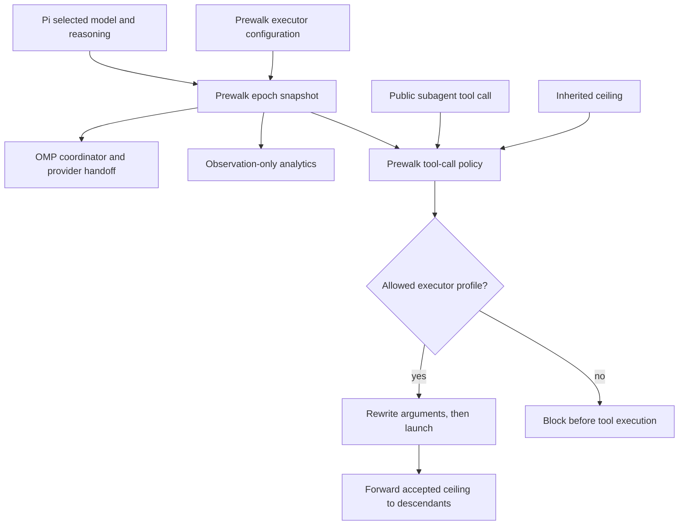
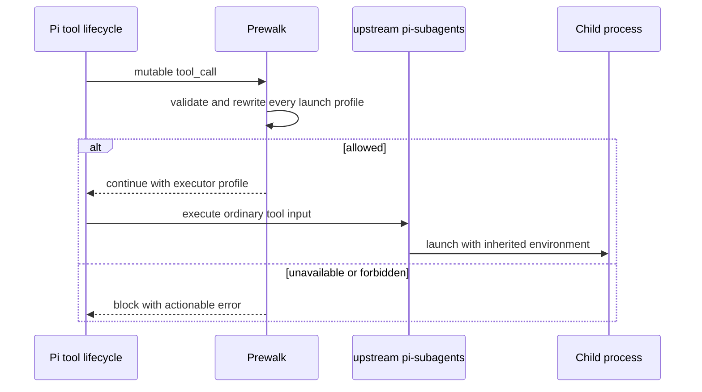
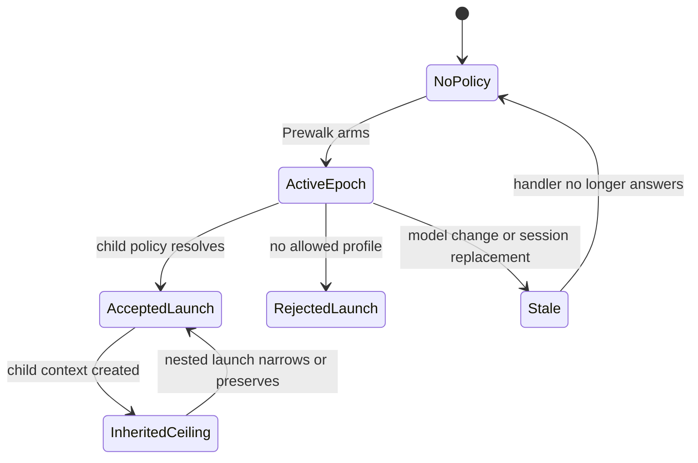

# Reconcile Prewalk Planner Authority, Analytics, and Subagent Policy

> **2026-07-31 architecture correction:** The implementation must not modify or replace
> `pi-subagents`. Prewalk owns the complete optional integration through stock Pi's public,
> mutable `tool_call` event, observes standard `tool_result` details for analytics, and carries
> one strict Prewalk-owned policy snapshot to child processes for nested enforcement. The
> canonical and installed upstream `pi-subagents` package remains unchanged. This correction
> supersedes every requirement and implementation unit below that assigns policy or analytics
> production code to the `pi-subagents` repository.

## Goal Capsule

- **Objective:** Make Pi's selected runtime model and reasoning authoritative for every new Prewalk epoch, finish the observation-only analytics work from Plan 003, and add a separate pi-subagents execution-profile ceiling that prevents expensive planner-profile fan-out.
- **Authority order:** The Pi runtime owns the planner profile. The active Prewalk epoch snapshots the selected model and initial reasoning, follows Pi reasoning changes until handoff, and Prewalk rewrites or rejects subagent launch arguments at Pi's public pre-execution boundary.
- **Execution order:** Correct Plan 002 and its implementation first, complete Plan 003 analytics second, then add the separate launch-policy contract.
- **Compatibility boundary:** Prewalk remains independently installable, the Pi setup continues to pin it as a Git submodule, and neither extension imports or requires the other.
- **Failure boundary:** If an active ceiling cannot resolve a supported child profile below the planner, Prewalk blocks the tool call before `pi-subagents` creates child artifacts, sessions, processes, or provider requests.
- **Tail ownership:** This plan ends with one combined correctness and reliability review, one consolidated fix pass, and final comprehensive verification. It does not commit, push, publish, or open a pull request.

---

## Product Contract

> **Product Contract preservation:** This plan changes the configured-planner requirements in Plan 002 because they conflict with the session-settled Pi-authority decision. It preserves Plan 002's OMP prompt, coordinator, handoff, standalone, provider-composition, and compaction intent. It preserves Plan 003's analytics requirements while repairing incomplete delegation and cleanup behavior. The execution-profile ceiling is a separate launch-control contract and does not add policy fields to analytics events.

### Summary

Prewalk must treat the model and reasoning already selected in Pi as the planner for each new epoch. Prewalk configuration owns the executor model and executor reasoning only. The executor inherits the same session after the OMP handoff gate, while Pi's selected model remains unchanged.

Analytics observes that lifecycle without choosing models or changing routing. Session receipts remain useful when pi-subagents is absent. When its tool is present, Prewalk consumes the standard public tool result details and records versioned content-free fallback evidence. Missing asynchronous or nested terminal evidence stays explicitly pending or incomplete rather than being guessed.

Launch control is separate from analytics. During an active Prewalk epoch, Prewalk mutates the public `subagent` tool input to the configured executor profile or blocks a broader override. A strict Prewalk-owned environment snapshot is inherited by child Pi processes, where the independently loaded Prewalk extension applies the same ceiling to nested launches without starting another automatic Prewalk.

### Problem Frame

The current Prewalk configuration persists a planner and refuses to arm unless Pi has already selected that configured model. This reverses the intended authority: changing Pi's model should change the next epoch's planner without rewriting Prewalk configuration.

Plan 003 added most of the local analytics implementation, but its final review and fix pass were interrupted. Foreground delegation starts are emitted after completion, foreground state is not durably replayed, nested events are rejected by the real Prewalk integration while tests bypass that boundary, reset can report success with cleanup outstanding, and task-tree coverage can hide unresolved overlap.

pi-subagents currently has no model-and-reasoning ceiling tied to an active Prewalk epoch. A child that omits a model override may inherit the planner model and use an equal or higher reasoning level. Existing capability ceilings constrain tools, not execution profiles.

### Actors

- A1. **Pi user:** Selects the planner model and reasoning, configures Prewalk's executor defaults, and expects delegated work to respect the cheaper execution boundary.
- A2. **Pi host:** Owns selected model and reasoning, supported model metadata, authentication, lifecycle events, and the public extension event bus.
- A3. **Prewalk:** Snapshots the planner profile per epoch, performs the OMP-faithful handoff, records local analytics, and enforces its optional subagent policy through Pi's public tool lifecycle.
- A4. **pi-subagents:** Remains the unmodified upstream extension that validates the rewritten public arguments, launches children, and returns its normal result details.
- A5. **Child and descendant agents:** Run with an effective profile that satisfies every inherited and active ceiling.

### Key Decisions

- **Pi's live runtime profile owns the planner.** (session-settled: user-directed - chosen over a persisted Prewalk planner: Shift+Tab and explicit Pi model changes must govern the next epoch without duplicate configuration.) Governs R1 through R5.
- **Prewalk remains a standalone pinned submodule.** (session-settled: user-approved - chosen over folding it into the Pi setup repository: independent installation and history are explicit prerequisites.) Governs R6, R7, R20, and R21.
- **OMP remains the coordinator authority.** (session-settled: user-directed - chosen over a broader Prewalk orchestration layer: only stock Pi extension-boundary adaptations are allowed.) Governs R6 through R9.
- **Analytics observes and launch policy controls.** (session-settled: user-directed - chosen over extending delegation analytics with policy fields: cost evidence and authorization have different lifecycle and trust boundaries.) Governs R10 through R19.
- **Timeouts do not substitute for protocol correctness.** (session-settled: user-approved - chosen over suite serialization and widened retry windows: deterministic synchronization and public lifecycle evidence must prove the behavior.) Governs R22 and R23.

### Requirements

**Planner and handoff authority**

- R1. A new Prewalk epoch must snapshot Pi's currently selected model and reasoning as its initial planner profile. The planner model remains fixed for that epoch unless a model change cancels it.
- R2. Persisted Prewalk configuration must contain executor model, executor reasoning, analytics configuration, and any approved reset profile, but no activation or planner selection. Automatic activation is session-only.
- R3. Before handoff, Shift+Tab must remain Pi's normal planner-reasoning control and update the epoch's current planner reasoning. After handoff, Prewalk must consume Shift+Tab and cycle only the active epoch's executor reasoning. Shift+Tab must never change a model.
- R4. An explicit Pi model change may cancel an active epoch, but the next epoch must derive its planner from the newly selected runtime model.
- R5. Status, audit records, receipts, reload state, and provider routing must use the epoch's host-owned planner state rather than a persisted planner. Reload restores routing only when the selected model and current planner reasoning match the latest valid epoch record.

**OMP fidelity and standalone operation**

- R6. OMP revision `4df68d60438423b384b2b47fb3d6835641624757` remains authoritative for prompt bytes, todo gating, bounded continuation, first-mutation handoff, and one-way executor activation.
- R7. Stock Pi with no Codex Conversion extension must support the normal Prewalk flow. Optional provider composition must use public registration surfaces and must not become a runtime dependency.
- R8. Handoff and compaction filtering must remove only the planning nudge. Continuation and executor-checklist history remain eligible for normal context and compaction behavior.
- R9. The compact footer must contain only planner and executor labels, reasoning, effective side, and one short state clause. Delegation and analytics details belong in explicit status and stats commands.

**Analytics completion**

- R10. Analytics must remain observation-only: it must not select a model, change reasoning, route a request, create a provider request, or delay the provider stream.
- R11. Reset must rotate to a clean generation immediately, preserve retryable cleanup state when prior managed artifacts remain, and report incomplete cleanup until verification succeeds.
- R12. Task-tree aggregation must deduplicate only matching usage-slice evidence keys and must label pending, fallback-backed, overlap-unresolved, unsupported, and incomplete coverage explicitly.
- R13. Prewalk must consume delegation evidence through Pi's public `tool_execution_start` and `tool_result` events and the standard pi-subagents result shape, without importing the package or reading child session files.
- R14. Direct terminal results supply child-only usage. Async launches remain pending until a public terminal result is observed, and nested usage unavailable from that result is reported as incomplete.
- R15. Delegation analytics must remain content-free, independent of launch control, and behaviorally invisible when the `subagent` tool is absent.

**Execution-profile policy**

- R16. Prewalk must define a strict versioned execution-profile snapshot and apply it only when an active epoch or inherited snapshot exists. Upstream pi-subagents remains unchanged.
- R17. Prewalk must mutate the public `subagent` tool input before execution, defaulting every single, parallel, chain, dynamic, and appended child to the configured executor model and reasoning. A delayed schedule must be rejected while a policy is active because the future process cannot inherit the transient snapshot safely.
- R18. Explicit overrides may use only the configured executor model at the default or lower allowed reasoning. The exact planner tuple and every broader or different model must be blocked.
- R19. Policy resolution must finish in `tool_call` before pi-subagents creates an artifact, session, child process, or provider request. Unavailable policy fails with an actionable error and never chooses an arbitrary model.
- R20. The accepted snapshot must be inherited by child processes so their independently loaded Prewalk extension applies the same rule to nested launches. Resume and steer must restore the original run snapshot, appended steps must use it, and child sessions must not start another automatic Prewalk.
- R21. Prewalk-only and pi-subagents-only operation retain existing behavior. Reload cannot revive a stale root epoch, while a live inherited child snapshot remains immutable for nested launches.

**Reliability and scope**

- R22. Keep deterministic condition-based synchronization in Prewalk tests and do not introduce timing changes in upstream pi-subagents.
- R23. Preserve existing dirty work and the staged Prewalk submodule architecture. Do not modify installed package caches, generated files, or manually maintained changelog output.
- R24. Keep all work local and unpublished unless the user separately authorizes staging, commit, push, publication, or a pull request.

### Key Flows

- F1. **Start an epoch**
  - **Trigger:** A live Pi session arms Prewalk.
  - **Actors:** A1, A2, A3
  - **Steps:** Prewalk reads executor defaults, snapshots `ctx.model` and initial `ctx.thinkingLevel`, follows Pi-owned reasoning changes before handoff, validates the executor independently, and opens the run and analytics journal.
  - **Outcome:** Every run record names the actual planner selected in Pi at that moment.

- F2. **Handoff without changing Pi selection**
  - **Trigger:** The OMP todo gate is open and the planner completes the first eligible mutation.
  - **Actors:** A2, A3
  - **Steps:** Prewalk removes only the planning nudge, activates the executor route at the public provider seam, retains continuation and checklist history, and leaves Pi's selected model untouched.
  - **Outcome:** The executor continues the same session with its configured reasoning.

- F3. **Observe a delegated task tree**
  - **Trigger:** pi-subagents starts, updates, or finishes a child.
  - **Actors:** A3, A4, A5
  - **Steps:** Prewalk observes the public subagent tool lifecycle, projects standard result details into versioned content-free evidence, and joins receipts and matching fallback slices.
  - **Outcome:** Totals are complete only when evidence proves completeness, with unresolved coverage visible.

- F4. **Constrain a child launch**
  - **Trigger:** Pi is about to execute the public subagent tool while a Prewalk epoch is active.
  - **Actors:** A2, A3, A4
  - **Steps:** Prewalk validates and atomically rewrites every launch profile through Pi's mutable `tool_call` event, then exposes the accepted snapshot through the child environment inherited by ordinary process launch.
  - **Outcome:** No child provider request can use the forbidden planner tuple.

- F5. **Propagate and restore policy**
  - **Trigger:** A constrained child launches a nested child or resumes after reload.
  - **Actors:** A3, A4, A5
  - **Steps:** The child Prewalk instance decodes the immutable inherited snapshot, suppresses a second automatic epoch, and applies the same public `tool_call` validation to nested launches. Root reload derives policy only from a live epoch.
  - **Outcome:** Nested and resumed work cannot escape the root ceiling.

### Acceptance Examples

- AE1. Given Pi is using Sol at high reasoning and Prewalk is configured for Luna at low reasoning, when a new epoch starts, then the run records Sol/high as its initial planner and Luna/low as executor without a planner field in configuration.
- AE2. Given the executor is not active, when the user presses Shift+Tab, then Pi changes planner reasoning normally. Given the executor is active, the same input changes only executor reasoning.
- AE3. Given stock Pi has no Codex Conversion registration, when Prewalk arms and hands off, then the executor request succeeds through the stock provider.
- AE4. Given a continuation and executor checklist exist, when handoff and later compaction occur, then only the planning nudge is excluded.
- AE5. Given an asynchronous launch returns before its child finishes, when Prewalk observes the public result, then the task tree stays pending until a later public terminal result is available and never fabricates completion during reload.
- AE6. Given a standard result identifies a nested run but omits nested child usage or session identity, when Prewalk projects it, then the nested run is recorded as incomplete without a package event or direct child-session read.
- AE7. Given a partial reset deletion failure, when reset returns, then new-generation reports exclude old data and the command says cleanup is incomplete with retry guidance.
- AE8. Given Sol/high is the planner and an ordinary child omits overrides, when pi-subagents resolves the launch, then it selects Luna/low or rejects before any provider request.
- AE9. Given an explicit child override exceeds the ceiling, when the launch is requested, then it fails before artifacts or processes exist. A permitted lower reasoning override succeeds.
- AE10. Given a constrained child launches a nested child, when the descendant omits overrides, then the inherited root ceiling still applies.
- AE11. Given Prewalk is absent, when pi-subagents launches a child, then its existing model and reasoning behavior is unchanged.

### Scope Boundaries

**In scope**

- Updating Plan 002 and Plan 003 where their written contracts conflict with the settled authority and verified implementation gaps.
- Replacing the unreleased planner-bearing Prewalk configuration without backwards compatibility.
- Completing the current analytics implementation and public delegation projection.
- Adding the separate versioned execution-profile policy through supported public APIs.
- Keeping the existing Pi submodule integration and deterministic condition-wait improvement.

**Deferred to Follow-Up Work**

- General cost-ranking across arbitrary model providers.
- Cross-provider Prewalk routing.
- A public release, migration guide, or compatibility parser for unreleased planner-bearing configuration.
- Broader pi-subagents reliability work not required by these contracts.

**Outside this product's identity**

- Patching Pi binaries, installed npm package caches, private runtime imports, or generated output.
- Using delegation analytics as an authorization channel.
- Choosing an arbitrary cheaper model when policy cannot prove an allowed profile.
- Global test serialization as a substitute for concurrency correctness.

---

## Planning Contract

### Key Technical Decisions

- KTD1. **Construct a host-owned epoch profile.** Build the run from Pi's selected model and initial reasoning plus the persisted executor defaults. Keep the planner model fixed, update current planner reasoning only from Pi's pre-handoff reasoning event, and carry both through audit, status, reload, provider, and analytics records. Configuration parsing rejects the old planner-bearing shape rather than carrying a fallback. Governs R1 through R5.
- KTD2. **Keep OMP adaptation narrow.** Preserve prompt bytes and coordinator transitions. Context and compaction projection distinguish the planning nudge from continuation and checklist messages, and stock provider fallback remains the default lane. Governs R6 through R9.
- KTD3. **Observe the standard tool lifecycle.** Prewalk keeps a bounded invocation registry from public `tool_execution_start` events and projects standard `tool_result` details into content-free terminal or pending evidence. Unsupported nested or asynchronous gaps remain explicit instead of triggering private file reads or a package patch. Governs R13 and R14.
- KTD4. **Keep upstream pi-subagents untouched.** Prewalk optionally recognizes the public `subagent` tool name and documented input/result shapes. No package import, custom producer event, installed-cache edit, or maintained fork is part of the runtime. Governs R13 through R17.
- KTD5. **Use Pi's mutable tool-call boundary.** Prewalk validates and rewrites `event.input` synchronously during `tool_call`, which Pi guarantees affects actual execution. A malformed or broader request is blocked before the tool runs. Governs R16 and R17.
- KTD6. **Represent policy as explicit allowed profiles.** The accepted snapshot contains the planner tuple, a default child profile, an allowlist of provider/model profiles with maximum reasoning, source, epoch, and version. The initial Prewalk response allows its configured executor and lower supported reasoning only. This avoids speculative price comparison. Governs R18 and R19.
- KTD7. **Enforce before the tool executes.** One Prewalk resolver validates single, parallel, chain, and dynamic inputs atomically, so a rejected sibling cannot leave partial mutations. The exact planner tuple is always rejected. Governs R18 through R20.
- KTD8. **Propagate a Prewalk-owned snapshot.** Serialize the accepted snapshot in one strict environment value inherited by child processes. The child Prewalk extension disables its automatic planning loop and uses the immutable snapshot only to constrain nested `subagent` calls. Governs R20 and R21.
- KTD9. **Separate reliability fixes by mechanism.** Keep condition polling that observes a real state transition. Remove serialization and widened time thresholds unless a focused reproduced failure proves a distinct product defect. Governs R22 and R23.

### High-Level Technical Design

### Sequencing

1. Correct the planner/configuration contract and OMP boundaries before analytics consumes the new epoch identity.
2. Complete Prewalk's projection of standard pi-subagents results before relying on it for task-tree accounting.
3. Finish Prewalk task-tree and cleanup behavior against the stable projection.
4. Add execution-profile policy only after Plan 003 analytics is accepted, keeping the contracts in separate modules and tests.
5. Run comprehensive checks, review the complete diff once, apply one consolidated fix pass, and run final verification.

### Risks and Mitigations

- **A prohibited candidate reaches a provider before policy.** Central resolution must happen before fallback and launch construction, with tests asserting zero forbidden provider requests.
- **Nested policy becomes broader after reload.** Persist and validate the accepted snapshot, intersect rather than replace, and make invalid inherited data a pre-launch failure.
- **Foreground analytics still reports history instead of lifecycle.** Emit and persist start at launch creation, then test observation before child completion.
- **Task-tree cost double-counts aggregate evidence.** Replace only matching evidence keys and expose overlap-unresolved coverage.
- **Planner configuration silently survives.** Strict parsing deliberately rejects the unreleased old shape, and documentation explains the replacement schema.
- **Test timing changes hide a race.** Restore concurrent integration execution and use observable synchronization instead of larger sleeps.

---

## Implementation Units

### U1. Make Pi's runtime profile authoritative

- **Target repo:** `pi-prewalk`
- **Goal:** Replace the configured planner with a per-epoch snapshot whose planner model and identity are immutable while current planner reasoning follows Pi until handoff.
- **Requirements:** R1 through R5, AE1, AE2
- **Dependencies:** None
- **Files:** `docs/plans/2026-07-30-002-feat-extension-only-sol-luna-prewalk-plan.md`, `src/core.ts`, `src/audit.ts`, `src/status.ts`, `src/analytics.ts`, `extensions/prewalk.ts`, `prewalk.example.json`, `README.md`, `test/core.test.ts`, `test/audit.test.ts`, `test/status.test.ts`, `test/config.test.ts`, `test/extension.test.ts`, `test/analytics.test.ts`
- **Approach:**
  1. Amend Plan 002's configured-planner requirements, configuration unit, status examples, and reset semantics to use the Pi runtime snapshot.
  2. Remove planner from persisted configuration and construct each run from the host snapshot plus executor defaults.
  3. Carry initial and current planner reasoning through audit, reload, status, provider, and receipt identity, updating current reasoning only before handoff.
  4. Keep pre-handoff Shift+Tab unconsumed and post-handoff executor reasoning epoch-local.
- **Execution note:** Start with failing configuration and extension tests that arm from a non-default Pi model and reasoning.
- **Patterns to follow:** `src/core.ts` strict parsing and immutable run snapshots; OMP host-selected planner behavior in the pinned coordinator.
- **Test scenarios:**
  1. A missing config uses executor defaults while preserving an arbitrary selected planner model and reasoning.
  2. A planner-bearing config fails strict validation instead of overriding Pi.
  3. Manual and automatic epochs snapshot the selected model, follow Pi reasoning changes before handoff, and stop following them after executor activation.
  4. Shift+Tab before handoff reaches Pi; after handoff it changes only executor reasoning.
  5. A model change cancels the active epoch and a later epoch snapshots the new selection.
- **Verification:** Config, coordinator, status, audit, and extension tests prove one planner authority and no persisted planner field.

### U2. Restore narrow OMP and standalone boundaries

- **Target repo:** `pi-prewalk`
- **Goal:** Correct prompt filtering, compact status, and stock-provider operation without changing OMP coordinator behavior.
- **Requirements:** R6 through R9, AE3, AE4
- **Dependencies:** U1
- **Files:** `docs/plans/2026-07-30-002-feat-extension-only-sol-luna-prewalk-plan.md`, `src/provider-overlay.ts`, `src/status.ts`, `extensions/prewalk.ts`, `README.md`, `test/provider-overlay.test.ts`, `test/status.test.ts`, `test/context.test.ts`, `test/compaction.test.ts`, `test/agent-loop.test.ts`, `test/omp-parity.test.ts`
- **Approach:**
  1. Delegate through stock `streamSimple` when no compatible registration exists and keep optional registered-stream composition capability-based.
  2. Filter only `prewalk-plan` after handoff and during compaction preparation.
  3. Remove delegation state from compact status while retaining it in explicit detailed status.
  4. Preserve exact prompt assets, continuation transitions, todo gate, and first-mutation handoff.
- **Execution note:** Add characterization coverage for the pinned OMP prompt lifecycle before changing the filters.
- **Patterns to follow:** OMP `#scrubPlanNudge`; existing provider ownership and drift checks.
- **Test scenarios:**
  1. Stock `openai-codex` with no prior custom stream completes the executor path.
  2. A compatible registered stream remains wrapped and restored without package-name detection.
  3. Continuation and checklist messages remain in effective context and compaction preparation while the planning nudge is absent.
  4. Delegation lifecycle does not change compact footer text.
  5. Prompt digests and every applicable OMP parity fixture remain unchanged.
- **Verification:** Real Agent-loop composition and focused provider, context, compaction, status, and parity tests prove the narrow adaptation.

### U3. Rejected pi-subagents analytics producer

- **Status:** Rejected and replaced.
- **Target repo:** None. The upstream `pi-subagents` source and installed package stay unchanged.
- **Replacement:** U4 projects ordinary upstream `tool_execution_start` and `tool_result` data through `src/analytics-subagents.ts`. Terminal or nested evidence that the public result cannot prove stays pending or incomplete.

### U4. Finish Plan 003 analytics behavior

- **Target repo:** `pi-prewalk`
- **Goal:** Close the reset, task-tree, nested-ingestion, reporting, and integration gaps without affecting routing.
- **Requirements:** R10 through R15, AE6, AE7
- **Dependencies:** U3
- **Files:** `docs/plans/2026-07-30-003-feat-prewalk-personal-savings-analytics-plan.md`, `src/analytics.ts`, `src/analytics-store.ts`, `src/analytics-report.ts`, `src/analytics-subagents.ts`, `extensions/prewalk.ts`, `test/analytics.test.ts`, `test/analytics-store.test.ts`, `test/analytics-report.test.ts`, `test/analytics-subagents.test.ts`, `test/extension.test.ts`, `test/agent-loop.test.ts`
- **Approach:**
  1. Update Plan 003's implementation description to match the completed public projection and runtime planner snapshot.
  2. Report and retry incomplete retired-generation cleanup while keeping the new generation isolated.
  3. Model task-tree actual and estimate coverage with explicit pending, fallback, unresolved-overlap, unsupported, and incomplete states.
  4. Use a bounded per-invocation registry to join each standard tool result to the locally observed parent invocation. Keep asynchronous or nested detail that the result cannot prove pending or incomplete.
  5. Correct report rendering and keep every analytics callback isolated from routing.
- **Execution note:** Drive each correction through the public command, event, and result surfaces rather than private store helpers.
- **Patterns to follow:** Strict content-free parsers in `src/analytics-subagents.ts`; atomic generation rotation in `src/analytics-store.ts`.
- **Test scenarios:**
  1. A partial cleanup failure reports incomplete, persists retry state, and becomes complete after a successful retry.
  2. Matching evidence keys replace fallback slices exactly once across repeated public lifecycle delivery.
  3. Partial aggregate overlap is excluded and labeled overlap-unresolved.
  4. Direct public result usage reaches the store through the real extension listener, while nested identity or usage absent from the result stays incomplete.
  5. Unsupported or malformed projection versions leave root-session analytics usable and mark task-tree coverage incomplete.
  6. Task-tree reports contain real line breaks and stable labels.
  7. Storage and reporting failures do not change selected model, reasoning, route, or provider-request count.
- **Verification:** Focused store, report, adapter, command, extension, and real Agent-loop tests satisfy every remaining Plan 003 acceptance case.

### U5. Add the Prewalk-owned execution-profile ceiling

- **Target repo:** `pi-prewalk`
- **Goal:** Enforce the active Prewalk executor boundary across every pi-subagents launch path and descendant.
- **Requirements:** R16 through R21, AE8 through AE11
- **Dependencies:** U4
- **Files:** `src/execution-profile-policy.ts`, `src/subagent-policy.ts`, `extensions/prewalk.ts`, `test/execution-profile-policy.test.ts`, `test/subagent-policy.test.ts`, `test/extension.test.ts`, `test/agent-loop.test.ts`, `README.md`
- **Approach:**
  1. Define a strict versioned Prewalk execution-profile snapshot and reject invalid inherited data.
  2. Observe Pi's mutable public `tool_call` event and atomically default or validate single, parallel, chain, dynamic, appended-step, delegation, resume, and steer arguments before tool execution. Reject delayed schedules while an active snapshot cannot be propagated to their future process.
  3. Block a forbidden or unavailable profile before pi-subagents can create artifacts, sessions, processes, or provider requests.
  4. Publish the accepted snapshot in the child process environment only for the duration of the tool execution. A child Prewalk instance enforces that inherited ceiling on nested launches and does not start a second automatic epoch.
  5. Keep upstream pi-subagents untouched and preserve its behavior when no Prewalk epoch or inherited snapshot exists.
- **Execution note:** Begin with a failing real-composition test in which Sol/high would currently launch an ordinary child as Sol/high, and assert that no provider request uses that tuple.
- **Patterns to follow:** OMP's extension-only composition and Pi's documented mutable `tool_call` lifecycle.
- **Test scenarios:**
  1. No active Prewalk policy preserves existing pi-subagents behavior.
  2. Active Prewalk defaults an override-free child to the configured executor profile.
  3. An allowed lower-reasoning override succeeds, while a forbidden model or reasoning fails before launch.
  4. No authenticated supported allowed profile produces an actionable pre-launch failure with zero provider requests.
  5. Foreground, async, parallel, chain, dynamic-fanout, appended-step, and delegation-shaped inputs resolve the same effective policy before tool execution, while delayed schedules fail closed.
  6. Resume and steer execute with the original ceiling still present.
  7. Nested children inherit and may narrow but never broaden the root ceiling.
  8. Reload clears stale root epochs and preserves only a valid inherited child snapshot.
  9. Prewalk-only operation and pi-subagents-only operation remain unchanged.
- **Verification:** Public-interface unit and real-composition tests prove effective model and reasoning, policy identity, propagation, failure timing, and zero forbidden requests.

### U6. Verify the complete system

- **Target repos:** `pi-prewalk` and the Pi setup
- **Goal:** Confirm the public composition and packaging boundaries, then complete one bounded review and verification tail.
- **Requirements:** R22 through R24
- **Dependencies:** U1 through U5
- **Files:** In Prewalk: `package.json`, `README.md`, `prewalk.example.json`; in the Pi setup: `.gitmodules`, `README.md`, `setup.sh`, `scripts/check.sh`
- **Approach:**
  1. Confirm the Pi setup pins and installs the independent Prewalk checkout while retaining the upstream pi-subagents package selector.
  2. Run Prewalk's comprehensive checks once, conduct one combined read-only correctness and reliability review, apply accepted findings in one consolidated pass, and run final verification.
- **Execution note:** Treat any unrelated pi-subagents fork or timing changes as out of scope and inactive.
- **Patterns to follow:** Existing Prewalk verification and Pi setup checks.
- **Test scenarios:**
  1. Pi setup dry-run resolves the pinned Prewalk submodule, selects upstream pi-subagents, and leaves installed caches untouched.
  2. Package dry-runs include runtime policy and analytics modules but exclude local journals, projections, and exports.
- **Verification:** Comprehensive Prewalk, real-session, package, and Pi setup checks pass before and after the consolidated review fix pass.

---

## Verification Contract

All test invocations must use the repository's `run-tests-on-request` skill.

| Gate | Repository | Coverage | Done signal |
|---|---|---|---|
| Focused planner and OMP | `pi-prewalk` | Config, core, audit, status, provider, context, compaction, extension, Agent loop | Runtime planner authority and OMP boundaries pass |
| Focused delegation analytics | `pi-prewalk` | Standard tool lifecycle projection, direct usage, nested incomplete coverage | Public projection is durable and content-free |
| Focused Prewalk analytics | `pi-prewalk` | Ledger, reset, report, adapter, command, task tree | Plan 003 gaps pass through public surfaces |
| Focused execution policy | `pi-prewalk` | Contract, serialization, every public launch shape, inherited composition | No forbidden provider request and nested ceilings remain monotonic |
| Comprehensive Prewalk | `pi-prewalk` | Lint, typecheck, unit, Agent loop, smoke RPC, package dry-run, diff validation | All required suites and packaging checks pass |
| Pi setup | Pi setup | Shell and JSON validation, submodule/install dry-run, secret boundary | Setup checks pass without installed-cache changes |
| Combined review | Prewalk and Pi setup | Complete diff against this plan | No unresolved correctness or reliability blocker |
| Final verification | All affected repositories | Affected focused checks followed by comprehensive checks | Exact final results recorded |

---

## Definition of Done

- Pi's selected model and reasoning define every new Prewalk planner profile.
- Prewalk configuration contains executor defaults and analytics only.
- Shift+Tab retains the agreed before-handoff and after-handoff meanings.
- OMP prompt, continuation, todo, mutation, and narrow filtering behavior is preserved.
- Stock Pi works without Codex Conversion, and optional composition stays public and capability-based.
- Plan 003 reset, task-tree coverage, public-result ingestion, and honest asynchronous and nested coverage requirements are complete.
- Analytics remains observation-only and separate from launch control.
- Every pi-subagents launch path enforces and propagates the active execution-profile ceiling before launch.
- The forbidden planner tuple never reaches a provider in composition tests.
- Both extensions still work independently.
- Deterministic Prewalk test synchronization remains, and upstream pi-subagents contains no changes from this plan.
- Required focused, comprehensive, review, and final verification gates pass.
- The Prewalk submodule architecture remains intact.
- No installed cache, generated file, commit, push, publication, pull request, or release state is changed.
