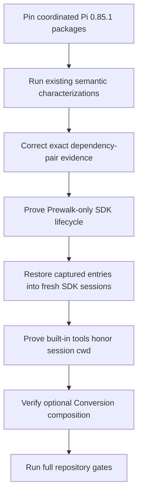
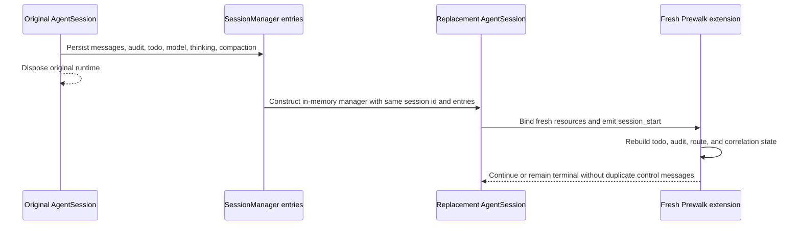

# Pi 0.85.1 Provider-Agnostic Compatibility - Plan

## Goal Capsule

- **Objective:** Make Prewalk demonstrably compatible with Pi 0.85.1 while preserving its provider-agnostic planner-to-executor behavior and its ability to run without Pi Codex Conversion.
- **Means:** Upgrade the coordinated Pi development packages, correct compatibility evidence, and add real SDK coverage for restored sessions and `ctx.cwd`-bound mutation.
- **Authority:** Existing Prewalk lifecycle, host-correlation, mutation, todo, compaction, route-lease, and recovery contracts remain authoritative; Pi 0.85.1 public APIs are the host contract.
- **Stop conditions:** Stop rather than broaden scope if Pi 0.85.1 requires private APIs, if Conversion 3.0.10 is genuinely incompatible, or if an existing semantic characterization fails without a product decision.

---

## Product Contract

### Summary

Prewalk must support Pi 0.85.1 without making Pi Codex Conversion a runtime dependency. The upgrade should use Pi's restored in-memory session support to strengthen recovery coverage and Pi's corrected `ctx.cwd` semantics to prove that real built-in mutations occur in the session workspace. Conversion-specific developer messages, Code/Notebook projection, context management, Astra effort control, and native Responses compaction remain separate follow-up work.

### Problem Frame

The repository declares Pi 0.84.4 as its development and documented compatibility baseline even though Pi 0.85.1 introduces host behavior directly relevant to Prewalk's SDK tests. The compatibility workflow also hard-codes a Conversion version that differs from the package actually installed, so its result can misstate the tested dependency pair. Without a controlled upgrade and stronger real-session tests, a green suite can overstate recovery and workspace correctness.

### Requirements

**Compatibility baseline**

- R1. The coordinated `@earendil-works/pi-agent-core`, `pi-ai`, `pi-coding-agent`, and `pi-tui` development packages resolve to exactly 0.85.1.
- R2. `@howaboua/pi-codex-conversion` remains at 3.0.10 for this initiative and remains absent from runtime dependencies and peer requirements.
- R3. Existing public-API-only model routing, host correlation, compaction pressure, todo gating, mutation proof, analytics, and recovery behavior remains unchanged unless a Pi 0.85.1 characterization demonstrates a real incompatibility.

**Compatibility evidence**

- R4. Compatibility artifacts report the Pi and Conversion versions actually installed in the candidate environment rather than a hard-coded pair.
- R5. Missing, malformed, or inconsistent dependency metadata fails closed and cannot produce a supported result.
- R6. The test suite proves both Prewalk-only operation and optional composition with Conversion without introducing a production import of Conversion.

**Session and workspace behavior**

- R7. A fresh Prewalk extension instance can restore externally managed in-memory session entries for active, interrupted, terminal, and compacted run states without duplicating prompts, audit entries, or route changes.
- R8. Restored runs preserve exact run ID and epoch, todo activation, model and thinking route, and stale-event isolation.
- R9. Real Pi built-in mutation tools honor the session `ctx.cwd` when it differs from `process.cwd()`, and the resulting mutation triggers exactly one eligible handoff.

**Scope control**

- R10. This initiative does not adopt any new Pi Codex Conversion integration surface or relax Prewalk's native Responses compaction refusal.
- R11. Tests and verification assets may be strengthened or adapted to documented public APIs, but they must not be weakened to make a failing behavior appear supported.

### Acceptance Examples

- AE1. Given a candidate environment with Pi 0.85.1 and Conversion 3.0.10 installed, when compatibility evidence is emitted, then it records those exact versions and validates successfully. Covers R1, R2, R4, and R5.
- AE2. Given Prewalk is loaded without the Conversion extension, when a planner initializes `prewalk_todo`, performs a proven mutation, hands off, and releases, then the complete lifecycle succeeds. Covers R3 and R6.
- AE3. Given session entries captured during planning or execution, when a new `SessionManager.inMemory` and fresh extension instance restore them, then the same run identity, todo state, and route are recovered without duplicate control messages. Covers R7 and R8.
- AE4. Given `process.cwd()` and the SDK session `cwd` are different, when Pi's built-in write or edit tool mutates a file, then only the session workspace changes and Prewalk records one handoff. Covers R9.
- AE5. Given Conversion 3.0.10 is composed before or after Prewalk, when the integration test runs on Pi 0.85.1, then Conversion retains its stream and Prewalk retains its model, tool, session, and compaction contracts. Covers R2, R3, R6, and R10.

### Scope Boundaries

**In scope**

- Pi 0.85.1 development dependency and support-baseline upgrade.
- Exact dependency-pair reporting in compatibility automation.
- Real in-memory restoration and `ctx.cwd` integration coverage.
- Existing optional Conversion 3.0.10 composition verification.
- Documentation changes required to state the verified baseline accurately.

### Deferred to Follow-Up Work

- Pi Codex Conversion developer-role delivery for Prewalk prompts.
- Explicit Code and Notebook projection of `prewalk_todo`.
- Conversion context-management capability negotiation.
- Astra-specific automatic effort behavior.
- Any relaxation of native Responses compaction refusal.
- Conversion 3.0.29 adoption and its own compatibility matrix.

**Outside this product's identity**

- Provider-specific routing or reasoning policy in Prewalk core.
- Private Pi imports, provider transport wrapping, credential handling, or duplicated session persistence.
- Weakening tests, adding suppressions, or bypassing the repository's required verification to certify compatibility.

---

## Planning Contract

### Key Technical Decisions

- KTD1. **Upgrade Pi independently of new Conversion features.** (session-settled: user-directed — chosen over a balanced or Codex-forward rollout: Prewalk must work for users who do not install Conversion.) The Pi packages move together to 0.85.1 while Conversion remains at 3.0.10 and optional. Governs R1-R3, R6, and R10.
- KTD2. **Treat compatibility evidence as an exact tested-pair record.** The workflow derives dependency versions from installed package metadata and validates them through the existing bounded contract instead of maintaining duplicated constants. Governs R4 and R5.
- KTD3. **Use restored in-memory sessions as test infrastructure, not production persistence.** Pi's new restoration constructor strengthens recovery proof without moving audit ownership out of `src/session/` or introducing a second session store. Governs R7 and R8.
- KTD4. **Test `ctx.cwd` through real built-in tools.** A custom tool or direct filesystem write would bypass the Pi behavior being certified, so the regression must execute Pi-created write/edit behavior. Governs R9.
- KTD5. **Preserve current lifecycle ownership.** `PiHostEventCorrelation`, `ContextPressureController`, `TemporaryModelController`, `TurnGate`, and `SessionRecovery` retain their current responsibilities; the version upgrade does not justify a new runtime-capability abstraction. Governs R3, R7-R9, and R11.
- KTD6. **Defer all new Conversion surfaces.** (session-settled: user-directed — chosen over opportunistic Conversion integration in this release: provider-specific enhancements must not become a prerequisite for core correctness.) Existing composition remains a compatibility gate only. Governs R2, R6, and R10.

### High-Level Technical Design

The following flow is directional guidance rather than implementation code.

The restored-session lifecycle is also directional guidance:

### Assumptions

- Pi 0.85.1's documented `SessionManager.inMemory(cwd, { id }, entries)` contract accepts entries produced by the SDK session manager without private transformations.
- Conversion 3.0.10 remains loadable with Pi 0.85.1 under its declared peer range; if runtime proof disproves this, implementation stops rather than silently expanding to Conversion 3.0.29.
- The existing Prewalk-only agent-loop fixtures can be extended without introducing paid provider requests.

### Sequencing

Dependency pins land first so every new test certifies the intended host. Compatibility evidence is corrected next because later results must identify the tested pair accurately. Provider-agnostic package and SDK proof precedes restored-session and workspace tests. Optional Conversion composition runs only after stock Pi behavior is green. Documentation is updated only after the full verification contract passes.

---

## Implementation Units

### U1. Pi 0.85.1 baseline and exact compatibility evidence

- **Goal:** Upgrade the coordinated Pi packages and ensure compatibility artifacts report the versions actually installed.
- **Files:** `package.json`, `package-lock.json`, `.github/workflows/pi-compatibility.yml`, `scripts/compatibility/contracts.mjs`, `test/compatibility-contracts.test.ts`.
- **Approach:** Update only the four coordinated Pi development packages. Keep Conversion at 3.0.10. Replace the workflow's stale Conversion literal with bounded metadata derived from the installed package and keep the candidate result schema strict.
- **Execution note:** Characterize the existing compatibility contract before changing workflow evidence.
- **Test scenarios:**
  - A Pi 0.85.1 candidate emits the exact installed Pi and Conversion pair.
  - A prerelease Pi version remains valid when manually dispatched.
  - Missing or malformed installed-package metadata fails the job before a supported result is written.
  - Candidate-controlled extra fields and inconsistent dependencies remain rejected.
- **Verification:** `npm ls` shows the intended versions; the focused compatibility contract suite passes; the workflow YAML remains parseable and preserves credential-free acquisition and timeouts.
- **Covers:** R1, R2, R4, R5, and R11.

### U2. Provider-agnostic package and SDK proof

- **Goal:** Prove Prewalk works and packages correctly when the Conversion extension is not loaded.
- **Files:** `test/pi/package.test.ts`, `test/integration/agent-loop.test.ts`.
- **Approach:** Strengthen package-boundary assertions and exercise a complete Prewalk lifecycle with only the Prewalk extension loaded. Do not add production feature detection for an absent optional extension.
- **Test scenarios:**
  - The package manifest has no runtime or peer dependency on Conversion.
  - A Prewalk-only session arms, activates `prewalk_todo`, accepts a valid todo, proves a mutation, hands off once, and restores the planner.
  - Cancellation and release remove only Prewalk-owned tools and retain the original active tool slate.
- **Verification:** Focused package and agent-loop tests pass; `npm pack --dry-run --json` contains no runtime Conversion coupling.
- **Covers:** R2, R3, R6, and R10.

### U3. Real restored-session recovery coverage

- **Goal:** Prove recovery with externally managed in-memory entries and a fresh extension instance.
- **Files:** `test/integration/session-restore.test.ts`, `package.json`, and shared integration helpers only if extraction prevents duplication without weakening isolation.
- **Patterns:** `src/session/recovery.ts`, `src/session/audit.ts`, `src/turn/turn-gate.ts`, `src/executor/temporary-runtime.ts`, and the resource-loader setup in `test/integration/agent-loop.test.ts`.
- **Approach:** Capture entries and session identity from one real SDK session, dispose it, create a replacement in-memory manager with those entries, and bind a fresh resource loader and Prewalk instance.
- **Test scenarios:**
  - Planning before todo initialization resumes with one bounded recovery path.
  - Ready state restores an actionable todo without duplicating initialization.
  - Handoff-pending and executor-active states restore the correct route and tool slate.
  - Paused recovery remains paused until a user message grants another bounded window.
  - Cancelled and failed states remain terminal and do not reinstall an executor route.
  - A compaction entry with its retained boundary rebuilds context without resurrecting filtered planning prompts.
  - A stale event from the disposed session cannot affect the replacement run.
- **Verification:** The new focused suite passes and is included in `test:agent-loop`; assertions cover exact run ID, epoch, message count, audit count, todo visibility, model, thinking level, and route.
- **Covers:** R7, R8, and R11.

### U4. Real `ctx.cwd` mutation and handoff coverage

- **Goal:** Certify Pi 0.85.1's corrected built-in-tool workspace behavior through Prewalk's mutation gate.
- **Files:** `test/integration/agent-loop.test.ts`; `src/turn/mutation.ts` only if the real result shape reveals a legitimate unsupported public shape.
- **Approach:** Run an SDK session whose workspace differs from the test process directory, have the scripted model call Pi-created built-in mutation tools, and observe the existing public tool events and result details.
- **Test scenarios:**
  - A built-in write creates the expected file only under the session workspace.
  - A built-in edit updates that workspace file and records a successful built-in mutation candidate.
  - Ignored-extension matching evaluates the actual changed path.
  - Successful todo plus mutation causes exactly one handoff; a failed edit causes none.
- **Verification:** The focused agent-loop test checks both filesystems, mutation evidence, phase transitions, and model selection.
- **Covers:** R3, R9, and R11.

### U5. Model-route and optional Conversion composition regression

- **Goal:** Confirm Pi 0.85.1 preserves temporary model/thinking ownership and the existing optional Conversion composition.
- **Files:** `test/executor/model-runtime.test.ts`, `test/integration/codex-conversion.test.ts`; production files only when a documented public API incompatibility requires a semantic fix.
- **Approach:** Re-run existing route-lease and both-order composition characterizations. Add coverage only where Pi 0.85.1 exposes an untested public transition; add no provider-specific branch.
- **Test scenarios:**
  - Planner to executor to planner uses public model and thinking setters and restores exactly once.
  - Same model at different effective reasoning remains a real route; the same effective route remains rejected.
  - User model selection cancels ownership while an internal selection is consumed.
  - A stale lease cannot restore or cancel a replacement run.
  - Conversion-first and Prewalk-first registration preserve the Conversion stream, Prewalk tool activation, selected planner, and empty initial history.
  - Enabled native Responses compaction remains refused.
- **Verification:** Model-runtime and Conversion composition suites pass on the upgraded Pi packages. A genuine Conversion 3.0.10 incompatibility stops this plan before scope expansion.
- **Covers:** R2, R3, R6, R10, and R11.

### U6. Verified support statement and full repository gates

- **Goal:** Declare Pi 0.85.1 support only after every secret-free gate passes.
- **Files:** `README.md`, with other documentation changed only when verification proves a statement stale.
- **Approach:** Update the supported Pi version and preserve the existing Conversion/native-compaction limitations. Run focused suites before the complete repository ladder.
- **Test scenarios:**
  - Documentation names Pi 0.85.1 and still describes Conversion as optional.
  - Link checking accepts every changed reference.
  - Package dry-run includes only intended distributable artifacts and no credentials, test artifacts, or optional runtime coupling.
- **Verification:** Every command in the Verification Contract exits successfully with no new lint suppressions or weakened tests.
- **Covers:** R1-R11.

---

## Verification Contract

| Scope | Command | Expected result | Units |
| --- | --- | --- | --- |
| Dependency resolution | `npm ls @earendil-works/pi-agent-core @earendil-works/pi-ai @earendil-works/pi-coding-agent @earendil-works/pi-tui @howaboua/pi-codex-conversion --depth=0` | Four Pi packages at 0.85.1; Conversion at 3.0.10; exit zero | U1 |
| Compatibility evidence | `npm test -- test/compatibility-contracts.test.ts` | One passing focused suite; exact dependency pair and malformed-evidence cases pass | U1 |
| Package boundary | `npm test -- test/pi/package.test.ts` | Prewalk package contract passes without runtime Conversion dependency | U2 |
| Session restoration | `npm test -- test/integration/session-restore.test.ts test/session/audit.test.ts test/session/session-metadata.test.ts` | Restored-session, audit, and metadata suites pass | U3 |
| Workspace and lifecycle | `npm test -- test/integration/agent-loop.test.ts test/integration/extension.test.ts` | Real `ctx.cwd`, mutation, handoff, and extension lifecycle cases pass | U2, U4 |
| Route ownership | `npm test -- test/executor/model-runtime.test.ts test/executor/context-pressure.test.ts` | Model/thinking lease and pressure suites pass | U5 |
| Optional composition | `npm test -- test/integration/codex-conversion.test.ts` | Both extension registration orders pass on the exact dependency pair | U5 |
| Static analysis | `npm run typecheck` and `npm run lint` | Zero type errors; Biome and Oxlint pass without new suppressions | U1-U6 |
| Documentation | `npm run check:links` | All links resolve under repository rules | U6 |
| Full behavior | `npm test` and `npm run test:agent-loop` | Entire Vitest suite and agent-loop group pass | U1-U6 |
| Process boundaries | `npm run smoke:rpc` and `npm run smoke:rpc-cross-provider` | Both RPC smoke tests exit zero without paid provider access | U2, U5 |
| Mutation regression | `npm run verify:teeth` | Cross-provider mutation descriptors remain satisfied | U4, U5 |
| Distribution | `npm run pack:dry-run` | Dry-run exits zero and package contents/dependencies match the manifest contract | U2, U6 |

Authenticated provider canaries, efficacy benchmarks, publication, and live installation are excluded from this verification contract and require separate approval.

---

## Definition of Done

- The four coordinated Pi development packages and lockfile resolve to 0.85.1, while Conversion remains exactly 3.0.10 and optional.
- Compatibility evidence derives and validates the actual installed dependency pair; no stale hard-coded Conversion version remains.
- Prewalk-only SDK and package tests prove operation without loading Conversion.
- Restored in-memory session tests use a fresh session manager, resource loader, and extension instance and cover active, interrupted, terminal, and compacted states.
- Real built-in mutation tools prove `ctx.cwd` isolation and exactly-once handoff behavior.
- Model/thinking lease and existing Conversion composition characterizations pass without provider-specific production branches.
- No new Conversion API, context-management mode, developer message, Code/Notebook projection, or native Responses compaction behavior is introduced.
- Focused checks and the complete secret-free verification ladder pass without weakened assertions, skipped semantic tests, new lint suppressions, or committed generated artifacts.
- `README.md` states Pi 0.85.1 support only after the verification contract is satisfied.
